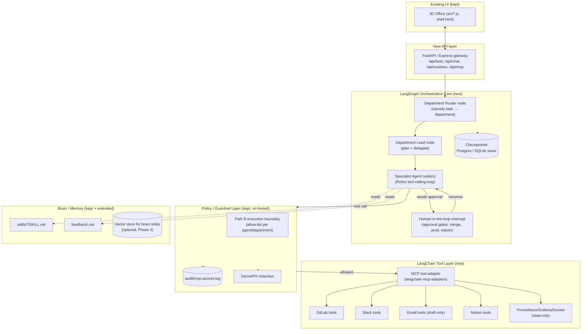
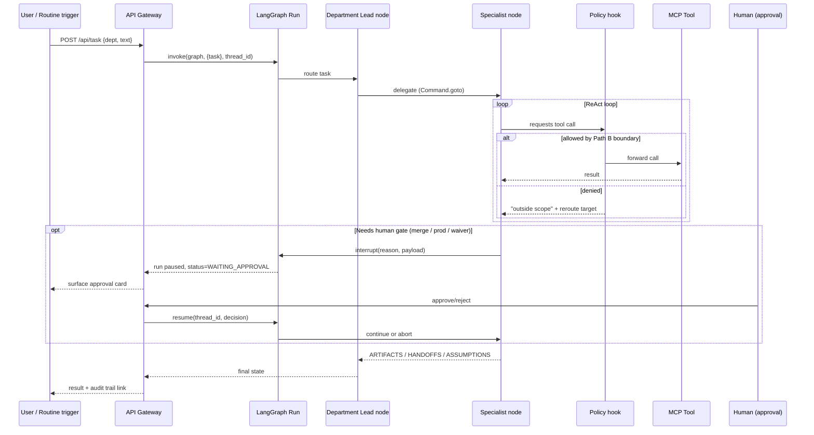
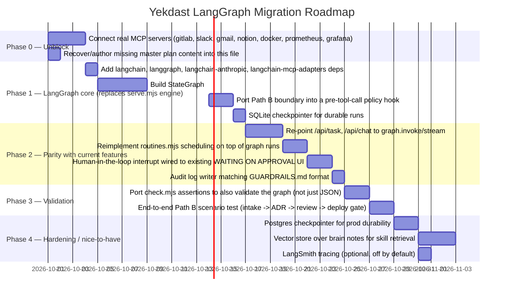

# Yekdast SaaS Factory Office → LangChain/LangGraph Backend

**Status:** Planning (pick-up from Phase 1 pause)
**Scope:** `agents-office-yekdast` only. `saas-factory` (the VPS/GitLab-CI scaffolding generator in `~/Documents/Projects/saas-factory`) is a separate, unrelated repo — it is not touched by this plan and is not where "LangChain/LangGraph" work belongs.
**Note on "dotcloud":** no `dotcloud` directory exists anywhere in this project or nearby projects. This plan assumes you meant `.claude/` (the planning docs already written there: `AGENTS.md`, `GUARDRAILS.md`, `MCP-MATRIX.md`, `Phase1-Setup.md`, `SETUP-CHECKLIST.md`, `unused-seats.md`). If you actually meant something else, say so and I'll re-scope.

---

## 1. Where things actually stand today (verified by reading the repo, not assumed)

### 1.1 What exists right now
- **Engine**: `serve.mjs` — a single Node/Express-style server (no framework) that:
  - Loads a **fixed 35-seat roster** (`office.agents.json` → `brain/Agents Office/agents.json` → `office.agents.local.json`, later wins) via `roster.mjs`.
  - Runs **one task = one Claude call**, either through the **Claude Code CLI** (`spawn('claude', [...])`, your own `claude` login, MCP tools resolved by the CLI itself) or the **Anthropic SDK** (`@anthropic-ai/sdk`, single `messages.create`, **no tool loop**) — see `serve.mjs:74-133`.
  - Has **no multi-step agent loop, no shared state graph, no supervisor/sub-agent handoff mechanism** — "handoffs" between agents today are just text in a brief (`HANDOFFS: agent-name`) that a human or another prompt reads later. There is no code that actually routes a task from one agent to another.
  - Schedules **routines** (`routines.mjs`) — cron-like, Emails/Accounting/Sales only this release — each firing is still one isolated Claude call.
  - Discovers MCP servers via `claude mcp list` (`mcp.mjs`) and hands the **connected** ones to the CLI as `--allowedTools`; department↔server wiring is config, not code (`office.config.local.json`).
  - Persists nothing structured beyond flat JSON files (`data/`, `brain*/Agents Office/*.json`) — no DB, no vector store, no run ledger beyond `data/routines.json` and `tasks.json`.
- **Frontend**: `src/*.js` + `src/shell.html` — a 3D isometric office UI (three.js) that is cosmetic only; it talks to `serve.mjs`'s HTTP/JSON API.
- **Config for this office** (`office.config.local.json`): 13 of 35 agents customized for "Yekdast SaaS Factory Office", Path B guardrails baked into every brief as plain English, `mcp.departments` wires 8 connector names (github, gitlab, slack, gmail, notion, docker, prometheus, grafana) to departments.
- **Reality check — connectors**: `claude mcp list` on this machine shows **only `exa` connected**. None of the 8 servers referenced in the Yekdast config are live. This is the actual blocker to "test it out" today, independent of any LangGraph work.
- **Brain** (`brain-yekdast/Agents Office/`): empty `agents.json` backup, **no skills/, no feedback/, no routines.json yet** — nothing has been taught to any agent yet.
- **Planning docs already written** (`.claude/*.md`, Sep 17): `Phase1-Setup.md` (12-agent lean team, Path B philosophy, expansion path), `GUARDRAILS.md` (Path B enforcement model, refusal protocol, approval gates, audit logging spec), `MCP-MATRIX.md` (per-department access table), `AGENTS.md` (per-agent mandates), `SETUP-CHECKLIST.md`, `unused-seats.md`. These reference a "Master Plan: `yekdast-saas-factory-office.plan.md`" that **does not exist on disk** — it was never written or was lost. This plan supersedes/replaces that reference.

### 1.2 The actual gap vs. your stated goal
You want the **orchestration backend** rebuilt in **LangGraph** (stateful multi-agent graphs, real tool-calling loop, durable checkpoints, human-in-the-loop interrupts) with **LangChain** providing model/tool/memory abstractions — replacing `serve.mjs`'s "one prompt, one CLI call, no loop" engine. The 3D office UI, the roster concept, the Path B guardrail philosophy, and the brain/skills/routines *content model* are all worth keeping — they're product/UX and policy, not backend architecture. What needs replacing is specifically: **how a task actually executes, how agents call tools, and how one agent hands work to another.**

---

## 2. Target architecture

### 2.1 Why LangGraph specifically (not plain LangChain agents)
- **Durable state**: a `StateGraph` with a checkpointer (SQLite to start, Postgres for prod) survives process restarts mid-task — something `serve.mjs` cannot do today (a routine firing is stateless).
- **Human-in-the-loop interrupts** map 1:1 onto the Path B "manual:approve gate" concept already designed in `GUARDRAILS.md` — LangGraph's `interrupt()` is the exact primitive for "pause here, wait for human, resume."
- **Multi-agent handoff** is native (`Command(goto=...)` / supervisor pattern) — replaces the current "handoff is just text in a brief" with an actual graph edge.
- **Streaming + observability**: LangGraph emits step-by-step state, which can drive the existing 3D UI's "what is this agent doing right now" affordance instead of waiting for one opaque CLI call to finish.

### 2.2 Model/provider layer
Keep **Claude** as the model (via `langchain-anthropic`, `ChatAnthropic`), honoring the existing `model`/`effort` precedence rules (task > routine > agent > office) already specified in `Phase1-Setup.md` and enforced by `check.mjs`. Do **not** introduce a different model provider — that would be unrelated scope creep per your own `CLAUDE.md` rule in `saas-factory` ("never introduce ... without asking first"), and the same discipline applies here.

### 2.3 MCP tool access — bridge, don't rebuild
`langchain-mcp-adapters` can turn any MCP server already visible to `claude mcp list` into LangChain `Tool` objects. This lets `mcp.mjs`'s existing discovery/allow/deny/department logic be **reused as a policy filter in front of the adapter**, rather than rewritten. The Path B boundary (what `GUARDRAILS.md` calls "MCP Router enforcement") becomes a LangGraph **pre-tool-call hook** that checks department wiring + operation allow-list before the adapter is invoked, then logs to `brain-yekdast/audit/mcp-access.log` in the same format already documented.

---

## 3. Execution flow (Path B, now literally enforced by the graph)

---

## 4. Migration phases (resuming from the Sep-17 pause point)

### Phase 0 — Unblock (do this first, costs nothing to skip LangGraph work)
- `claude mcp add` (or connect via claude.ai) for: GitLab, Slack, Gmail, Notion, Docker, Prometheus, Grafana, GitHub. Until these show `✔ Connected` in `claude mcp list`, **no architecture change will let agents "do real work"** — this is independent of LangGraph.
- Re-run `npm run check` after each connector add; confirm `/api/mcp` reports them connected.

### Phase 1 — LangGraph core
- New dependencies: `langchain`, `langgraph`, `langchain-anthropic`, `langchain-mcp-adapters`, `langgraph-checkpoint-sqlite`.
- **Decision needed from you**: keep the backend in Node (via `@langchain/langgraph` JS packages, keeping `serve.mjs`'s surrounding Express/fetch handlers) vs. rewrite the orchestration core in Python (`langgraph` Python, FastAPI) and keep Node only for the static UI. JS keeps one language and the existing `mcp.mjs`/`roster.mjs` reusable as-is; Python has the most mature LangGraph tooling (interrupts, Studio, Postgres checkpointer) and is what most production LangGraph deployments use. **Recommendation: Python/FastAPI core, Node kept only to serve the static 3D UI**, because the Path B human-approval interrupt pattern and MCP adapters are most battle-tested there — but this is your call to confirm before Phase 1 starts.
- Graph shape: one `StateGraph` per department lead + specialists, a thin router graph on top that reads `office.agents*.json` roster data to build nodes dynamically (so the 35-seat/6-department fixed structure from `CLAUDE.md` stays the single source of truth — do not hardcode agent lists in the graph).

### Phase 2 — Feature parity
- Every current HTTP endpoint in `serve.mjs` keeps its contract; only the implementation behind `/api/task` and the chat endpoints changes to call the graph.
- `routines.mjs`'s scheduling logic (cron-ish `when.js`, LATE catch-up, `needsOk`) is preserved as-is; it just invokes `graph.invoke(...)` instead of the current single CLI call.
- The `WAITING ON APPROVAL` UI state already exists in the product (per `GUARDRAILS.md` and the office UI) — wire it to LangGraph's `interrupt()`/resume instead of inventing a new approval mechanism.

### Phase 3 — Validation ("test it out")
- Extend `check.mjs` (don't replace — it already validates roster/skills/routines/MCP) with graph-level checks: a dry-run task through Router→Lead→Specialist with a mocked tool, assert the Path B denial path actually blocks a disallowed MCP call, assert an interrupt actually pauses and resumes.
- One real end-to-end run of the Stage 1–7 example already documented in `GUARDRAILS.md` ("Add Payment Processing Service"), using whatever MCP servers are connected after Phase 0, even if some stages are stubbed.

### Phase 4 — Hardening (optional, do after it works)
- Swap SQLite checkpointer for Postgres if you need multi-instance durability.
- Optional vector store over `brain-yekdast/Agents Office/skills` and notes so specialist nodes retrieve relevant skill content instead of the current "read the whole file" approach — only worth it once skill count grows.
- Optional LangSmith tracing for debugging multi-agent runs — off by default per the "never emit secrets" policy already in `GUARDRAILS.md` (tracing payloads must pass the same redaction).

---

## 5. Open decisions I need from you before Phase 1 starts

1. **Language for the orchestration core**: Python/LangGraph + FastAPI (recommended) vs. staying in Node with `@langchain/langgraph` JS.
2. **Which MCP servers to connect first** in Phase 0 — all 8, or a smaller set to get one department (e.g., Sales intake) fully working end-to-end before wiring the rest?
3. **Checkpointer for now**: SQLite (zero infra, fine for single-VPS dev) vs. jumping straight to Postgres (more setup, but matches `saas-factory`'s existing Postgres-on-VPS pattern if you want this office deployed the same way).
4. Should the 3D office UI be kept as-is (cosmetic, talks to the same API contract), or is a simpler dashboard acceptable while the backend is rebuilt — keeping the UI as-is means Phase 2 has a hard contract-compatibility requirement.

---

## 6. What this plan deliberately does NOT change
- The fixed 35-seat / 6-department roster model (`CLAUDE.md` rule — never add/remove seats).
- The Path B philosophy itself (author/coordinate, pipeline executes, human approves) — it's re-hosted on LangGraph primitives, not redesigned.
- `saas-factory` — separate project, not touched.
- Skills/briefs/routines *content format* — same JSON/Markdown shapes, just executed by a different engine.
