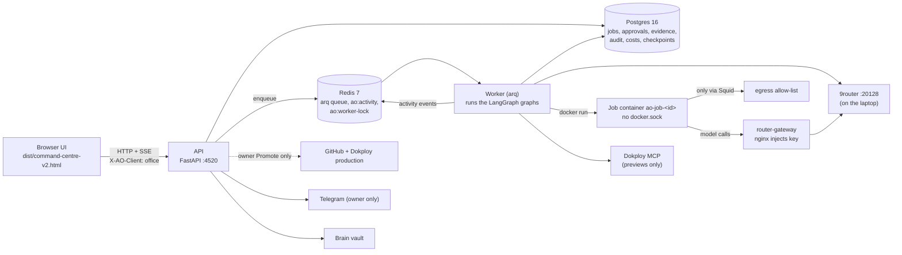
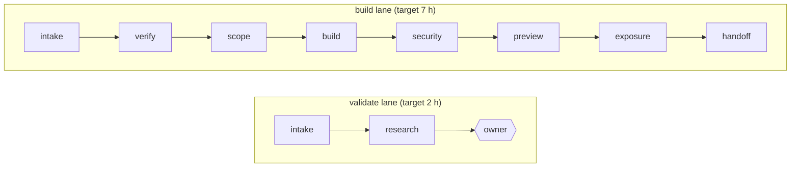

# Agents Office — Master Plan

| | |
|---|---|
| Date | 2026-10-09 (created 2026-10-07) |
| Repo state | branch `main` at `bfc8e7a`, plus 74 uncommitted files |
| Status | **Under owner review.** Order approved 2026-10-10: real runs first, personas last. Brain in Postgres (md backup) and Redis/arq kept. GATE 1 and GATE 2 still open; no code written. |
| Built from | `CLAUDE.md`, `.claude/plans/PLAN.md`, `PROJECT_STRUCTURE.md`, four read-only audits |
| Audit caveat | Audit claims are **unverified until a failing test reproduces them** (rule B1). A claim that does not reproduce is dropped. |

## Read this first

**In one paragraph.** We are turning the Agents Office into a platform that designs, builds, deploys and hands over a SaaS product, web app or other app from a customer request, mostly autonomously, with the owner deciding only at a few important gates. The architecture is sound; time is lost because the build lane has never run end to end, failures are quiet, and the preview was never reached. Order of work: **define every agent persona → make a run cheap, finite and honest → close security holes → prove one real run → cut drag.**

**Where to look**

| I want to… | Read |
|---|---|
| Know what we are building | §13 |
| See what is done vs remaining (UI, LangGraph, features) | §14 |
| Departments, seats, independence from CLAUDE.md, step-by-step | §15 |
| Know why it felt slow | §1 |
| See everything waiting on you | **Needs your attention** (top of this file) |
| See what you already decided | §6 (table at the top) |
| See the work in order | §7 |
| Know when we are done | §8 |
| Know what could go wrong | §10 |
| Check the rules | §2 |
| Look up code, infra, API | §3 |
| See today's live state / audit findings | §4 / §5 |

Section numbers are stable IDs used across the file and in older notes, so they were kept when sections were moved.

**What is decided / open**

| Item | State |
|---|---|
| D1 freeze side parts · D2 governor on (B) · D3 local then Dokploy via MCP · D4 haiku main + nemotron rest · D5 Jobs first · D7 advisory review | **Approved** |
| D6 `check:core` fast loop | **Open** |
| V1–V5 platform vision (§13) | **Recorded**; five questions open |
| Agent personas (Phase P) | **Next** |

**Relationship to other files.** `CLAUDE.md` rules win over everything. `PLAN.md` stays the decision log and the §11 run-results runbook. `PROJECT_STRUCTURE.md` is merged into §3 (not deleted). Neither `CLAUDE.md` nor `PLAN.md` was changed; once approved, add one pointer line in `PLAN.md`. A decision here that reverses `PLAN.md` (D2) takes effect after that line is added.

---

## Needs your attention

Only open decisions. "Rec" is my recommendation. Last updated 2026-10-10 (after owner round 5).

**Settled since the last version (no action):** order of work (real runs first, personas last, §16.10) · brain in Postgres with automatic markdown backup · Redis + arq kept · stack frozen as in §16.9.15 · three Postgres uses: persona catalog, brain, agent memory (§16.10.1).

| # | Decide | Options | Rec | Read |
|---|---|---|---|---|
| 1 | **Persona catalog design (your proposal, reworked):** the catalog indexes every file an agent has (persona, its domain rules, skills, subagent definition) with full-text search over their details; leads search, the pipeline loads the files found by path. Files are copied unmodified into the repo (all 265; only 146 are there today) | accept / change | accept | §16.10.2 |
| 2 | Keep Citadel's 15 domain folders on disk (department is a column in the catalog), or physically move files into the 8 department folders | keep folders / move | keep folders | §16.10.2 |
| 3 | The 8 departments and which Citadel domains go in each; dept 8 "Growth & Customer" dormant | accept / move a domain | accept | §16.9.10 |
| 4 | Seat rule: max 10 per department, lead fills from the bench using the catalog search | accept / change number | accept | §16.9.10 |
| 5 | Sandbox: one throwaway container per department per job; per-agent tools and writable area inside (software-enforced), or one container per role | per department / per role | per department | §16.9.11-12 |
| 6 | Billing in generated apps: Stripe test mode only; Polar/Autumn optional; Lago only as a separate service | accept / other | accept | §16.9.8 |
| 7 | Templates: default open-source starter per product type | accept table / change row | accept | §16.9.8 |
| 8 | Product modes: 14 on two axes. Given the new order, build web SaaS and landing site first; the rest later | accept / change | accept | §16.9.9 |
| 9 | Custom-build fallback when no template fits | accept / change | accept | §16.4 |
| 10 | Web search for the validate lane: SearXNG or your own tool (name it). Not needed for the build lane | SearXNG / my tool | SearXNG, later | §16.9.5 |
| 11 | Retention classes (forever / 90 / 30 / 7 days) and loadout matrix | accept / edit | accept | §16.8 |
| 12 | A failed container check can never be overridden, only re-run | never / owner override | never | §16.8 |
| 13 | Platform changes itself only with your approval each time | confirm | confirm | §16.9.3 |
| 14 | `check:core` goes in `package.json`, `CLAUDE.md` unchanged | yes / no | yes | D6 |
| 15 | This file vs `PLAN.md`: fold into PLAN.md, or amend `CLAUDE.md` | fold in / amend | fold in | B4 |
| 16 | **GATE 2** (do first): commit the 74 uncommitted files on a new branch, no push, after `npm run check` | yes / no | yes | |
| 17 | **GATE 1**: approve the plan so work can start (step 1 = GATE 2, step 2 = finish S2) | Approve | when 1-15 settled | |

Things only you can do outside the repo (no decision, just tasks): provide the search tool if not SearXNG; Dokploy server and DNS; Telegram bot token as an env-var name; confirm the two models exist in 9router; set `AO_API_TOKEN`. Reference notes and warnings are kept at the end of this section.

<details><summary>Reference: guardrails decided, owner tasks, warnings (no action)</summary>

### C. Rules and guardrails: decided so far
| Topic | Decision (canvas 2026-10-09) |
|---|---|
| Departments | Pipeline-driven: 7 Citadel domains active first; all 15 imported; the other 8 dormant |
| Agent source | Citadel agents only, personas imported unmodified |
| Guardrails | Citadel default: hallucination threshold 0.85, 3 retries, **fail closed** (block and park the job for you) |
| Autonomy | Level 3: agents act between gates, you approve key gates |
| Budget | $10 and 500k tokens per run; park at the cap |
| Still undecided | per-department tool allowlists (which tools each domain may call), whether any agent may write outside the job dir, egress allowlist for web research, retention of job artifacts, what counts as "important" for notifications. answered in §16.7: loadouts and retention are proposals awaiting your yes; web search engine name still needed |

### D. Things only you can do (outside the repo)
| # | Task | Blocks |
|---|---|---|
| D1 | Provide the keyless web search/fetch tool (runbook S1b) | research stage |
| D2 | Dokploy: server, wildcard DNS, preview repo; Dokploy MCP is configured locally, tool names still unconfirmed | preview deploy (S5) |
| D3 | Telegram bot token and chat id (S7) as env-var names only | notifications |
| D4 | Confirm `cc/claude-haiku-4-5-20251001` and `oc/nemotron-3-ultra-free` exist in 9router | D4 model rule |
| D5 | Set `AO_API_TOKEN` (needed before exposing the UI beyond localhost; also breaks the SSE stream until fixed, S-04) | security phase |

### E. Warnings (no decision needed, but know them)
- **No run has ever completed end to end.** S2 was last seen at the build stage (2026-10-07; this reading is stale). None of S1–S7 is recorded as passed.
- **74 files are uncommitted** with no rollback point until GATE 2.
- **Citadel personas are boilerplate** (254 of 265). Seat quality will come from the platform layer, not persona text.
- **Agent audit findings are advisory** until a failing test reproduces them (rule B1).
- **Do not touch** `templates/webapp/` or `infra/sandbox/run-job.sh` or restart the worker until S2 finishes.
- **Citadel's deploy/rollback commands and docker/k8s MCP conflict with our rules** and are not exposed to agents.

</details>

---

# Part A. What and why

## 13. What we are building: platform vision and feature decisions

**Target:** a platform that designs, builds, develops, deploys and delivers a SaaS product, web app or other app from a customer request. This supersedes the "make the existing pipeline reliable" framing: reliability (Phases 1-3) is the foundation, not the goal.

| # | Decision | Owner answer |
|---|---|---|
| V1 | Deliverable per job | **Live SaaS + handoff**: deployed app on a URL, repo, docs and admin access handed to the customer |
| V2 | Product types | Whatever the customer asks, mostly web SaaS and websites; must cover web SaaS (auth, billing, dashboard), marketing/landing + simple apps, mobile apps, APIs/internal tools |
| V3 | Design capabilities | Design brief + brand/system, mockups/wireframes for owner approval, generated UI from template. **More options wanted** (open: see below) |
| V4 | Autonomy | **Gated but mostly autonomous.** The owner does not want to interact with routine decisions; agents decide within their persona. The owner decides only at specific, important gates |
| V5 | Order of work | **Define every agent persona first, before building anything else.** No new implementation until the personas are agreed |

**Consequences for this plan**
- New **Phase P (before Phase 0 implementation): agent personas.** For each seat: role, scope, what it may decide alone, what it must escalate, tools, model (haiku main, nemotron others per D4), output contract. Existing sources: `roster_seed.json`, `backend/app/personas.py`, `office.agents.json` overrides.
- **Owner gates list to be decided** (candidates: scope/brief, design approval, verify, handoff, promote, spend). Everything else autonomous. Maps onto existing gates `verify`, `handoff`, `research`.
- **Product-type coverage is a capability gap:** `templates/webapp/` is the only template. Mobile, API-only and marketing sites need templates (or a PWA route) before they can be promised. Decide per type in Phase P.
- **Design is a missing stage** today (brief, brand system, mockups, owner approval). Needs a design department/seat set and a gate.
- **Delivery/handoff** needs: customer URL, repo transfer or access, docs, credentials handoff without putting secrets in files.
- Rules in section 2 stay: previews only by agents, Promote is the owner's endpoint, computed verdicts, no secrets in files.

**Open questions for the owner**
1. More design options beyond the three listed (e.g. design-system library choice, accessibility pass, copy/brand voice, logo/assets, user-flow maps).
2. Per product type: which templates to create first, and in what order?
3. Which gates are the "important" ones the owner always decides?
4. Billing: real payment provider integration in generated SaaS (test mode only?).
5. Customer-facing side: does the customer see a portal, or does the owner relay everything?

## 14. Readiness audit: what is done and what remains (2026-10-09)

Source: three read-only ECC agents (code-explorer, code-architect, architect). Findings are advisory and **unverified until a test reproduces them** (rule B1). Evidence is `file:line` as the agents reported it.

### 14.1 Frontend and backend: connected?
**Verdict: the core flows are connected; side features are not.**

| State | Items |
|---|---|
| **Done (UI call matches a live route)** | Tasks (create, list, delete, approve, reject, run, revise); routines (create, list, delete); jobs (list, create, detail, gates, retry, kill, promote, SSE stream, inbox); chat; activity feed; MCP and agents lists; usage, brain, health. `X-AO-Client` header is added to every `/api/` call (`src/api.js:14-24`). No UI call lacks a backend route. |
| **Remaining: backend with no UI** | skills, lessons, bench, brain proposals; job consult, spawn, archive; routine edit, pause, resume, run-now |
| **Remaining: UI on static data** | top-bar KPIs show 0 (not fed from `/api/usage` or `/api/jobs`); roster, layout and seats come from `data.js`, although `/api/agents` is fetched; Brain screen agent list; file-generation and approval-prompt content |
| **Remaining: behaviour** | Calendar cannot schedule future tasks (ADD always runs now). If `AO_API_TOKEN` is set, the live job stream breaks because `EventSource` cannot send `X-AO-Token` (untested; ties to S-04). |
| **Not verified** | Whether `dist/command-centre-v2.html` is rebuilt from the modified `src/` |

### 14.2 LangGraph and LangChain
**LangChain is used only as a model client and MCP adapter layer** (`llm.py:123-127`, `connectors/mcp_client.py:18`). No chains, agents, retrievers, memory or vector stores. `langsmith` is not pinned.

| State | Items |
|---|---|
| **Done** | Pipeline `StateGraph` with intake, per-stage work/review/gate nodes, park, finish, resume (`pipeline/graph.py:275-320`); Postgres checkpointing in API and worker (`main.py:68`, `jobqueue.py:164-177`); `interrupt()` owner gates and parked jobs; resume by `Command(resume=...)`; `park_interrupted()` after restart; arq worker with in-process fallback; separation of duties per stage (`config.py:21-32`) |
| **Partial** | No streaming (UI polls events); personas used only for spawned sub-agents (off by default); tool-calling only in the chat specialist (`engine.py:160`), not in pipeline stages; MCP adapters only for Dokploy and GitHub; only 4 departments live |
| **Remaining to add to the stack** | (1) design stage and department; (2) sub-graphs or a template router per product type; (3) prebuilt tool-calling loop for stage work with MCP tools bound as LangChain tools; (4) memory and retrieval: LangGraph `Store` plus a retriever over the brain; (5) opt-in tracing (LangSmith or Langfuse) with secret redaction; (6) evaluation harness replaying the bakery job against the computed gates; (7) `astream` into SSE; (8) handover sub-graph; (9) wire `personas.py` into stage leads' prompts; (10) `RetryPolicy` and `Send` fan-out |

### 14.3 Feature readiness against the platform vision
| Feature | Status | Note |
|---|---|---|
| Intake | **Done** | rules-based; deposit check for client work |
| Security scan | **Done (core)** | rules-based evidence; no pen-test or threat model |
| Exposure tiers | **Done (code)** | probes and rolls back; unrun live |
| Budget caps | **Done (code)** | per-lane; runbook S4 not run |
| Research | Partial | rubric computed; web tool not bound (S1b) |
| Verify | Partial | model judgement, not computed |
| Scope | Partial | hard-wired to the web stack; only check is 1+ criterion |
| Build + test | Partial | tests run inside build checks; no check against acceptance criteria; S2 not recorded |
| Preview deploy (Dokploy MCP) | Partial | tool names unconfirmed; S5 not passed |
| Promote | Partial | owner endpoint exists and is pinned; S6 not run |
| Handoff / delivery | Partial | memo only: no repo transfer, docs bundle, credentials handoff or portal |
| Notifications | Partial | Telegram only, S7 not run |
| Personas | Partial | loader exists; Phase P contracts not agreed |
| Owner gate policy | Partial | configurable; which gates always apply is open |
| Design stage | **Missing** | no stage, seat or gate |
| Billing in generated apps | **Missing** | template has auth and DB, no payment provider |
| Mobile, API, marketing templates | **Missing** | only `templates/webapp/`; scope forbids other stacks |

**Overall.** The code covers the reliable core of a web-app MVP: intake to private preview plus a handoff memo. It does not yet design products, deliver to a customer, or build anything but web apps. None of the laptop runbook steps S1-S7 is recorded as passed.

### 14.4 What this changes in the plan
- Phase P also covers the stage leads' persona wiring (14.2 item 9).
- New work items, not yet scheduled: design stage; template router and extra templates; handover sub-graph; billing (test mode); streaming; tracing and eval; UI wiring of the static screens and unused routes.
- Run-proof work (Phases 1-3) stays the foundation: the above is built on a lane that has never completed a real run.

## 15. Agent platform design: departments, seats, independence (proposal for owner decision)

**Inputs.** Owner: use Citadel's 15 domains and everything an agent has in Citadel; agents isolated, independent of `CLAUDE.md`, built on LangGraph + LangChain. Evidence: two read-only agents (advisory, unverified until tested). Items 2, 4, 5, 6 of the web research were not source-checked.

### 15.1 What Citadel really gives us
| Citadel part | Real or boilerplate | Use |
|---|---|---|
| 265 registry agents, 15 domains | **Boilerplate**: 254 personas are one template (`tools: []`, `skills: []`); only role text and tier differ | Use as a **registry/data**, not 265 nodes. One generic node factory (role line, tier, tools from config) |
| 11 hand-written subagents (code-reviewer, api-tester, security-auditor, deploy-agent, …) | **Real**: tool allowlists, disallowed tools, model, permission mode | Reuse as the real seat definitions for QA, security, engineering, docs. Do **not** bind `deploy-agent` to production |
| SafetyGovernor (budget, kill switch, confidence gate) | Real code | Keep (D2 = B) |
| Supervisor (autonomy 0–5), Router (domain:type → fallback), Planner (max 3 replans) | Real code | Map to LangGraph supervisor node, conditional edge, plan/critique loop |
| Rules (guardrails, security: deny-by-default, HITL, token budgets) | Real, short | Inject per domain into the platform rules file |
| Hooks, 38 commands, docker/k8s MCP, deploy/rollback | Real but **conflict with our rules** | Do not expose to agents (preview-only, no Docker socket) |
| Obsidian/wiki rules, OpenHands `config.toml` | Irrelevant | Skip |

**Owner decision (canvas 2026-10-09): only Citadel agents are used, imported with their own personas and everything they carry, into our own setup.** So: no agents outside Citadel, no hand-authored replacements. The 265 registry entries and the 11 hand-written subagents are imported as they are (vendored, unmodified, per `PROVENANCE.md`). What we add around them is configuration only: which department a seat belongs to, its tier/model, its tool allowlist, its budget, and the platform rules. Known limit to accept: the 254 generated personas differ only in role text and tier, so a seat's real behaviour comes from the platform layer (rules, guardrails, tools, model), not from persona depth. Persona text can be extended later by *adding* a platform overlay file, never by editing the vendored file.

### 15.2 Departments and seats (recommendation)
**Decided (canvas): pipeline-driven, 7 domains first.** All 15 Citadel domains are imported as the department catalog; only the 7 the pipeline needs are active, the rest dormant. Waves below. A department is inactive (no cost, no seats running) until its wave.

| Wave | Departments (Citadel domain) | Seats each | Why now |
|---|---|---|---|
| **1: core** (needed for web SaaS idea → preview) | Executive & Strategy · Product & UI/UX Design · Engineering & Backend · Frontend & Mobile · DevOps & Infrastructure · Security & Compliance · QA & Testing | 1 lead + 2–3 specialists (~3–4) → **≈ 24 seats** | covers the full pipeline incl. the missing design stage |
| **2: delivery & money** | Customer Success & Support (handoff) · Finance & Billing (SaaS billing, pricing) · Legal & Governance (ToS, DPA) · Data & Analytics | 1 lead + 1–2 | needed for handoff, billing, compliance |
| **3: growth** | Marketing & Growth · Sales & Revenue · Content & Communications · HR & People | on demand | not on the build path; frozen until needed (D1) |
| Shared | The Brain (memory/retrieval) | 1 | keeps current role |

Why not all 15 live: the research agent's (unsourced) judgement is that coordination cost dominates beyond ~5–8 reports per supervisor or ~4–5 handoffs per job. Wave 1 is 7 departments under one executive supervisor. **Seat counts per department are still to be confirmed** (default: 1 lead + 2–3 specialists chosen from that domain's Citadel agents).

### 15.3 Independence from CLAUDE.md (architecture)
1. Each agent's prompt = its imported Citadel persona file (unmodified) + one shared `platform-rules.md` (new, in the repo, not `CLAUDE.md`). `CLAUDE.md` governs only the developer assistant.
2. Workers run with **no ambient settings**: Agent SDK `settingSources=[]` and a string system prompt (not the preset); for the CLI worker use the equivalent flag (**unverified**, confirm against the real CLI). Job working directory has no `CLAUDE.md` in it or any parent.
3. **Test it:** ask the agent to quote any `CLAUDE.md` text it sees; assert empty. Two GitHub issues dispute how reliably `settingSources` behaves, so the test is mandatory.
4. Per-agent policy map in config (tools allowlist/denylist, model tier, budget), enforced by a pre-tool hook; never in prompts.
5. LangGraph: one **supervisor subgraph per department**, seats as worker nodes, Postgres checkpointer plus a Store namespace per agent, shared facts under a job namespace; only a handoff payload crosses departments.
6. Hard rules carried into `platform-rules.md` (copied from `CLAUDE.md`, because agents will no longer read it): previews only, no production/marketing/outreach/spend, no secrets in files, no Docker socket, computed verdicts only.

### 15.4 Step-by-step (replaces the vague Phase P; no implementation before step 1 is approved)
| Step | Work | Output | Gate |
|---|---|---|---|
| **P1** | Owner confirms 15.2 (waves, seat counts) and the §13 questions | decision record | **owner** |
| P2 | Seat sheet per Wave-1 seat: which Citadel agent fills it, department, tier/model, tool allowlist, what it decides alone vs escalates, budget. Personas imported unmodified | seat sheet (config, not new persona prose) | **owner approves sheet** |
| P3 | Write `platform-rules.md` and the policy map (tools/model/budget per agent) | files + test that Promote/prod are unreachable | security-reviewer |
| P4 | Isolation proof: `settingSources=[]` worker + "quote CLAUDE.md" test (SDK and CLI worker) | red test then green | none |
| P5 | Generic node factory + department subgraph skeleton (LangGraph), Store namespaces, registry loader (265 as data) | one department running end to end behind a flag | none |
| P6 | Add the **design** department and gate (brief → brand → mockups → owner approval) | new stage in `DEFAULT_STAGES` + tests | **owner design gate** |
| P7 | Wire Wave-1 departments into the existing stages; keep computed verdicts and separation of duties | stages use persona nodes | existing gates |
| P8 | Then Phases 0–3 of §7 (safety net, run honesty, security, prove one real run), with D4 models | S2 recorded in `PLAN.md` §11 | per §7 |

Waves 2–3 start only after one Wave-1 run completes end to end.

### 15.5 Open decisions
Moved to **Needs your attention** at the top of this file (single list).

## 16. Your questions answered (canvas round 2, 2026-10-09)

Section 16 answers your notes fb-27 to fb-39 in the order of the "Needs your attention" list. The registry holds **265** agents, not 250 (counts in the Appendix F list).

### 16.1 A1: Roster proposal (lead + 5 specialists per active department)

**How I chose.** An agent is picked only if (1) it maps to work our pipeline really does, (2) it does not overlap with another pick, (3) it is allowed under our hard rules (previews only, no production, no spend, no outreach), (4) its description is concrete enough that a persona file can drive it. Everything passed over stays imported and dormant, so any pick can be swapped later without code changes. **Seats are not workers running at the same time.** A seat only runs when its stage runs, inside the $10 / 500k budget.

Heads-up: the current `DEFAULT_STAGES` maps only exec/engineering/secdata/devops and names leads like `exec-vp-engineering`, `devops-cd` and `sec-compliance`. **Design, Frontend and QA have no stage yet**, and `devops-cd` is a deployment-execution persona, so it must not lead a previews-only department. Adding stages and changing leads is Phase P work.

| Domain | Lead | 5 specialists | Why these | Passed over (why) |
|---|---|---|---|---|
| Executive (12) | `exec-cpo-product` | `exec-cto-technology`, `exec-coo-operations`, `exec-cfo-finance`, `exec-competitive-intel`, `exec-decision-logger` | Lead: our owner gates (scope, verify, handoff) are product decisions. CTO decides template vs custom. COO coordinates and writes the handoff. CFO owns unit economics and the budget cap. Competitive-intel feeds verify. Decision-logger = the run log the owner reads. | CEO-strategist (company level, not per job), CMO/VP-sales (marketing and sales are out of scope), OKR-tracker and board-reporter (no company to report to), VP-engineering (overlaps CTO) |
| Product & UI/UX Design (20) | `design-ui` | `design-wireframe`, `design-user-flow`, `design-system`, `design-color`, `design-a11y` | Wireframes and user flows give you something to approve. Design-system and color give brand tokens that the template consumes. A11y is cheap now, costly later. | Typography (fold into design-system), responsive (frontend covers it), UX-research (needs real users we do not have), prototype (static mockups are enough), animation, icon, illustration (later) |
| Engineering & Backend (25) | `eng-api-designer` | `eng-model-builder`, `eng-auth-builder`, `eng-migration-gen`, `eng-service-builder`, `eng-code-reviewer` | Contract first (API), then data, auth, migrations, logic, review. This is the order a SaaS backend is built in. | `eng-multi-tenant` (first swap-in if a product is multi-tenant), `eng-webhook` and `eng-email` (needed once billing or email ships), cache/search/websocket/graphql (on demand). **Caution:** several descriptions assume Python/Pydantic while `templates/webapp/` is TypeScript, so personas may suggest the wrong stack until the platform rules pin it. |
| Frontend & Mobile (18) | `fe-page` | `fe-component`, `fe-layout`, `fe-form`, `fe-auth`, `fe-api-client` | The template is Next.js; these cover shell, screens, forms, login and data calls. | `fe-table`, `fe-chart` (first swap-ins for dashboards), `fe-seo` (marketing sites), `fe-a11y` (design and QA cover), `fe-pwa` (mobile later) |
| DevOps (28) | `devops-ci` | `devops-image-build`, `devops-image-scan`, `devops-release`, `devops-debugger`, `devops-dns` | We build an image, scan it, deploy a preview, diagnose failures and point a preview URL. | `devops-cd`, `-canary`, `-rollback`, `-k8s`, `-helm`, `-terraform`, `-gitops` (deploy or cluster tooling that breaks "previews only, Promote is owner-only"), monitoring/alerts (post-launch wave) |
| Security (22) | `sec-vuln` | `sec-sast`, `sec-sca`, `sec-secret`, `sec-container`, `sec-dast` | Lead turns findings into a ranked list. The five map to the scans our security stage already runs. Verdict stays computed by code, personas only explain. | `sec-compliance` (certifications are not a preview concern), runtime/policy/network (no cluster), `sec-pentest` (offensive; needs a written authorisation), `sec-iac`, `sec-pii` (swap-in later) |
| QA & Testing (22) | `qa-e2e` | `qa-unit`, `qa-api`, `qa-a11y`, `qa-visual`, `qa-smoke` | Match `npm test`, `npm run test:e2e` and `/healthz`. | integration, load, mutation, chaos, flaky (later) |

Total 7 x 6 = **42 seats** (my earlier "about 24" was lighter). Cheaper alternative: 1 lead + 3 specialists = 28. **You decide.** The 11 hand-written Citadel subagents (`code-reviewer`, `security-auditor`, `api-tester`, `database-explorer`, `deploy-agent`, `documentation-writer`, `guardrails-validator`, `incident-responder`, `obsidian-curator`, `performance-profiler`, `wiki-curator`) are the only ones with real tool lists. `deploy-agent` stays unexposed.

### 16.2 A2: Owner gates explained

A gate is a point where the job stops and waits for your click. Fewer gates = fewer interruptions but more risk.

| Gate | What you see | If skipped |
|---|---|---|
| Scope/brief | What will be built, template or custom, estimated cost | wrong product built, budget burned |
| Design approval | Mockups and brand tokens | UI rebuilt after code exists |
| Verify | Is the idea worth building (market evidence) | build things nobody wants |
| Handoff | Finished preview + docs + checks report | you learn of problems at Promote time |
| Promote | Production release | **never skippable**, owner-only by rule |
| Spend over cap | Job hit $10 / 500k tokens | the job stays parked until you raise it |

Recommendation: scope, design, handoff, promote, spend-over-cap always. Verify only for the validate (own idea) lane.

### 16.3 A3: Extra design outputs
From the repo: nothing exists for design today (no stage, no template tokens). From Citadel: 20 design personas. Researched list in 16.8. Short list, with what each produces: user-flow map (diagram), accessibility pass (checklist + fixes), design tokens (colors, type, spacing as a file), responsive spec, empty/error-state copy. No image generation with our models, so logos are SVG only.

### 16.4 A4/A5/A6: Templates, custom builds, billing, portal

**Templates found online (researcher; stars and licenses read from the repo pages, last-commit dates not seen):**

| Need | Pick 1 | Pick 2 |
|---|---|---|
| Web SaaS (auth+billing+dashboard) | `nextjs/saas-starter` (MIT, 16.2k stars; Drizzle, Stripe, shadcn, RBAC) | `fastapi/full-stack-fastapi-template` (MIT, 45.9k; no billing) |
| Marketing/landing | Astro starters (MIT) | Next.js static export + shadcn |
| Mobile | Expo templates (MIT) | Flutter `create` (needs heavier worker image) |
| API only | FastAPI backend half | Hono (unverified) |
| Admin/internal tools | `react-admin` (MIT; library) | refine (unverified) |
| LangGraph backend reference | `langgraph-checkpoint-postgres` docs (unverified); the supervisor repo is **archived**; no template has supervisor + Postgres + tool policy + FastAPI, so our backend is already ahead. | |

Our `templates/webapp/` is already Next.js + Drizzle + Playwright; it stays the base (nextjs/saas-starter is close to it). Mobile can only be checked by lint/unit/web export in our sandbox, which is a limit on the gate, not on the template. Researcher caveat: only direct repo fetches, no forum sweep; rows marked unverified need a check before vendoring (also check the dependencies' licenses).

**Custom builds (fb-31): my view: yes, template-first with a computed fallback.** Rule: choose from a fixed menu plus a "none" option, by comparing the brief's required capabilities to each template's declared list, not by model prose. Use a template if it covers about 70% and the rest is additive. Go custom if the stack is mandated and differs, a core requirement conflicts (e.g. multi-tenant model vs single-user template), the template fails its own gate in the sandbox, or its licence is not MIT/Apache/BSD. A custom build still starts from the nearest template's Dockerfile, `/healthz`, tests and `start` script so the gates apply. If a template build fails its gate twice, retry once custom, then ask you. Custom builds are a **scope gate** decision you see.

**A5 billing explained.** Many SaaS apps charge their own users (subscriptions). "Billing in generated apps" means the app we build can take payments through a provider such as Stripe. We would wire it in **test mode only** (fake cards), and you add live keys yourself at Promote. It is unrelated to our own budget cap. The `saas-starter` already has Stripe wired.

**A6 portal, your answer.** You said some products live in a customer portal for their own product, while others are paid services. So intake records a **product mode**: (a) *portal product*: the customer logs in to their own area, no billing needed; (b) *paid service*: billing required. The template menu then includes billing only for (b). Portal for **our** clients to watch builds (the owner relaying) stays "owner relays" for now.

### 16.5 A7: What `CLAUDE.md` is doing here
You are right to ask. `CLAUDE.md` is only the rule file for the **developer assistant** (me, Claude Code, working in this repo). The platform backend (LangGraph) never loads it: I searched `backend/app` and `infra`; the only mentions are a comment in `roster.py` and a prompt line in `worker/base.py` that points at the **generated app's own** `CLAUDE.md` inside `templates/webapp/`. The container worker already runs `claude --bare` (`worker/claude_code.py:31`), and the installed CLI also has `--setting-sources`, so the flag question from §15.3 is answered: both exist (confirm behaviour with the "quote CLAUDE.md" test). Consequences:
1. Platform agents get their rules from `platform-rules.md`, not `CLAUDE.md`.
2. D6 (`check:core`) is a dev-loop convenience for **me**; it edits `CLAUDE.md` only because that file lists my loop. It is not a platform feature. Default: skip the `CLAUDE.md` line, put the script in `package.json`.
3. B4 (a second plan file next to `PLAN.md`) is a developer-process question. Recommendation: fold into `PLAN.md` after approval.
Backend templates: see the table in 16.4.

### 16.6 A8: D2 = B explained
The SafetyGovernor is Citadel's budget and kill-switch guard. "B" means it is the single place that says stop. Before: our own budget code and Citadel's both existed. With B, each model call asks the governor first: over $10 / 500k tokens or kill switch flipped means the call is refused and the job parks for you. Why B: one authority, so no double counting and no job that one guard stops while the other keeps going. What it costs: the three defects listed under D2 must be fixed first, and PLAN §19 pointed the other way, so it needs your yes (B3). Ask me if any row of the D2 table is unclear.

### 16.7 A9: Rules, agent loadouts, web search, retention
(Wording note: I read your "loudest" as **loadout**: the set of tools, folders and network access each agent gets.)

- **Loadout** is a per-agent policy: tools it may call, folders it may read, folders it may write, and network access. Citadel's 254 generated personas have empty tool lists, so the platform supplies the loadout in the policy map (§15.3 step 4). Proposed matrix and sandbox facts: see 16.8.
- **Web search.** The engine is not in this repository. `connectors/web.py` only defines the port: the owner's keyless MCP search tool, bound by name in `office.config.json`; built-in fetch exists, built-in search does not. Web access runs on the host in the research stage only, never in a container that holds client code. I found no tool name, URL or path in the repo or `.env.example`. **Please tell me its name or where its notes are** (that is step S1b).
- **Retention of job artifacts** means how long we keep what a job leaves behind: the workspace files, build logs, screenshots, checkpoints and the research memo. Disk fills up otherwise. Proposal: memos, handoff reports and decisions kept forever; deliverable previews 90 days; failed or parked job workspaces 30 days; logs and checkpoints 30 days; nothing deleted while a job is parked. Researched version in 16.8 (adds a 7-day delete class and pinning).
- **Rules table (section C)** is updated for your changes: models (D4), D2 = B, D3 = C, D7 = C, Citadel-only agents, loadouts per agent, product mode, template menu.


### 16.8 Loadouts, design outputs and retention (research results)
Source: one research agent plus a read of `sandbox.py` and `infra/sandbox/`. Advisory. Items marked **U** were not checked against a source.

**What the sandbox already enforces (read from code).** One throwaway container per job; non-root user, all capabilities dropped, read-only root filesystem, 4g memory, 2 CPUs, 512 processes; two mounts only (`/workspace` and `/out`, both read-write, paths checked); no Docker socket; network is internal-only with two exits: the allow-listed `egress` proxy and `router-gateway`, which holds the model key so the key never enters the container.

**Gaps found.**
1. The container spec is identical for every role. Every role can write the whole workspace and has the same network.
2. No per-role tool list exists. The worker also runs with `--dangerously-skip-permissions` (`worker/claude_code.py`), so the container is the only boundary.
3. Web search is not specified for containers (by design it is host-side only).
4. `/out` is writable by the agent, so a hostile agent could tamper with `exit_code` or check results. Make check results host-verified.

**Proposed loadout matrix.** KB = a new read-only mount holding the job's brief, brand and design tokens. GW = router-gateway. PKG = package registry proxy. WEB = a host-side search/fetch tool reached through GW.

| Role | Tools | Reads | Writes | Network |
|---|---|---|---|---|
| Designer | Read, Grep, Glob, Edit/Write limited to `design/` | KB, template (ro) | `workspace/design/**` only | GW + WEB; no PKG |
| Backend dev | Read, Edit, Write, Bash (npm, node, git, tests) | workspace, KB (ro) | `server/ api/ db/ tests/` | GW + PKG |
| Frontend dev | same, edits limited to UI paths; Playwright via Bash | workspace, KB, design (ro) | `src/ public/ e2e/` | GW + PKG |
| DevOps | Read, Edit limited to Dockerfile, start script, deploy config | workspace | those files only; never secrets | GW; PKG while building; no deploy credentials |
| Security scanner | Read, Grep, Bash limited to audit and scan tools | workspace (ro) | `out/security/` only | none |
| QA | Read, Grep, Bash limited to `npm test`, `test:e2e` | workspace | `tests/ e2e/`, `out/qa/` | localhost only |

How to enforce: (a) a role-to-tools map in config passed to the CLI as allow/deny lists with `dontAsk` mode (flag names **U**, confirm against the installed CLI); (b) per-role read-only bind mounts and no-egress networks, which is the only part a hostile model cannot talk its way around. Tool lists alone are advisory against prompt injection; (c) per-role `/out/<role>/` folders so one role cannot overwrite another's evidence.

**Web search design (the "where does the right hand read" question).** Search and fetch run **on the host** as a tool the container reaches only through the gateway (e.g. a `/tools/web` route). The host tool blocks private/metadata addresses, caps size, strips to text, labels results untrusted, logs and rate-limits per job. Designer and research get it; the security scanner does not. Our `connectors/web.py` already does the SSRF guard and size cap; it still needs your search tool bound (S1b).

**Design outputs, top 5 (all text, so free models can do them).**
1. Design tokens (JSON) with a computed colour-contrast check.
2. User-flow map (Mermaid) plus screen inventory.
3. Component inventory: each need mapped to reuse / extend / new template component.
4. States and microcopy: empty, loading, error, denied, in a strings file (gives i18n free).
5. Accessibility and responsive checklist, verified by an automated axe/Playwright check (new check **U**).
Runners-up: SEO/Open Graph copy, analytics event plan, data-model sketch. Skip images; logos become SVG wordmarks. Each deliverable is machine-validated, not approved by model prose.

**Retention: what it means.** How long we keep what a job leaves behind (files, logs, traces) before deleting it. The policy below is a judgment, not a standard.

| Class | Keep | What |
|---|---|---|
| Forever | indefinitely | job and verdict rows, final brief/brand/design files, the promoted build's source bundle and checks, your approvals and audit log, template version per job |
| 90 days | 90 d | preview-build bundles (at least the latest 3 per project), security scan output, agent logs and full model traces; cost aggregates stay forever |
| 30 days | 30 d | failed-build workspaces, Playwright traces and screenshots, egress logs, superseded design drafts |
| Delete soon | ~7 d | per-job workspace copy after its bundle is archived, caches, superseded stage drafts |
Plus: never store secrets (redact before storing), a nightly cleanup with a pid-file lock and a dry-run report, a disk ceiling that deletes the 30-day class first, and a per-job **pin** so you can exempt a job.

**Questions for you (A9).** (1) Accept the loadout matrix, or change a row? (2) Accept the retention classes or change the numbers? (3) Name or location of your search tool. (4) Should a failed container check ever be overridden by you? (my view: no, only a re-run).


### 16.9 Round 3: your answers recorded and how all 265 agents fit

**Decisions recorded (canvas 2026-10-09 14:39).** No agent outside Citadel, ever (no custom-built personas). A2 approved as recommended. A3: add the Citadel design/frontend/UI agents fully. A4: use already-built, already-deployed projects' stacks as templates. A7: `CLAUDE.md` is used only to build the platform; after that only the platform is used (see 16.9.3). A8: D2 = B approved.

**16.9.1 How every Citadel agent is included.** The repo already has the mechanism (`pipeline/spawn.py`, `seed/bench.json`): each department has **seats** (standing members who run when their stage runs) and a **bench** (the rest of that department's Citadel agents, which the lead can call on demand). Rules already enforced there: only a lead, only its own department's bench, at most `spawn.max_per_stage` per stage (now off, max 3 when on), depth 1, cost on the job meter, output is information only and never a verdict.

So "use every agent" becomes:
1. **All 265 imported** and indexed with their capability text (the registry description).
2. **Core seats** per department stand in every job of that kind. Bigger than my first proposal for Design, Engineering, Frontend and DevOps (below).
3. **The rest are bench**: the lead picks by matching the brief's needed capability to the registry description (computed menu, not model improvisation), spawns, and the result lands in the job record.
4. **Dormant departments** (8 of 15) stay imported; their agents are bench for the Executive lead until the department is switched on.

Proposed core sizes (you set the numbers): Design 10, Engineering 10, Frontend/Mobile 9, DevOps 8, Security 7, QA 7, Executive 6 = **57 seats**; the remaining ~170 agents are bench. Cost note: seats run only for their stage; cost stays under $10 / 500k tokens per run.

| Domain | Core seats (adds to the 16.1 list) |
|---|---|
| Design (10) | `design-ui` (lead), wireframe, user-flow, design-system, color, a11y, **+ typography, responsive, prototype, onboarding** |
| Engineering (10) | `eng-api-designer` (lead), model-builder, auth-builder, migration-gen, service-builder, code-reviewer, **+ middleware, multi-tenant, error-handler, config** |
| Frontend/Mobile (9) | `fe-page` (lead), component, layout, form, auth, api-client, **+ table, chart, state** |
| DevOps (8) | `devops-ci` (lead), image-build, image-scan, release, debugger, dns, **+ cert, logs** |
Security, QA and Executive stay as in 16.1. Mobile-specific agents (`design-mobile`, `fe-pwa`) are bench until a mobile template exists.

Remaining caution: a bench agent that turns out to be deploy- or cluster-oriented (e.g. `devops-cd`, `-k8s`) is **blocked by the loadout policy**, not by hiding it. It exists but its tools are denied.

**16.9.2 A5: Billing explained (own section, as you asked).**
- *What it is.* Some products we build charge their own end users, for example a monthly subscription. "Billing" is the code in that product that takes the payment: a pricing page, a checkout, a customer's subscription status, invoices, and the rules that unlock paid features.
- *Provider.* Usually a payment company such as Stripe. The product talks to it through its API and receives notices (webhooks) when someone pays, cancels or fails to pay.
- *What the platform does.* Builds all of that with the provider's **test mode** (fake cards, fake money). You then add your live provider account and live keys yourself when you Promote. Agents never hold live keys and never move real money (hard rule).
- *What it is not.* It is not our own cost control ($10 per run budget) and not charging you.
- *Who needs it.* Only the "paid service" product modes (see A6). Portal products and marketing sites skip it.
- *What it takes.* A template that has it (`nextjs/saas-starter` does), the agents `eng-webhook` and `eng-email` on the core list when the mode is paid, and a QA check that the checkout works in test mode.
- *Risk.* Wrong entitlement logic (a user paying but locked out, or the reverse). Mitigation: a computed test that walks subscribe, cancel and fail-to-pay.

**16.9.3 A7 consequence: the platform must stand on its own.** If Claude Code is no longer used here after the platform exists, then (a) every rule agents need must live in `platform-rules.md`, not `CLAUDE.md`; (b) maintenance of the platform itself (fixes, new templates) needs a path that is not me: proposal is a "platform maintenance" lane run by the platform's own agents on a copy of its own repo, gated by your Promote; (c) `check:core` (D6) goes into `package.json` only. This is a design decision for you: do you want the platform to be able to modify itself (gated), or will you accept manual updates?

**16.9.4 A4: templates from your own projects.** I need the list: the repos or folders of your already-built and already-deployed products. I cannot see them from here. For each I record stack, license (yours), whether it builds and tests, and which product mode it serves. The online starters from 16.4 are the fallback.

**16.9.5 A6: Product modes (research result, provisional).** Evidence is thin: the researcher ran one web search and opened no pages, so only the tenancy points are source-backed (shared vs dedicated instance, and that architecture limits which pricing models fit). The rest is engineering judgement. You asked for the deepest research, so treat this as a first draft; a second, deeper pass is available on request.

**How many modes?** Three independent choices: about 17 product types x 8 ways to earn x 4 tenancy styles x 3 delivery styles. Too many to ask about, so intake picks one of **12 bundled modes** and sets three flags.

| # | Mode | Core capabilities | Template hint | Main risk |
|---|---|---|---|---|
| 1 | Marketing / content site | forms, SEO, CMS | static or webapp, no auth | low |
| 2 | Internal tool / admin | login, roles, CRUD | webapp, single-tenant | scope creep |
| 3 | Client portal | client login, documents, invoices | webapp, one per client | access leaks |
| 4 | B2B SaaS, multi-tenant | organisations, roles, billing, audit log | webapp + tenant isolation | tenant data leak |
| 5 | B2C SaaS / freemium | social login, plans, limits | webapp + billing | abuse, churn |
| 6 | E-commerce store | catalog, hosted checkout, tax | hosted checkout (no card data on us) | payments, refunds |
| 7 | Marketplace | two sides, payouts, disputes | webapp + payout provider | payments liability |
| 8 | Booking / directory / community | search, calendar, moderation | webapp + search | moderation, abuse |
| 9 | API / platform | keys, rate limits, metering, docs | API service + OpenAPI | breaking changes |
| 10 | AI app | model gateway, per-user cost caps, guardrails | webapp + gateway | cost, prompt injection |
| 11 | Mobile app / PWA | push, offline, store release | PWA first, native later | store rejection; platform cannot create store accounts |
| 12 | Extension / CLI / library | packaging, permissions, docs | package template | supply chain |

**Flags set at intake (not separate modes).** Earning: free, freemium, subscription, usage, one-time, commission, ads, none. Tenancy: single, multi, per-client, white-label. Delivery: preview-only (default), client-hosted, we-host (production still only through your Promote).

**Questions intake asks, in order.** 1) Who uses it and who pays: you, a client, or end customers? 2) What is its one core job? 3) Web, mobile, API only, or extension/CLI? 4) How does it earn, and who owns the payment account? 5) How many customers share it, must their data be isolated, is reseller branding needed? 6) Payments, personal or health data, children, or a regulated sector? 7) Who hosts it afterwards and who owns the repo, domain and accounts? 8) Required logins and integrations? 9) Scale, uptime, budget, deadline?

**Effect on the pipeline.** The mode decides the template (and custom-build fallback), whether billing is built (modes 4-7, 10 with a paid flag), which departments are seated (secdata is always on for login, payments or personal data; legal/compliance wakes for payments, ads, personal data, AI), and which tests the QA lane runs. Marketing, outreach and spending stay owner-only in every mode.

**A9 Search setup (research result; sources opened: SearXNG docs, the official `fetch` MCP readme; pricing from search results).**
- **What the repo already has:** `connectors/web.py` takes a `web.search` and `web.fetch` block in `office.config.json` (command, tool, arg, env). Built-in `HttpFetch` has an SSRF guard (every redirect hop, 5 requests, 1.5 MB, 12k chars). It has **no search**. `research.py` caps 12 searches and 20 fetches, a FAIL verdict needs 6 queries and 3 fetches, quotes must appear verbatim in the fetched page. Today `tools.web` is false and no `web` block exists, so S1b is open: **your keyless tool's name is not in the repo.**
- **Recommendation:** self-hosted **SearXNG** in Docker for search (keyless, JSON API, loopback only, read-only, cap_drop ALL), plus our own `HttpFetch` for fetch (upstream `fetch` MCP only as fallback; it has no SSRF protection of its own). A ~40-line host-side wrapper calls SearXNG and returns title, url and a 300-char snippet. Enable only duckduckgo, brave, startpage, wikipedia, mojeek engines; limiter off (single local user, rate limit in the wrapper).
- **Alternatives rejected:** Brave API (free tier removed Feb 2026, needs a card), Tavily (free but needs a key), Exa (key, conflicting prices), Crawl4AI/Firecrawl self-host (heavy, a browser fetching hostile pages), DuckDuckGo scraper MCPs (fragile fallback only).
- **Egress:** SearXNG and the fetcher go through a host forward proxy that denies private ranges (127/8, 10/8, 172.16/12, 192.168/16, 169.254/16, host.docker.internal), http/https on 80/443 only. This also closes a DNS-rebinding gap in today's `check_url`. Job containers get **no web access**; only the host-side research stage calls these tools.
- **Caps per job:** 12 searches, 20 fetches (already in config), 8 results per search, 15 s timeout, per-job counter in the wrapper too, all returned text fenced as untrusted, every call audited.
- **Unverified (test on the laptop):** that the upstream engines stay unblocked from your IP, and that Docker Desktop for Mac honours the proxy-based egress rule.
- **Your decision:** is your own keyless tool something other than this? If yes, give its name or command and S1b binds it instead; if no, I build SearXNG as above.


**16.9.6 Round 4 decisions (canvas fb-51..56, recorded; research for A4/A5/A6 running).**
- **A1 seats:** each department holds at most **10 seats** (the UI renders 10). The rest of its Citadel agents are bench, imported fully into the backend. When a task reaches the lead, the lead assigns seats from the bench up to 10. This replaces the fixed 57-seat core in 16.9.1; the existing spawn mechanism keeps its rules (lead only, own department, audit logged, output is information only).
- **A4 templates:** use **online open-source projects, products and services**, not your own repos. Your deployed-projects list is no longer needed.
- **A5 billing:** find existing GitHub billing projects and embed one instead of building billing ourselves. Licence (AGPL vs permissive) is the main thing to check.
- **A6 product modes:** redo the research from real sources, with Odoo-style standard setups for automations as a reference.
- **A7:** manual updates only. The platform does not modify itself automatically; it may do so only on your explicit approval each time.
- **New questions from you:** (1) sandbox rules per agent or per department; (2) a knowledge base the leads and departments query instead of the Markdown brain. My answers are being added after the research.

**16.9.7 Your two new questions (my recommendation, you decide).**
- **Sandbox rules: per department or per agent?** Per **department profile**, with per-agent *narrowing only*. Each department gets one loadout (tools, read paths, write paths, network) from the matrix in 16.8; any agent in it may be given less, never more. Why: 265 separate specs cannot be reviewed or tested, while 7 profiles can, and bench agents inherit a safe profile the moment a lead calls them. Deploy- and cluster-oriented agents get an empty tool list regardless of department. The rules are enforced by mounts and networks, not by prompts.
- **Knowledge base instead of the Markdown brain?** Yes for the agents' reading, with a caveat. Proposal: Postgres (already in the stack) holds the knowledge base, with pgvector for search. Leads and departments query it through one read-only tool; every entry has a source, owner, version and department tag, so a department only sees its own and shared entries. Writes by agents go to a proposal queue that you or a lead approves (so a hostile web page cannot poison it). The Markdown brain stays as the editable and exportable form you can read, synced into the database. Why not database-only: you lose the plain files you can open and diff. Open point: embeddings need a model; use a local or gateway one with no new key.

**16.9.8 A4 and A5 research result (14 GitHub pages opened; V = read on the page, U = from memory; commit dates were not visible, so activity is unchecked).**

*Billing: reuse, do not build.*

| Project | Licence | Stars | Fit and effort |
|---|---|---|---|
| Stripe Billing / Connect | proprietary service | n/a | All four cases; Connect is the marketplace-payout path; lowest effort; test mode |
| Polar | Apache-2.0 (V) | 10.3k | Merchant of record, subscription, one-time, usage; hosted API; low effort; sandbox (U) |
| Autumn | Apache-2.0 (V) | 2.8k | Pricing and entitlements on top of Stripe; young project |
| Lago | **AGPL-3.0 (V)** | 10.7k | Usage and subscription; separate service; run unmodified and call its API only |
| Kill Bill | Apache-2.0 (V) | 5.8k | Heavy Java service; subscription and invoicing |
| Hyperswitch | Apache-2.0 (V) | 45.3k | Payment orchestration, not a billing engine |
| OpenMeter | MIT (V) | unverified | Usage metering only; repo page looked wrong, recheck |

Default: **Stripe directly** (every starter below already includes it), with Autumn for entitlements or usage and Polar when you want a merchant of record. Lago only as a separate unmodified service.

*Templates by product type (open source, permissive licence).*

| Product type | Default | Licence | Note |
|---|---|---|---|
| B2B multi-tenant SaaS | BoxyHQ saas-starter-kit | Apache-2.0 (V) | SSO, audit logs, Stripe, Playwright |
| B2C SaaS, client portal, API product | nextjs/saas-starter | MIT (V) | Stripe, Drizzle, shadcn; API product adds Autumn |
| E-commerce | Medusa core + dtc-starter | MIT (V) | the older nextjs-starter-medusa is archived; avoid its enterprise RBAC |
| Marketplace | Medusa + vendor module + Stripe Connect | MIT | no ready permissive starter found; custom work |
| Booking | Cal.diy (MIT fork of cal.com) | MIT (V) | plain cal.com has commercial folders |
| Admin / internal tool | Refine | MIT (V) | React, 15+ connectors |
| AI app | vercel/ai-chatbot | **check LICENSE** | licence not stated on the page |
| Marketing site, mobile/PWA | plain Next.js (+ PWA manifest) | n/a | no template verified |

*Risks:* AGPL (Lago), commercial folders (cal.com, Medusa RBAC), archived repos (nextjs-subscription-payments, nextjs-starter-medusa). Our own `templates/webapp/` stays the base that every chosen starter must pass through the container gate. Before any starter is adopted, re-read its LICENSE and last-commit date.

**16.9.9 A6 second pass: product modes with Odoo and open-source systems (pages opened: Odoo licences, Odoo/ERPNext/Appsmith/Budibase/Activepieces repos; Stripe, Product Hunt, G2 and n8n licence pages were not reachable, so those points are from memory).**
- **Two additions to the 12 modes:** (13) **Automation / workflow** (triggers, connectors, retries; Activepieces, MIT, can supply the engine so a build emits a flow instead of code) and (14) **Business-ops / ERP** (accounting, inventory, HR, CRM, POS: adopt Odoo Community or ERPNext, do not generate an ERP). Optional: dashboard/BI.
- **Better model:** two axes, *delivery surface* (web, mobile, API, extension) and *capability bundle* (commerce, auth, billing, tenancy, ops). This avoids duplicate pipelines. B2B and B2C SaaS stay one mode with a flag.
- **Reuse vs generate:** reuse for internal tools (Appsmith, Apache-2.0), e-commerce commodity stack (Odoo eCommerce or Medusa), ERP, automations. Generate for SaaS, marketplace, API, AI app, mobile, marketing site, extension.
- **Licence rules:** Odoo Community is LGPLv3 (self-host and customise allowed); **Odoo Enterprise is per-user paid and must never be bundled or resold**. ERPNext (GPL-3.0) and Budibase (GPLv3) run only as separate unmodified containers, never embedded in generated code. Appsmith and Activepieces CE are the safe ones. n8n is fair-code: do not offer it as a service without reading its licence.
- **Fit with the rules:** every reused system is a container with no Docker socket and secrets by env-var name, preview only; Promote stays yours.

**16.9.10 Eight departments from 15 domains, and bench selection by knowledge base (your fb-57).**

*Redefining all 265 agents into 8 departments.* Every agent keeps its Citadel id and persona unmodified; only its **department** changes, by a fixed mapping from its Citadel domain (counts from `catalog/_registry.yaml`):

| # | Department | Citadel domains merged in | Agents |
|---|---|---|---|
| 1 | Executive & Strategy | executive 12, finance 15, legal 8, hr-people 12 | 47 |
| 2 | Product & UI/UX Design | product-design 20, content 10 | 30 |
| 3 | Engineering & Backend | engineering 25, data-analytics 18 | 43 |
| 4 | Frontend & Mobile | frontend 18 | 18 |
| 5 | DevOps | devops 28 | 28 |
| 6 | Security & Compliance | security 22 | 22 |
| 7 | QA & Testing | qa-testing 22 | 22 |
| 8 | Growth & Customer (dormant) | marketing 22, sales 18, customer-success 15 | 55 |

Total 265, none dropped, none duplicated (a test will assert it). Department 8 is my proposal for the eighth: it is imported and searchable but dormant, because marketing, outreach and spending stay owner-only. Each department's seats (max 10) are filled from its own members; each lead keeps the lead already chosen in 16.1.

*Knowledge base instead of reading personas.* Each agent's registry description, domain, department, tool loadout and persona summary is loaded into the knowledge base (16.9.11: one Postgres table, plain full-text search first, vector search only later if needed). When a task reaches a lead, the lead calls one read-only tool, "find agents", with the task text and gets back the top matches (id, one-line capability, loadout, blocked or not) instead of reading personas into its context. Then the lead assigns up to 10 as seats. The persona text is fetched only for the agents actually chosen. Selection is logged to the audit table; a loadout-blocked agent can appear in results but cannot be assigned. The search itself uses no model tokens (see 16.9.13).

*Your decision:* confirm department 8 (Growth & Customer, dormant) and the domain-to-department mapping above, or move any domain.

**16.9.11 Your answers to fb-59, fb-60, fb-61.**
- **Sandbox container (fb-59): one container per department, per job.** All seats of a department share that container, so they see the same workspace. Inside it each agent is still narrowed by its tool list (an agent may get less than the department, never more). The container is throwaway per job and never shared between departments or jobs. Cost of this choice: two agents in one department can see each other's files, which is intended; a compromised agent can touch its department's workspace but not another department's. Table row 3 changed to this.
- **Knowledge base cost (fb-60): small if we only index the agent catalog.** The Markdown brain stays as it is. Only the 265 agent descriptions go into one Postgres table with plain full-text search, a loader, one read-only "find agents" tool and tests. No embeddings and no vector database at first; those can come later if full-text search picks badly. This is my estimate, not measured; it is a few files, not a rewrite of the brain. Row 4 changed to this.
- **Self-hosted or paid (fb-61)?** Prices below are from memory (U) and must be checked on each vendor's page before we commit.

| Item | Self-hosted free? | What costs money |
|---|---|---|
| Stripe | no self-host | no monthly fee; per-transaction fee in live mode (about 3% + a fixed amount, U); test mode free |
| Polar | hosted | merchant-of-record takes a percentage of each sale (U) |
| Autumn | open source (Apache-2.0) | hosted version may charge (U) |
| Lago, Kill Bill | yes (AGPL, Apache) | only your server; Lago also sells a cloud plan |
| Medusa, BoxyHQ, nextjs/saas-starter, Refine, Cal.diy | yes, MIT/Apache | nothing |
| Odoo Community, Appsmith, Activepieces CE | yes | nothing; **Odoo Enterprise is paid per user and excluded** |
| SearXNG | yes | nothing (your server only) |

So the build side costs nothing in licences. Money only appears when a generated product takes real payments (Stripe or Polar fees, paid by the product's owner) or if you choose a hosted service.

**16.9.12 Each agent's own capabilities and area inside its department container (fb-63).**
- **A department manifest** (one file per department, reviewed by you) lists every seat agent with: allowed tools, read areas, write area, and whether it may run commands. Bench agents get the department default (read-only, no commands) until a lead assigns them a seat, then the manifest entry for their role class applies.
- **Areas inside the container:** `/workspace/<dept>/shared/` (read for all seats of the department, written only by the lead and the build output), `/workspace/<dept>/<agent-id>/` (that agent's private scratch, written only by it), and `/out/<agent-id>/` for its results. No agent may write another agent's area. Example: the designer writes mockups only to its own area; the QA agent reads the build but writes only test results; the security scanner reads the build and writes only its report.
- **Capabilities per agent** are the tool allow-list from its role class (designer, backend, frontend, DevOps preview, security scanner, QA) in the 16.8 matrix, narrowed further per agent. Deploy and cluster tools are empty for everyone.
- **How it is enforced, honestly:** the kernel boundary is the department container (read-only root, no Docker socket, limited network, memory and process caps). Between agents *inside* one container, separation is software-enforced: a path guard in the file and command tool every agent goes through, plus the CLI's tool allow/deny lists (flag names unverified, to be tested). A determined agent running arbitrary shell commands in the container could in principle reach another agent's folder, so agents that can run commands (backend, DevOps, QA) get a per-agent unix user and folder permissions if the test shows the guard is not enough. Strongest option, if you want it: one container per agent role instead of per department (more containers, real kernel separation). Everything is logged to the audit table with agent id and path.
- **Test before trusting:** a red test per rule (agent A writes to agent B's area: refused; agent without command tool runs a command: refused; write outside the job directory: refused).

**16.9.13 Does the knowledge base spend tokens (fb-64)?** The lookup itself: **no**. Full-text search runs inside Postgres, so finding candidates costs zero model tokens. The only token cost is what the lead then reads: about 10 result lines (id, one-line capability, loadout), roughly a few hundred tokens, plus the full persona of only the agents it actually picks. Compare with reading all personas of a department (28 to 55 each) into the lead's context on every task: the knowledge base is much cheaper (my estimate, not measured). If we later add vector search, each query needs one small embedding call and the 265 agents are embedded once; that is a tiny, one-time cost, and it is off by default. Every lookup and assignment is logged and counted on the job meter.

**16.9.14 Consequences of Postgres full-text search instead of the Markdown brain (fb-67).** Scope first: this applies only to the **agent catalog** (265 rows). The Markdown brain is not replaced.

| | Postgres full-text search | Markdown files (brain) |
|---|---|---|
| Finding the right agent | ranked matches by words; misses synonyms ("sign-in" vs "authentication") unless descriptions contain them | the lead must read files or grep; no ranking |
| Tokens | zero for the lookup; lead reads only top ~10 lines | tokens for every file the lead opens |
| Editing | through a loader or a small admin step; not a text editor | you open and edit a file, diff it in git |
| Audit / rollback | rows are logged; rollback needs the seed file (kept in git) | git history is the audit trail |
| Failure modes | needs Postgres up (it already is for the job queue and checkpoints); stale index if the loader is not rerun | none beyond file access |
| Access control | per-department filter is a query rule | folder permissions |

*Net consequences:* (1) a worse pick is possible when words differ; mitigation: the registry descriptions are written for this, the lead can refine the query, and vector search can be switched on later; (2) one extra moving part (a loader that rebuilds the table from the seed files on boot, with a test that all 265 are present); (3) the source of truth stays the files in git (`seed/citadel/`), the table is only an index and can be rebuilt any time, so nothing is lost if it breaks. If you prefer zero new parts, the fallback is a small generated index file (id plus one line) the lead reads: roughly 265 lines is a few thousand tokens per task, which is the cost we are avoiding.

**16.9.15 The original stack, kept unchanged (fb-69).** From `PLAN.md` §3.1 (rev 5): FastAPI orchestrator on 127.0.0.1 with a token header; **LangChain + LangGraph** (owner-required) for orchestration; **Postgres** for job state and `langgraph-checkpoint-postgres` checkpoints; **9router** as the model gateway through `langchain-openai` (OpenAI format); build worker = **Claude Code headless in the hardened Docker container**; deploy = **Dokploy**; UI = vanilla JS built by `node build.mjs`.

What this plan adds on top, none of it changing those choices: department containers (same Docker sandbox, same hardening); agent catalog table (inside the existing Postgres); SearXNG (one extra local container, only if you accept row 9); open-source templates and billing libraries (inside generated apps, not the platform). **One drift, confirmed:** `PLAN.md` dropped Redis, but the uncommitted code now has `backend/app/jobqueue.py` and `arq==0.28.0` in `requirements.txt` (graph runs in an arq worker on Redis, state still in Postgres). That is the only change to the original stack so far. Decision for you: keep it (jobs survive an API restart) or revert to in-process runs as in the original. Until you answer, I treat the original stack as the rule and flag arq as unapproved.

### 16.10 Gap review of the whole platform and the stack that fills it (fb-71)

Method: read §4, §5, §13, §14, §15, §3.2–3.7 of this file. Everything below is my judgement from those sections and is **unverified until a test or a real run shows it** (rule B1). The stack stays as in §16.9.15; this section only says what is missing and what to add to it.

**The gaps, biggest first**

| # | Gap | Evidence in this plan | Fill with |
|---|---|---|---|
| G1 | **No real job has ever finished.** None of S1–S7 is recorded as passed; S2 is still running. Everything else is untested theory. | §4, §14.3 last paragraph | Finish S2 first. Nothing new is built until one bakery job reaches a private preview |
| G2 | **Runs can die silently or lie.** Crashes end in `failed` with no notice; a job can be driven twice; the fake worker reports green. | F-02, F-03, F-04, F-09 | Fix those four first, each with a red test. No new stack, only fixes |
| G3 | **A hostile web page can drive your browser** (XSS to Promote, SSRF to the token). | S-01, S-02, S-03 | Escape and CSP in the UI, `ip.is_global` plus per-hop re-check in fetch, wider redaction. Before any research stage touches the web |
| G4 | **The product is incomplete:** no design stage, handoff is a memo, no billing, one template. These are the V1–V3 you asked for. | §14.3 | Design stage (brief, mockups, your gate); handoff = GitHub repo transfer plus a docs bundle; billing = Stripe test mode in the template; templates per §16.9.8, one at a time |
| G5 | **"Agents" are mostly single prompts.** Personas are used only by spawn (off); stage work has no tool loop; real work happens only in the Claude Code container. | §14.2 | LangGraph prebuilt tool-calling loop per stage (already in the stack). Do not add a framework |
| G6 | **The brain does not help the agents.** Markdown vault, chunks in the database, but no retrieval wired into stages and no memory across jobs; skills and lessons have no UI. | §14.1, §14.2 item 4 | See "Brain" below |
| G7 | **No way to know whether a change made things better:** no replay of the bakery job, no tracing. | §14.2 items 5, 6 | One scripted replay (S2 as a test) and the audit tables you already have. No tracing service yet |
| G8 | **The UI shows static data:** KPIs 0, roster and seats from `data.js`, calendar cannot schedule. | §14.1 | Wire after G1. Cosmetic until then |
| G9 | **The plan itself is the biggest time sink:** 1,578 lines in this file plus a 665-line `PLAN.md`, 74 uncommitted files, and no rollback point. | §4, F-22 | GATE 2 first (commit the work), then fold this file into `PLAN.md` (B4) and keep one short list of next steps |

**The stack: keep it, add only this**

| Need | Choice | Why this and not something bigger |
|---|---|---|
| Orchestration, queue, state | FastAPI, LangChain + LangGraph, Postgres, Redis + arq, 9router: **unchanged** | All built and tested (315 tests). Replacing any of it restarts G1 |
| Build and test | Claude Code headless in the hardened container, Dokploy previews: **unchanged** | Same |
| Brain | **Postgres only:** keep markdown files as the editable source in git; sync them into a Postgres table with full-text search; use LangGraph's Postgres `Store` for per-agent and per-job memory. Lookup costs no model tokens | One database you already run. No vector database, no extra service. Vectors (pgvector) only if full-text search proves poor on real queries |
| Agent catalog | Same Postgres table, filled from the vendored Citadel files | Same reason |
| Tracing | Skip for now. Use `audit`, `costs`, `evidence` tables and the activity feed | Langfuse self-hosted needs several extra services; not worth it before one run passes |
| Web research | SearXNG (row 9 of the decisions) or your own tool | Only if you want the validate lane. Not needed for the build lane |
| Billing in generated apps | Stripe test mode, via the chosen template | Reuse, as you asked |
| Design | Brief and mockups produced as HTML pages from the template, shown in the UI for your gate | No design tool to integrate |

**What I recommend not spending time on yet** (all still in the plan): the 14 product modes (build web SaaS and a landing site first), the 8×10 seat grid and bench spawning (the pipeline runs on four live departments today), the SearXNG container, importing all 265 agents beyond a catalog table, and any UI polish. They stay in the file, marked as later.

**Order of work (APPROVED by the owner 2026-10-10; replaces the Phase P-first order, so V5 "personas first" is reversed)**
1. GATE 2: commit the 74 files on a branch (rollback point).
2. Finish S2; record it.
3. Fix G2 and G3 (red test first).
4. Design stage + handoff (repo transfer, docs) + billing in the template, in that order, one real job each.
5. Brain in Postgres (sync, search, Store), then wire it into stage prompts.
6. Persona wiring and the department grid, only after one full job passes.

**Decided (owner, 2026-10-10)**
- Q1 Order with real runs first and personas last: **yes**.
- Q2 Brain in Postgres: **yes**. Postgres is the main store; the markdown files are kept as a **backup** (exported from Postgres, committed to git), and the Brain screen reads from Postgres.
- Q3 Redis and arq: **kept**.
- GATE 1 for the whole plan and GATE 2 (commits) are **still open**; no code has been written.

### 16.10.1 Where the Postgres knowledge base is used (fb-72)

Three separate uses, three separate tables, one database. They differ in who writes them and who reads them.

| Use | What it holds | Who writes | Who reads | Source of truth |
|---|---|---|---|---|
| **1. Persona catalog** | The 265 Citadel agents: id, domain, department, role line, tier, tools | Nobody at run time; rebuilt from `seed/citadel/` | Department leads, through a read-only "find agents" tool, when picking bench seats | Files in git (the table is a rebuildable index). Zero model tokens to look up |
| **2. Brain** | Company facts, playbooks, tech-stack notes, owner skills, lessons you approved | You (Brain screen) and approved proposals | Stage prompts (top few hits as context), the Brain screen | **Postgres**; markdown is an automatic backup export. One-time import of today's vault |
| **3. Agent and job memory** | What an agent learned on this job or across jobs: decisions made, failed attempts, facts found | The pipeline, after a stage, never the agent directly | The same agent or lead on later stages and later jobs | **Postgres** (LangGraph `Store`, namespaced per job and per agent) |

Rules that keep them apart:
- Agent memory never writes into the brain by itself. A lesson becomes a brain entry only through the existing proposals flow, which you approve.
- The catalog is read-only to everyone at run time, so no agent can change a persona.
- Each use is retrieved by full-text search first; vectors only if search proves poor on real queries.
- Build order: brain (use 2) first, because it helps every stage; agent memory (use 3) second; catalog (use 1) with the persona work in step 6.
- Risk of making Postgres the main store for the brain: if the database is lost, the brain is lost. The markdown backup must therefore be exported automatically on every change and checked by a test (restore from the export into an empty database and compare).

### 16.10.2 Persona catalog: index every file, load by path (fb-73)

**What I found on disk.** Each of the 265 agents is **one** markdown file (about 2.3 KB: front matter with `id, domain, tier, tools, skills`, a role line, and RAG/guardrail boilerplate). Their other "details" live elsewhere: a one-line description in `_registry.yaml`, tool definitions in `tools.yaml`, subagent definitions in `subagents.yaml`, and per-domain `rules/` and `skills/`. Only **146** agent files are in `backend/app/seed/citadel/` today (7 of 15 domains); all 265 are in the vendored clone `citadel-saas-factory/.claude/agents/`.

**Options considered**
| Option | What it means | Verdict |
|---|---|---|
| A. Prompt-only rows | Catalog stores the system prompt text | Rejected: what you want is every detail, and copying text into a table makes two copies to keep in step |
| B. Whole files inside Postgres | Copy full file text into the table | Rejected: the files are the source and the table would drift |
| **C. Index plus pointer (your idea, chosen)** | A row per agent holds parsed details and the **path and hash** of each file; the files stay unmodified in git | **Chosen** |

**Design (option C)**
- **Files:** copy the missing 119 agent files, plus the domain rules and skills, from the vendored clone into `backend/app/seed/citadel/` byte for byte; record it in `PROVENANCE.md`. Never edit them (rule: personas unmodified).
- **Table `persona_catalog`:** `agent_id`, `name`, `domain`, `department` (from our 8-department map), `tier`, `role_line`, `description` (registry), `tools`, `skills`, `headings` (the section titles), `search_text` (generated, indexed with Postgres full-text search).
- **Table `persona_files`:** `agent_id`, `kind` (persona, rule, skill, subagent), `path`, `sha256`. This is the "address of every file the agent has".
- **Lead flow:** `find_agents(query, department)` returns at most 10 lines (id, name, role line, tier). The lead picks. The **pipeline**, not the lead, then loads the chosen agents' files by path, only from `seed/citadel/`, only the picked ones. Lookup costs no model tokens; the lead reads about 10 lines plus the chosen personas.
- **Rebuild and checks:** the table is rebuilt from the files at boot. Tests: all 265 registry ids have a file, every hash matches, the rebuild twice gives the same table, a path outside `seed/citadel/` is refused, the 8-department counts sum to 265.
- **Folders (decision 2):** keep Citadel's 15 domain folders on disk so future upstream updates stay a clean diff; department is a catalog column from one mapping file. Moving files into 8 folders would break that for no search benefit.

**Honest limit.** 254 of the 265 files are the same template with a different role line, so searching their "details" mostly matches the role line and description. Search will find the right *kind* of agent; it will not reveal depth the files do not have. The 11 hand-written agents are the only ones with real tool lists. The files also mention a RAG vector store (`backbone/rag/`) we do not run; the platform rules file overrides that, the file stays unedited.

## 1. Why this exists: goal, diagnosis, strategy

**Goal (PLAN §1).** A private workshop run from one laptop by one owner. An idea or client request goes in; **within one working day** it comes out as a **validated or killed idea** (validate lane, 2 h target) or a **live preview URL** (build lane, 7 h target). Agents build and deploy previews only. Promote to production is the owner's endpoint.

**Why it feels like it only consumes your time** (all four audits agree):

1. **Never run end to end.** Worker startup, `run-job.sh`, `run-checks.mjs`, the real Docker daemon, Redis/arq, the Dokploy MCP session and the git publisher have no test that executes them. Each real run is the test, and S2 attempt #8 took about 13 h.
2. **Failure is quiet.** A model review can rerun a green 3-hour build up to twice. Timeouts do not add up (lane 7 h, three builds up to 9 h, arq `job_timeout` 4 h). A crash ends in a terminal `failed` with no notification. Park reasons say only `RuntimeError`.
3. **The preview is unproven.** The preview check passes if an app id exists. A Tier 0 preview has no URL by design. Dokploy, the preview repo and wildcard DNS are not set up.
4. **The dev loop is taxed.** `npm run check` runs 3D-scene smoke tests on every backend change, checks share one database so only one runs at a time, and 74 files have no rollback point.

**Strategy.** Fix what burns hours first (Phase 1), close the holes that matter once the validate lane fetches hostile web text (Phase 2), then run the real proofs (Phase 3). Freeze everything that is not on the critical path (D1).


---

# Part B. Decisions

## 6. Decisions and what the owner chose

Scoring: 1–5 per criterion (5 best), weighted **time-to-platform 35%, capability kept 25%, risk (inverse) 20%, effort 10%, reversibility 10%**. The scores are judgment calls, not measurements; read the ranking, not the decimals. Where options are close, the tie-break is stated.

### Verdict at a glance

| # | Decision | Recommended | Needs your yes? |
|---|---|---|---|
| D1 | Scope of work | **Freeze (A)** non-critical subsystems (keep code, no new work) | **Approved** (canvas) |
| D2 | Citadel SafetyGovernor / `AO_BACKBONE` | **On (owner chose B)**: the Citadel bridge is the single model-and-budget authority | **Approved** (canvas 2026-10-09; needs `PLAN.md` line) |
| D3 | Preview target | **Hybrid (C)**: local first, then Dokploy via the Dokploy MCP | **Approved** (canvas) |
| D4 | Model for real runs | **Owner option D**: `cc/claude-haiku-4-5-20251001` main, `oc/nemotron-3-ultra-free` for all other agents | **Approved** (canvas) |
| D5 | Landing screen | **Jobs first (A)**, office one click away | **Approved** (canvas) |
| D6 | Check loop | **Add `check:core`**, keep `check` as the pre-commit gate | Optional |
| D7 | Lead model review on computed stages | **Advisory only (C)**; rework only when computed checks fail | **Approved** (canvas) |

### D1. Scope of work

| Option | Time | Capability | Risk | Effort | Reversible | **Score** |
|---|---|---|---|---|---|---|
| **A. Freeze** (keep code, no new work, off the dev loop) | 4 | 5 | 5 | 5 | 5 | **4.65** |
| B. Delete the non-critical parts | 3 | 2 | 2 | 1 | 3 | 2.35 |
| C. Keep developing every subsystem at once (our dev effort, not runtime workers) | 1 | 5 | 3 | 3 | 5 | 3.00 |

**Clarification:** "parallel" in option C means *our development effort* spread over every subsystem at once (routines, marketing, 3D office, brain retrieval and so on) while the core idea-to-preview pipeline is still unproven. It has nothing to do with the office's runtime parallel workers, which are untouched by any option. **Pick A.** C is what has consumed the time. B loses option value, produces a large diff, and risks tests that pin the roster and architecture. Freezing costs nothing and is reversible. **Enforcement:** rule B5 and the §12 list. **Caveat:** `context.py`/brain retrieval may be used by agent calls on the job path, so "freeze" means no new features, never removal.

### D2. Citadel SafetyGovernor (`AO_BACKBONE`)

| Option | Time | Capability | Risk | Effort | Reversible | **Score** |
|---|---|---|---|---|---|---|
| **A. Off**; `llm.py` is the single authority (`config.roles` + per-lane caps) | 4 | 3 | 4 | 4 | 5 | **3.85** |
| B. On, and make it the single authority | 2 | 4 | 2 | 2 | 3 | 2.60 |
| C. Status quo (two authorities) | 1 | 3 | 1 | 5 | 5 | 2.30 |

**Pick A.** Today every tier maps to one model, so routing adds nothing; the bridge's per-stage cap is never reset by Retry; the `$` ceiling is skipped for `job:` labels (it does not govern jobs); and the vendored code is a prototype on the hot path. **What you lose:** the `$1` per-routine-run ceiling (routines are frozen) and the Citadel daily budget; per-lane caps stay. **Revisit when** there are two or more real model tiers or you need a daily cap; then port the cap into `llm.py` rather than enabling the bridge. This **reverses the PLAN §19 migration direction**, so it needs your explicit yes and a `PLAN.md` line. The code, tests and clone stay.

**Owner decision (canvas, 2026-10-09): B.** There are now two real model tiers (`cc/claude-haiku-4-5-20251001` main, `oc/nemotron-3-ultra-free` for the rest), so routing has value and the governor is worth keeping on. Tasks: make the bridge the single authority, reset its per-stage cap on Retry, and make the `$` ceiling apply to `job:` labels (today skipped). Still needs a `PLAN.md` line; supersedes the Pick A reasoning above.

**Pros and cons of keeping D2 = B (governor on) — owner asked 2026-10-09**

| | Pros | Cons |
|---|---|---|
| **For B (governor on, single authority)** | Real enforcement code already written: per-run budget, kill switch with fail-closed resume, confidence gate. Supervisor, router and planner come with it, which is exactly what a Citadel-only multi-department setup needs. Two real model tiers (haiku main, nemotron rest) now make routing meaningful. Matches your Citadel-only direction and PLAN §19. | The audit found three defects that must be fixed first: Retry does not reset the per-stage cap; the `$` ceiling is skipped for `job:` labels (it does not govern jobs); the vendored code is a prototype on the hot path. Two authorities (`llm.py` roles vs the bridge) would be worse than one, so B means retiring one of them. A fail-closed kill switch can stop a legitimate job. Extra work before the first real run. |
| **Against B (A, governor off)** | Fewer moving parts; per-lane caps in `llm.py` already work; nothing blocks S2. | You lose the supervisor/router/governor you now want to reuse; routing value is wasted; later you would port it into `llm.py` anyway. |
| **My view** | B is right *because* of the Citadel-only direction, on one condition: the three defects get red tests first and `llm.py` is demoted to a thin client of the bridge (one authority). If the fixes slip, fall back to A for S2 only. | |

### D3. Preview target

| Option | Time | Capability | Risk | Effort | Reversible | **Score** |
|---|---|---|---|---|---|---|
| A. Dokploy only (current plan) | 2 | 5 | 3 | 3 | 5 | 3.35 |
| B. Local preview only | 5 | 2 | 3 | 3 | 4 | 3.55 |
| **C. Hybrid**: local first, Dokploy destination | 5 | 5 | 3 | 2 | 4 | **4.20** |

**Pick C, conditional.** Dokploy is the real destination (shareable URL, Promote chain, exposure tiers) but needs a server, wildcard DNS, a preview repo, ~4–6 h outside the repo, and unverified MCP tool names, so it blocks the one-day acceptance. A local preview lets you measure "idea → verified preview" before that infrastructure exists. **Tie-break:** if you can have Dokploy up within about 3 days, choose A and skip 3.7.

**Owner decision (canvas): C confirmed, with the MCP path.** Local preview first; once it is evaluated and fixed, deploy to Dokploy through the Dokploy MCP server already configured on this machine. Task 3.5/3.7: bind that MCP, confirm its real tool names (currently unverified), and use it for the preview deploy. Promote stays the owner endpoint.
**Hard constraint for any local preview (task 3.7):** the app must run **inside the hardened sandbox spec** (no docker.sock, cap-drop, internal network, loopback-published port). Never `docker build` an agent-authored Dockerfile on the laptop: build-time `RUN` steps would execute on the host Docker with network. A `code-architect` design check precedes any code. Local preview is inherently Tier 0 (private); it does not replace S5/S6.

### D4. Model for real runs

| Option | Time | Capability | Risk | Effort | Reversible | **Score** |
|---|---|---|---|---|---|---|
| A. Keep big-pickle everywhere | 4 | 3 | 3 | 5 | 5 | 3.75 |
| B. Switch all roles to a Claude tier now | 3 | 4 | 3 | 4 | 5 | 3.55 |
| **C. Keep now; switch the build stage only if S2 trips a rule** | 4 | 5 | 4 | 4 | 5 | **4.35** |

**Pick C.** We have no data: S2 on big-pickle is unmeasured, and the 13 h attempt was driven by review loops, not proven model quality. Switching now spends money to answer a question S2 will answer for free. **Rule:** if S2's build stage exceeds ~2.5 h or fails checks twice, A/B the build stage on a Claude tier via 9router (if one is available there; unverified). `CLAUDE.md` says Haiku; reality is big-pickle, so record that in every result line.

**Owner decision (canvas): new option D.** Main model (build and other model-heavy stages) = `cc/claude-haiku-4-5-20251001`; every other agent = `oc/nemotron-3-ultra-free`. Replaces "all big-pickle". Tasks: update `models.py`/9router mapping, confirm both ids exist in 9router, record the model per stage in every result line. The 2.5 h switch rule is dropped.

### D5. Landing screen

| Option | Time | Capability | Risk | Effort | Reversible | **Score** |
|---|---|---|---|---|---|---|
| **A. Jobs first**, office one click away | 4 | 5 | 5 | 5 | 5 | **4.65** |
| B. Office first (today) | 2 | 5 | 5 | 5 | 5 | 3.95 |
| C. Remove the 3D office | 4 | 2 | 2 | 2 | 3 | 2.80 |

**Pick A.** Everything you act on (gates, Retry, Promote) lives in Jobs. About 1 h; fully reversible; keeps the office.

**Owner decision (canvas): A approved.**

### D6. Check loop

| Option | Time | Capability | Risk | Effort | Reversible | **Score** |
|---|---|---|---|---|---|---|
| **A. `check:core` for the inner loop; full `check` before commit** | 4 | 5 | 4 | 4 | 5 | **4.35** |
| B. Keep one `check` | 2 | 5 | 5 | 5 | 5 | 3.95 |
| C. Drop UI smoke from `check` | 5 | 2 | 2 | 5 | 5 | 3.65 |

**Pick A.** Backend work stops waiting on 3D smoke tests, and UI regressions are still caught before commit. It adds one line to `CLAUDE.md`'s Loop section, which needs your OK.

### D7. Lead model review on computed stages

| Option | Time | Capability | Risk | Effort | Reversible | **Score** |
|---|---|---|---|---|---|---|
| A. Remove the review on build, security, preview | 5 | 3 | 3 | 4 | 4 | 3.90 |
| B. Keep it; cap loops at 1 | 3 | 5 | 4 | 4 | 5 | 4.00 |
| **C. Advisory only**: recorded on the gate, never reruns the container; rework only when computed checks fail | 5 | 5 | 4 | 3 | 5 | **4.60** |

**Pick C — approved by the owner (canvas 2026-10-09).** The model keeps its voice (shown to the owner on the gate) but cannot burn 3 h: bad JSON means "no opinion", a model FAIL on green checks is a visible warning, and a budget error parks the job. Verify, scope and handoff keep their reviews. **Exposure** keeps its lead input, and the model verdict can **only lower** the tier (S-09). The lead seat stays the recorded approver for its stages, so separation of duties is preserved in code. This is consistent with the `CLAUDE.md` rule that prose never upgrades a verdict.

**Plain-language version (owner asked):** after a stage like build or preview, the container already runs real checks (install, tests, start, healthz) and gets a pass/fail. Today the team lead (a model) then re-reads the result and can say "redo", which restarts the whole stage; that loop is what burned ~13 h. Pick C: the lead still writes an opinion, shown to you at the gate, but it can never restart the stage. Only failed real checks cause rework. If the lead's reply is garbled, it counts as "no opinion". If the lead says FAIL while checks are green, you just see a warning. For exposure (who may see the app) the lead may only make it stricter, never looser.


---

# Part C. The plan

## 7. Delivery plan: what we do, in order

Estimates are rough working hours. The sequence is in 7.5. Each task: red test first (B1), then fix, then `pytest` green and the pinned tests (B7) green.

### Phase P. Define every agent persona (first; no implementation before this)

For each seat in `roster_seed.json`: role, scope, what it decides alone, what it escalates to the owner, tools, model (haiku main, nemotron others), output contract. Add the missing **design** seats (brief, brand system, mockups). Decide the owner-gate list and the product-type templates (§13 open questions). Exit: owner approves the persona sheet. Phases 0–4 below start only after this.

### Phase 0. Safety net (~0.7 h)

- **0.1 Test database check.** Confirm `AO_TEST_DATABASE_URL` is not the live database before running Postgres tests while S2 runs. Run backend tests only (not the full UI check) until S2 ends. *Done when:* written down in §4.
- **0.2 Commit the 74 files.** New branch off `main`, logical conventional commits (including `PROJECT_STRUCTURE.md`, `scripts/gen_roster.mjs`, `src/roster.gen.js`), no push, `npm run check` first. **GATE 2:** present the diff summary and messages; wait for confirmation.
- **0.3 Docs.** After approval, add one line to `PLAN.md` pointing to this file, and record accepted decisions (D1–D7) there.

### Phase 1. Make a run cheap, finite and honest (~9 h)

- **T1.1 Advisory lead review on computed stages (D7=C)**, fixes F-01. *Files:* `pipeline/leads.py`, `pipeline/graph.py` (`_gate_node`), `pipeline/exposure.py`. *Red tests:* green checks + bad JSON/FAIL review → stage passes, no second worker run, note recorded; failed checks → one rework; `BudgetExceeded` in review → budget park; exposure review can only lower the tier. ~1.5 h.
- **T1.2 Time budgets and a reliable driver**, fixes F-02, F-04, F-17. *Files:* `jobqueue.py` (`WorkerSettings.job_timeout` above the lane worst case), `pipeline/api.py` (`_drive`), `sandbox.py` (`kill_job`, error logging). *Red tests:* a cancelled drive parks the job and kills its container; any crash parks (type message) instead of terminal `failed`; the job appears in the inbox and gets a notification; Retry accepts it; a Docker error is not reported as `timed_out`. ~2 h.
- **T1.3 Park race and dropped Retry**, fixes F-03. *Files:* `pipeline/api.py`, `jobqueue.py`. Extract `RESTART_REASON`; at the top of `_drive`, a job parked for exactly that reason returns to `running` with the reason cleared; `_enqueue` returns False (and the route 409s) on an arq dedupe; the boot sweep notifies. *New test:* `tests/test_park_interrupted.py` (sweep, then `_drive` records `running`; negative case: a job parked for "budget" stays parked). ~1 h.
- **T1.4a Evidence cannot lie (Python side)**, fixes F-05, F-06, F-07, F-09, F-10, F-20. *Files:* `pipeline/stages.py`, `checks/patch.py`, `checks/run.py`, `worker/fake.py`, `worker/base.py`, `worker/claude_code.py`, `llm.py`. Use `is True` for verify flags; require the audit counts; require all six checks and skip only root-level `build/dist/coverage`; the fake worker fails outside tests and `make_worker` warns; an empty `models_seen` is a failing evidence row for real workers; a missing template is an error. ~2 h.
- **T1.4b Container scripts (after S2 ends)**, fixes F-08, F-16. *Files:* `infra/sandbox/run-job.sh`, `infra/sandbox/run-checks.mjs`. `rm -f` stale `/out` files at start; check the port is free and assert the spawned server is alive; narrow the `API Error` regex and record the retry count as evidence. Rerun `run-checks.mjs` on a template copy; rebuild the worker image.
- **T1.5 Honest research**, fixes F-11. *Files:* `pipeline/research.py`, `connectors/web.py`. Re-raise `BudgetExceeded` and router-down; count only extracted pages and searches that returned results. *Red test:* dead router + 3 fetched pages must not produce a computed verdict. ~1 h.
- **T1.6 Parks and notifications that explain themselves**, fixes F-12, F-13, F-18, F-24. *Files:* `pipeline/jobs.py`, `connectors/notify.py`, `pipeline/graph.py`, `deps.py`, `scripts/boot.sh`, `pipeline/api.py` (inbox). Park reasons carry a redacted `str(exc)[:200]`; `ok` reflects success; mark a notification sent only after a successful send; a counter-based park key; `NullNotifier` logs "Telegram not configured" once; `boot.sh` starts Redis when `AO_QUEUE=1`; the in-process fallback emits a loud activity event; "ready to promote" requires `PRODUCT_*`. ~1.5 h.

### Phase 2. Security before hostile web text reaches your browser (~4 h)

Run `security-reviewer` over this phase.

- **T2.1 XSS (S-01).** `esc()` also escapes `"` and `'`; only `http(s)` hrefs, validated server-side in claim verification; add a CSP (script-src self + nonce). *Files:* `src/main.js`, `src/jobs.js`, `main.py`, `pipeline/research.py`. ~1 h.
- **T2.2 SSRF (S-02).** Route every fetch through `HttpFetch`; pin the connection to the validated IP; test `ip.is_global`. *File:* `connectors/web.py`. *Red test:* a public URL that 302s to `localhost` is refused. ~1 h.
- **T2.3 Redaction and logs (S-03, S-11).** Regex `[A-Za-z0-9_]*(?:token|secret|api[_-]?key|access[_-]?key)[A-Za-z0-9_]*`; add URL-userinfo; call `redact` inside `db.audit`; gitignore `brain-yekdast/audit/mcp-access.log`. *Files:* `policy.py`, `db.py`, `.gitignore`. ~1 h.
- **T2.4 Require `AO_API_TOKEN` (S-04).** Generated per boot, held in the process environment only, never written to a file. *Files:* `scripts/boot.sh`, `main.py`. ~0.5 h.
- **T2.5 Fence and tier (S-07, S-09).** `fence()` loops until stable; the exposure model verdict can only lower the tier. *Files:* `context.py`, `pipeline/exposure.py`. ~0.5 h.

### Phase 3. Prove the platform (needs your inputs)

- **3.1 Finish S2 (running).** Record per-stage minutes, the build-gate checks (install, build, unit tests, start, `/healthz`, home, e2e), writes outside the job dir, egress refusals, no docker.sock, Claude Code flag confirmations, and "results are big-pickle, not Haiku" in `PLAN.md` §11. Apply the D4 rule.
- **3.2 S3 restart/resume (needs T1.3).** Kill the worker via `data/worker.pid` (no `pkill -f`) mid-build; the job parks once; Retry resumes from the checkpoint; exactly one `ao-job-*` container exists. Record the minutes. ~1 h.
- **3.3 Preview that proves itself (F-14, F-19).** *Files:* `pipeline/stages.py`, `connectors/dokploy.py`, `connectors/mcp_client.py`, `pipeline/graph.py`. Check every Dokploy call result; poll the deployment status; probe `/healthz` with backoff; `apply_exposure` errors park instead of failing; reuse one app per job (janitor-expirable); wrap MCP calls in `asyncio.wait_for`. Needs the real Dokploy to confirm tool names. ~3 h.
- **3.4 Lockfile before bundle (F-15, after S2).** *Files:* `infra/sandbox/run-job.sh`. Generate the lockfile before the final commit so the shipped tree equals the checked tree and `npm ci` passes. Rebuild the image together with T1.4b.
- **3.5 Your side:** bind the keyless search tool (S1b); Dokploy + preview repo + wildcard DNS (S5); Telegram bot (S7). Do S7 first: without it gates and parks are invisible when the UI is closed.
- **3.6 One timed run.** A fresh client brief to a preview URL in under 7 h including your clicks (see §8).
- **3.7 Local preview (only if D3=C).** `code-architect` design check first, then the sandbox-run design from D3. ~4 h.

### Phase 4. Cut the drag (your decisions)

- **4.1 `check:core`** (D6). *Files:* `check.mjs`, `package.json`; one line in `CLAUDE.md` Loop (needs your OK). ~1 h.
- **4.2 `AO_BACKBONE` off, single authority** (D2). *Files:* `llm.py`, `.env.example`, `.env.local`, `PLAN.md` line. Keep the bridge code and tests. ~1 h.
- **4.3 Jobs first** (D5). *Files:* `src/shell.html`, `src/main.js`, `src/jobs.js`. ~1 h.
- **4.4 Freeze list** into `PLAN.md` §20. ~0.3 h.

### 7.5 Sequence

```
0.1 → 0.2 (GATE 2) ───────────────────────────────────────────────┐
1.3 → 1.2 → 1.1 → 1.6 → 1.5 → 1.4a      (Python only; safe during S2)│
2.1 → 2.2 → 2.3 → 2.4 → 2.5             (parallel with Phase 1 reviews)
                      [ S2 ends ]
1.4b + 3.4 (one image rebuild) → restart API + worker → 3.2 (S3)
3.5 (you) → 3.3 → 3.6 → (3.7 if D3=C)
Phase 4 last
```

**Totals.** Phase 0 ≈ 0.7 h, Phase 1 ≈ 9 h, Phase 2 ≈ 4 h, Phase 3 coding ≈ 5–9 h, Phase 4 ≈ 3.3 h, plus waiting on real runs. Roughly 1.5 working days of coding for Phases 1–2.

## 8. Done means: acceptance checklist

- [ ] **Validate lane:** three known-answer ideas, each under 2 h and 800k tokens, with at least 6 searches and 3 fetches; every claim links to a fetched page; the good idea is never NO-GO and the bad one never GO.
- [ ] **Build lane:** a fresh client brief reaches a working preview URL in under 7 h including your clicks; build checks green in one attempt; no model review reruns a green build; cost within the lane cap (covers S4).
- [ ] **Preview proof:** Tier 1 ends with an https URL that returns 401 without credentials and 200 on `/healthz` with them (or, for a local preview, 200 on `127.0.0.1`).
- [ ] **Restart:** killing the worker mid-build parks the job once; Retry resumes it; exactly one `ao-job-*` container exists.
- [ ] **Visibility:** one Telegram message per gate, park and done; a `failed` or parked job always says why.
- [ ] **Safety:** `test_promote` and `test_openapi_contract` green; an agent cannot reach Promote; S-01..S-03 closed with tests; the owner Promotes one app (S6).
- [ ] **Loop:** 74 files committed; `npm run check` green; `check:core` under a few minutes (if D6 accepted).

## 10. Risks and stop rules

| Risk | Likelihood | Mitigation |
|---|---|---|
| S2 fails or runs beyond 7 h on big-pickle | Medium | B10 stop rule; D4 rule; fix review loops (T1.1) before re-running |
| Audit claim is wrong | Medium | B1: a finding that does not reproduce is dropped |
| Editing `run-job.sh` / template while S2 runs breaks the run | Low if B2 holds | Defer 1.4b and 3.4 until S2 ends |
| Test run touches the live database during S2 | Unknown | Task 0.1 before any Postgres test |
| Gate refactor weakens a pinned rule | Medium | B7: promote, architecture, infra, OpenAPI tests stay green; separation of duties kept by D7=C |
| Dokploy MCP tool names differ from the code | High | 3.3 confirms against the real server; mark unverified names |
| Scope creep back into frozen parts | High | B5; §12 list |
| Local preview adds attack surface | Medium | D3 constraint: run inside the sandbox spec only; design check first |
| Reversing PLAN §19 (D2) surprises later work | Low | Your explicit yes; keep code and tests; `PLAN.md` line |

**Stop and rethink** if S1, S2 or S5 fails, or S2's wall clock exceeds 7 h (PLAN §11).


---

# Part D. How we work

## 2. Rules (the ones that do not bend, and this plan's own)

### A. Rules that do not bend (from `CLAUDE.md`)

- Agents build and deploy **previews** only. Never production, marketing, outreach or spending. Production is the owner's Promote endpoint (`/api/jobs/{id}/promote`); nothing an agent can call may reach it (`tests/test_promote.py` pins this).
- A verdict that can be computed is computed: build gates from the container's checks, market verdicts from the rubric in `pipeline/research.py`. A model's prose never upgrades either.
- Builds extend `templates/webapp/`. Keep its `npm test`, `npm run test:e2e`, `/healthz`, Dockerfile and `start` script working, and rerun `infra/sandbox/run-checks.mjs` on a copy after any change.
- Separation of duties: the building department never approves exposure. Each lead approves only its own stages (`DEFAULT_STAGES` in `backend/app/config.py`).
- Never put a secret in a file (config holds env-var **names**). Never give a container the Docker socket or credentials.
- Never use `pkill -f` / `pgrep -f`; use pid files in `data/`.
- Unverified flags in `backend/app/worker/*.py` are marked; confirm them against the real CLI before trusting them.
- `npm run check` after any change; one check run at a time.

### B. Rules for this plan

| # | Rule |
|---|---|
| B1 | **Red test first.** Every fix starts with a failing test that reproduces the finding. If it does not reproduce, drop the finding and note it in §5. |
| B2 | **Do not touch S2's inputs while S2 runs:** `templates/webapp/`, `infra/sandbox/*`, the worker image, and the running API and worker. Python edits are safe (the running API and worker do not reload), but they take effect only after a restart. |
| B3 | **Do not restart the worker during a build.** S3 is the deliberate exception. |
| B4 | **One real run at a time.** Never use the real model to find a bug a fixture can reproduce in seconds. |
| B5 | **Frozen means no new work** in frozen paths (§12) unless a bug there blocks the critical path. Frozen does not mean deleted. |
| B6 | **Gates.** GATE 1 (this plan) before any implementation; GATE 2 (diff summary + messages) before any commit. No push without an explicit ask. |
| B7 | **Pinned rules stay green:** `test_promote`, `test_architecture`, `test_infra_invariants`, `test_openapi_contract` must pass after every task. |
| B8 | **Security-trigger diffs** (auth, input handling, DB, file paths, external calls, crypto, secrets) get `security-reviewer`. |
| B9 | **Where results go.** Run results go to `PLAN.md` §11. Status ticks go to §4 and §7 of this file. |
| B10 | **Stop and rethink** if S1, S2 or S5 fails, or if S2's wall clock is beyond 7 h (PLAN §11). |
| B11 | **Commits** are conventional, one logical change each. |

## 9. Tips

**Dev loop**
- Inner loop: `cd backend && .venv/bin/python -m pytest -q tests/<file>`; full backend: `pytest -q tests` (baseline 315 passed, 12 skipped); `PATH=$PWD/backend/.venv/bin:$PATH npm run check` before commit only. One check at a time: they share one database.
- Restart only the API: `scripts/stop.sh --api-only`, source `.env.local`, start `backend/.venv/bin/uvicorn backend.app.main:app --host 127.0.0.1 --port "${PORT:-4520}"` with the pid in `data/api.pid` (`scripts/restart_api.sh` also exists).
- macOS BSD `sed -i ''`. In zsh, quote URLs containing `?`. A foreground `sleep` is blocked; wait with a loop in a monitored command.
- Never `pkill -f` / `pgrep -f`; use `data/api.pid` and `data/worker.pid`.

**Time control**
- Reproduce a pipeline bug with `FakeWorker`/`FakeDeployer` in `tests/test_pipeline.py` in seconds before spending a real run (B4). Real runs are only for the container, CLI, Docker, Redis and Dokploy hops.
- Time-box every real run; stop-and-rethink at S2 > 7 h (B10).
- Poll a job with `GET /api/jobs/{id}` and `docker ps --filter name=ao-job`; the workspace under `data/jobs/<id>/workspace` shows build progress by modification time.
- Do the Telegram bot (S7) early; it is the cheapest way to stop watching the screen.

**Working with agents**
- Audits are read-only and advisory; their output is data, not approval. Red test first.
- One `tdd-guide` run per task; `code-reviewer` per phase; `security-reviewer` for Phase 2 and for the fetch/redaction/auth diffs.
- Never run two agents that edit the same files.

**Operations**
- With `AO_QUEUE=1` Redis must be up (`boot.sh` will start it after T1.6).
- Owner gates are decided in the Jobs screen (or `POST /api/jobs/{id}/gates/{stage}` with `{"verdict":"PASS"|"FAIL","note":...}` and header `X-AO-Client: office`). An agent does not approve an owner gate.
- The `GateGuard` hook asks for the user request and the command's purpose before the first Bash/Edit/Write of a session; state both and retry.

## 11. Who does what: process and agent map

Size: **large**, cross-cutting, security triggers touched (phases 1 → 2 → 4 → 5 → 6).

| Phase | Primary | Notes |
|---|---|---|
| Intake / trace | `code-explorer` | done (this audit) |
| Plan | `planner`, `architect`, `code-architect` | `code-architect` for 3.7 |
| Implement | `tdd-guide` | red → green → refactor, per task |
| Build breaks | `build-error-resolver` | only if the build fails |
| Review | `code-reviewer`, `python-reviewer`, `fastapi-reviewer`, `typescript-reviewer` | per phase |
| Security | `security-reviewer` | Phase 2 and the fetch/auth/redaction diffs |
| Silent failures | `silent-failure-hunter` | rerun after Phase 1 |

**GATE 1:** this plan. **GATE 2:** before the commit in 0.2 and before each later commit batch.


---

# Part E. Reference (look things up here)

## 4. Where things stand today

| Item | State |
|---|---|
| Boot, verify, UI, queue/worker, task queue, worker lock, policies, SafetyGovernor, OpenAPI contract, roster fixtures | Done (315 tests, `npm run check` 18/18) |
| S1 9router | Partial pass (PLAN §11) |
| S1b keyless search tool, S4, S5 Dokploy, S6 Promote, S7 Telegram | Not done. Dokploy, Promote and Telegram are not configured here (no `DOKPLOY_*`, `PREVIEW_*`, `PRODUCT_*`, `TELEGRAM_*` in `.env.local`) |
| **S2 bakery build**, job `7bc5b4b2aa83` | **Running.** Stage `build`; container `ao-job-7bc5b4b2aa83` up 40 min; workspace last written 21:40. S2 clock started 20:51:52 (52 min elapsed). The owner verify gate was passed by someone other than the assistant. Token count read 9,342, the same as an earlier reading (it may update only at stage end; unverified). |
| Symptom of F-03 visible now | The job reads `running` but still carries the restart `parkReason` text. |
| S3 restart/resume | Not run; needs 1.3 first |
| Stress test | Not started |
| Uncommitted work | 74 files, no rollback point |
| Running processes | API pid 55136, worker pid 60476, both alive. **Do not restart them before S2 ends.** |

## 5. Audit findings register

Severity is the auditor's. "Src" = which audit(s) reported it: **A** architect, **E** code-explorer, **F** silent-failure-hunter, **S** security-reviewer. All unverified until a red test reproduces them (B1).

### 5.1 Reliability, cost and honesty

| ID | Sev | Src | Finding | Task |
|---|---|---|---|---|
| F-01 | High | A F | `leads.review` calls the model even when every check passed. Bad JSON or a FAIL sends `_gate_node` to retry and reruns the whole container (180 min, up to 2 more times). `BudgetExceeded` inside a review becomes a FAIL and a rework loop. | 1.1 |
| F-02 | Crit | A F | arq `job_timeout` (4 h) is below the worst-case lane (build alone can take 3 × 180 min). `_drive` catches `Exception` only, not `CancelledError`; the `to_thread` container keeps running; the job stays `running` with no driver. | 1.2 |
| F-03 | Crit | E F | Park race: a job queued while no worker runs is parked by the boot sweep, then driven by its still-queued `drive-<id>` entry while reading `parked`. `_enqueue` returns True when arq dedupes, so a Retry, gate decision or kill is silently dropped. Retry of a restart-park never sets `running`. | 1.3 |
| F-04 | Crit | F | Any other crash (a bare `raise` in `graph.py`, an `apply_exposure` error) ends in terminal `failed`: no notification, not in the inbox, Retry refuses it. | 1.2 |
| F-05 | High | F | `bool(data.get(k))` in `stages.py` turns the model string `"false"` into True; verify evidence reads ok. | 1.4a |
| F-06 | High | F | `checks/patch.py`: audit JSON with neither the vulnerability counts nor `error` (e.g. `{}`) passes with 0 high. | 1.4a |
| F-07 | Med | F | `checks/run.py` REQUIRED omits build, home page and e2e. `patch.py` skips `build/`, `dist/`, `coverage/` at any depth, so a secret or `.env` there goes unscanned. | 1.4a |
| F-08 | High | F | `run-job.sh` clears only `agent.stdout/stderr`; stale `checks.json`, bundle, tar and audit survive a retry that fails midway. A stray server on :3000 can answer `/healthz` after `npm start` died. | 1.4b |
| F-09 | High | F | The default worker is `fake` and reports green checks; only security's missing `tree.tar.gz` stops it, with a reason that does not name the fake worker. | 1.4a |
| F-10 | High | F | Empty `models_seen` (or an unreported model) makes the model-swap check pass vacuously. | 1.4a |
| F-11 | High | F | `research.py` counts `fetched` before extraction, swallows `BudgetExceeded` and router outages, and counts planned (not answered) queries; a dead router plus 3 fetched pages yields `sufficient=True` and a computed NO-GO that ends the job `done`. | 1.5 |
| F-12 | High | F E | Notifications: the notify key is stored before the send; `NullNotifier`, non-200 and exceptions return False silently; the park key stops changing once events cap at 50; boot parks notify nobody; `failed` jobs are not in the inbox. With no `TELEGRAM_*`, gates and parks reach the owner only through the open UI. | 1.6 |
| F-13 | Med | F | Park reason is only the exception class ("preview failed: RuntimeError"); `ok=bool(out)` shows "did not finish" for stages that succeeded. | 1.6 |
| F-14 | High | A E F | Preview passes if an app id exists (`stages.py`); `auth_configured` echoes local state; deploy is fire-and-forget; the Tier-1 probe fires right after `domain-create`; Tier 0 has no URL; `apply_exposure` raising is unguarded; every attempt creates a new app, so orphans are never expired. Dokploy tool names are unverified (~508 tools). | 3.3 |
| F-15 | High | E | `run-job.sh` builds the bundle before `run-checks.mjs` repairs a stale lockfile, so the shipped tree keeps the stale lock and the template Dockerfile's `npm ci` fails (the PLAN §15.6 failure). | 3.4 |
| F-16 | Med | F | The `API Error` regex in `run-job.sh` also matches 401/429/bad-model; up to 5 `--continue` runs are logged only in stderr, not as evidence. | 1.4b |
| F-17 | Med | F | `sandbox.py`: any Docker error becomes `timed_out` (124) with no log; `kill_job` ignores a False return, so the agent can run 180 min after a kill. | 1.2 |
| F-18 | Med | E F | `boot.sh` does not start Redis; with `AO_QUEUE=1` and Redis down the API silently drives in-process with no dedupe (a double click gives two drivers). A lost worker lock is only logged. | 1.6 |
| F-19 | Med | F | No timeout on Dokploy or search MCP calls (`mcp_client.py`); a hung server stalls a stage until the 4 h cutoff. | 3.3 |
| F-20 | Med | F | `worker/base.py` silently starts from an empty workspace if the template is missing. | 1.4a |
| F-21 | High | A | With `AO_BACKBONE=1`, `role_model` comes from `routing.yaml`, not `config.roles` (two authorities); the bridge adds an in-memory 500k-token per-stage cap that Retry never resets and that can park research before the 800k lane cap. | 4.2 |
| F-22 | Med | A | The dev loop is blocked by 3D smoke tests; 74 files uncommitted. | 0.2, 4.1 |
| F-23 | Med | E | Untested hops (no test executes them): worker `on_startup`/`drive_job`, `run-job.sh`, `run-checks.mjs`, real Docker, real Redis/arq, `McpSession`, `GitPublisher`, `Promoter`/`RepoCreator`, real-Postgres routes (manual script only). | 3.x |
| F-24 | Med | E | The inbox says "ready to promote" when `PRODUCT_*` is unset (checks only the checklist); the click then returns 502. | 1.6 |

### 5.2 Security

| ID | Sev | Finding | Task |
|---|---|---|---|
| S-01 | High | **Stored XSS → owner actions.** `esc()` in `src/main.js` does not escape `"` or `'`; `src/jobs.js` renders `<a href="${esc(x.url)}">` from claim URLs that come from fetched pages; `javascript:` is not blocked; the page injects the API token meta and has no CSP. A hostile page could drive Promote or gate approvals from the owner's browser. | 2.1 |
| S-02 | High | **SSRF.** `WebTool.fetch` (`connectors/web.py`) checks only the first URL; `HttpFetch` re-checks redirects but the MCP path bypasses it; `_public_host` resolves once (DNS rebinding) and uses a denylist, not `ip.is_global`. A redirect to `http://localhost:4520/` returns the token meta to the model. | 2.2 |
| S-03 | High | **Redaction gaps.** `policy.py` `\b` + key list misses `ROUTER_API_KEY=…`, `GH_TOKEN=…`, `DB_SECRET=…`; URL credentials are not covered; `db.audit` does not redact. | 2.3 |
| S-04 | Med | `AO_API_TOKEN` is optional and unset in `.env.local`; any local process or tab that passes the Host/Origin checks has full API access. | 2.4 |
| S-05 | Med | `spawn`/`consult` take a client-supplied `stage`, are unmetered, ignore `enabled`, and do not fence the task text. | backlog |
| S-06 | Med | `mode=="approve"` approves every write for the task; `tool_verdict` returns None for servers with no owner note, so their write tools run unapproved. | backlog |
| S-07 | Med | `fence()` strips `</untrusted>` in one pass (`</untru</untrusted>sted>` survives); `leads.py` passes evidence unfenced. | 2.5 |
| S-08 | Med | `same_model` trusts what the router reports; `backbone_bridge.py` does `sys.path.insert(0, …)`, which can shadow installed packages. | backlog |
| S-09 | Med | Exposure tier is decided by an LLM lead after three owner clicks; the model verdict must only be able to lower the tier. | 2.5 |
| S-10 | Med | `_inline_secret_problems` is opt-in; `_ENV_NAME` is permissive; `web.py` passes MCP env values literally. | backlog |
| S-11 | Med | `brain-yekdast/audit/mcp-access.log` is untracked and not gitignored. | 2.3 |
| S-12 | Low | `test_promote.py` is a case-sensitive substring scan; `/api/openapi.json` lists the promote route; nginx has no rate limit; docker-proxy allows container POST/DELETE; Postgres default password `office`; one Dokploy key serves read and write. | backlog |

**Verified OK (security audit):** Promote is structurally isolated (only the owner endpoint in `pipeline/api.py` uses the promoter; the MCP registry has no promote tool; the Dokploy guard has `HARD_DENY`). The sandbox flags are correct (cap-drop ALL, no-new-privileges, read-only, tmpfs, limits, user 1000:1000, no docker.sock, `assert_hardened`; internal network; Squid allows only npm/yarn/nodejs on 443; nginx injects the key; the container gets a placeholder key). Build and research verdicts are computed. No pid-pattern kills. No secrets in tracked files. `personas.py`, the `run-job.sh` retry loop and the arq/Redis queue were clean.

## 3. How the project is built: structure reference

Counts: 55 Python files in `backend/app` (~7,900 lines), 32 test files (~4,100 lines; 315 pass, 12 skipped), 17 `src` files (~6,900 lines), `citadel-saas-factory/` 889 tracked files. Forked from AJ Sahni's Agents Office (PolyForm Noncommercial, see `NOTICE`); the 3D UI is kept, the runtime is new.

### 3.1 Top-level layout

```
agents-office-yekdast/
├── CLAUDE.md                  Rules for Claude Code in this repo
├── README.md  SKILLS.md  CHANGELOG.md  LICENSE  NOTICE
├── PROJECT_STRUCTURE.md       Structure map (merged into this file)
├── .claude/plans/PLAN.md      Decisions, architecture, §11 runbook, §20 feature inventory
├── .claude/plans/MASTER_PLAN.md   This file
│
├── backend/                   API, pipeline, workers, tests            → 3.3
├── src/                       UI source                                → 3.8
├── dist/command-centre-v2.html   Built UI (only tracked file in dist/)
├── templates/webapp/          Golden Next.js template every build extends → 3.10
├── infra/                     sandbox image/scripts, egress proxy, router gateway, Dokploy hardening → 3.9
├── scripts/                   boot / stop / restart_api / verify / gen_roster
├── brain-yekdast/             Owner's vault (company, playbooks, tech stack, audit log)  → 3.7
├── brain/                     Numbered sample vault shipped with the fork (35 notes)
├── skills/                    Example owner skills (client-reply, house-style, proposal)
├── assets/mcp/tiles/          28 connector tile images
├── citadel-saas-factory/      Vendored upstream clone + its own graphify graph (MIT)  → 3.13
│
├── build.mjs                  UI build: gen roster → bake brain graph → esbuild → dist/
├── graph-build.mjs            Bakes the vault's [[wiki-link]] graph into src/braingraph.js
├── check.mjs                  The build loop (`npm run check`)
├── config.mjs                 Node-side config loader (same layering as the backend)
├── setup                      One-command preparation
├── docker-compose.yml         postgres, redis, egress, router-gateway (+ app profile)
├── Dockerfile                 Optional container for the app (default is native)
├── office.config.json  office.config.local.json  office.agents.json
├── .env.example  .env.local   Env-var names / values (.env.local is gitignored)
├── package.json  package-lock.json
├── data/                      Runtime state: pid files, logs, job workspaces (gitignored)
└── graphify-out/  .arena/  .graphify-venv/  node_modules/   local tooling (gitignored)
```

`scripts/gen_roster.mjs` and `src/roster.gen.js` are new and uncommitted.

### 3.2 Runtime topology



- **Ports:** API `127.0.0.1:4520`; 9router `127.0.0.1:20128` (containers reach it as `host.docker.internal`).
- **Compose services** (project `agents-office`): `postgres` (16-alpine), `redis` (7-alpine), `egress` (ubuntu/squid), `router-gateway` (nginx 1.27); profile `app`: `docker-proxy`, `app`. Network `ao-internal`; volumes `pgdata`, `egresslogs`.
- **Process model:** with `AO_QUEUE=1` (on in `.env.local`) every job start/resume/kill, chat task and routine run is enqueued on Redis and driven by **one** worker. With it off, the API drives the graph in-process.
- **Pid files:** `data/api.pid`, `data/worker.pid`. **Boot:** `npm run boot` (`scripts/boot.sh`). **Stop:** `scripts/stop.sh` (`--api-only` leaves containers up).

### 3.3 Backend (`backend/app/`)

**Plumbing**

| Module | Role |
|---|---|
| `main.py` | FastAPI app; serves the UI and `/api/*`; `guard` middleware requires `X-AO-Client: office` on mutating calls (and `AO_API_TOKEN` when set); OpenAPI JSON at `/api/openapi.json` for loopback only; Swagger/ReDoc off. |
| `config.py` | Layered config: code defaults ← `office.config.json` ← `office.config.local.json` ← environment. Holds `DEFAULT_STAGES`, lanes, `live_departments`, exposure keys, worker/sandbox/dokploy/github/router/policies sections. Env-var **names** only. |
| `db.py` | One psycopg 3 pool; jobs, tasks, approvals, evidence, audit, costs, counters, brain chunks. |
| `deps.py` | Builds the pipeline's dependencies once at startup. |
| `llm.py` | The only model layer: 9router client, `RunMeter`, per-lane USD/token caps, model-swap check; calls the SafetyGovernor when `AO_BACKBONE=1`. |
| `models.py` | The four office model keys; all roles map to `oc/big-pickle`. |
| `activity.py` | 400-event ring buffer; `emit(...)` never raises; forwards to Redis in worker mode. |
| `jobqueue.py` | arq glue: `enqueue`, `drive_job`, `drive_task`, worker lock, `ao:activity` stream, `WorkerSettings` (`max_jobs=3`, `max_tries=1`, `job_timeout=4h`). |
| `backbone_bridge.py` | Prototype bridge to Citadel's backbone (SafetyGovernor). |
| `policy.py` | Secret redaction, MCP audit log, refusal rules, `tool_verdict(...)`. |
| `mcp.py` | `MCPRegistry`; per-department allow/deny; `call_allowed(...)`. |
| `sandbox.py` | Builds the hardened `docker run` command for job containers. |

**Roster, brain, learning:** `roster.py`, `personas.py`, `onboard.py`, `brain.py`, `context.py`, `learn.py`, `proposals.py`, `skills.py`, `routines.py` + `when.py`.

**Pipeline (`pipeline/`)**

| Module | Role |
|---|---|
| `graph.py` | LangGraph: `intake`, then per stage `work → review → gate`, plus `apply_exposure`, `park`, `resume_router`, `finish`. A FAIL loops back (max 2), then parks. |
| `stages.py` | The work of each stage; returns a dict merged into graph state. |
| `leads.py` | A lead's model review of a stage (advice only). |
| `exposure.py` | Separation of duties in code. Tier 1 needs a security key, a commercial key and owner clicks. |
| `research.py` | Validate lane: web research and a memo whose GO/TEST/NO-GO verdict is **computed** from a rubric. |
| `api.py` | `/api/jobs/*` router; `park_interrupted()`. |
| `jobs.py` | Job record creation/merging; a job is one JSON document. |
| `spawn.py` | A lead may spawn a bench role as a bounded sub-agent (off by default). |
| `activity.py`, `janitor.py`, `ports.py` | Pipeline work shown as tasks; expired previews taken down; interfaces. |

**Single-task engine:** `graph/engine.py` (chat/Task-panel `specialist → gate` graph).

**Workers (`worker/`):** `base.py`, `claude_code.py` (headless `claude --bare -p … --output-format stream-json --verbose`), `openhands.py`, `mini_swe.py`, `fake.py` (current default).

**Connectors (`connectors/`):** `guard.py`, `mcp_client.py`, `dokploy.py`, `git_publish.py`, `github.py`, `web.py` (keyless search/fetch, host side), `notify.py` (Telegram to the owner), `promote.py` (owner Promote).

**Checks / migrations / seed:** `checks/run.py` reads `/out/checks.json`; `checks/patch.py` checks `/out/tree.tar.gz` and `/out/npm-audit.json`. Migrations `001_core.sql`, `002_brain.sql` (LangGraph tables via `AsyncPostgresSaver.setup()`). `seed/roster_seed.json`, `seed/bench.json`, `seed/backbone/{catalog,routing}.yaml`, `seed/citadel/`.

### 3.4 Pipeline lanes, stages, who approves



| Stage | Dept | Lead seat | Owner gate |
|---|---|---|---|
| intake | exec | `exec-ceo-strategist` | no |
| research (validate only) | exec | `exec-ceo-strategist` | **yes** |
| verify | exec | `exec-ceo-strategist` | **yes** |
| scope | engineering | `exec-vp-engineering` | no |
| build | engineering | `exec-vp-engineering` | no (the gate is the container's checks) |
| security | secdata | `sec-compliance` | no |
| preview | devops | `devops-cd` | no |
| exposure | secdata | `sec-compliance` | commercial key `exec-ceo-strategist`; the building department never approves exposure |
| handoff | exec | `exec-ceo-strategist` | **yes** |

- Each stage = work, lead review, deterministic gate. FAIL loops back up to `max_review_loops=2`, then the job parks.
- Live departments: `exec`, `engineering`, `secdata`, `devops`. Stages of any other department wait for the owner.
- Status: `running`, `waiting` (owner gate), `parked`, `failed`, `killed`, `done`. `park_interrupted()` parks every `running` job when a worker boots; **Retry** continues from the last checkpoint.
- Build gate checks (inside the container): install, build, unit tests, start, `/healthz`, home page, e2e.

### 3.5 Queue, worker and streaming

1. The API handler calls `dispatch()` (jobs) or `enqueue_task()` (chat tasks, routine runs, approve/reject/revise).
2. arq ids dedupe: `drive-<job_id>` and `task-<task_id>-<key>`.
3. The worker (`on_startup`) takes the lock `ao:worker-lock` (TTL 30 s, renewed every 10 s; a second worker exits 1), opens the Postgres pool and saver, compiles the graphs, parks interrupted jobs and fails interrupted tasks.
4. Activity flows worker → Redis `ao:activity` → API → `/api/activity` and `GET /api/jobs/{id}/stream` (SSE).
5. If Redis is unreachable at enqueue time the API runs the work in-process.
6. State lives in Postgres, so either process can restart without losing a job.

### 3.6 Safety model: where each rule is enforced

| Rule | Where |
|---|---|
| Agents never reach production | `connectors/promote.py` + Promote route in `pipeline/api.py`; `test_promote.py`, `test_openapi_contract.py` |
| Computed verdicts | `checks/`; `pipeline/research.py` |
| Separation of duties | `pipeline/exposure.py`, `DEFAULT_STAGES`, `test_architecture.py` |
| Secrets out of files and containers | env-var names in config; `policy.py` redaction; nginx injects the key; no docker.sock in job containers |
| Egress allow-list | `infra/egress/{squid.conf,allowlist.txt}`; `test_infra_invariants.py` |
| MCP access | `mcp.py` + `policy.py` + `connectors/guard.py`; audit log `brain-yekdast/audit/mcp-access.log`; `test_mcp_policies.py` |
| Budget | `llm.py` per-lane caps; SafetyGovernor via `backbone_bridge.py` |
| Cross-site guard | `X-AO-Client: office`; optional `AO_API_TOKEN` |
| OpenAPI exposure | loopback only; routes pinned in `backend/tests/api_routes.txt` (43 routes) |
| One worker | `jobqueue.take_lock`; `test_worker_lock.py` |

### 3.7 Data, brain and owner content

Postgres holds operational state; `data/` holds `tasks.json`, `usage.json`, `jobs/<id>/` workspaces. The brain is a markdown vault at `./brain-yekdast` (`Company/`, `Playbooks/`, `Tech Stack/`, `Agents Office/`, `audit/mcp-access.log`); runtime-generated `skills/`, `routines.json` and proposals are gitignored. `brain/` is a sample vault; `skills/` holds three example owner skills.

### 3.8 Front end (`src/` → `node build.mjs` → `dist/command-centre-v2.html`)

`build.mjs` runs `scripts/gen_roster.mjs`, bakes the brain graph, and bundles `src/main.js` with esbuild (+ three.js) into one self-contained HTML.

| File | Role |
|---|---|
| `shell.html` | Page markup and CSS |
| `main.js` | Office scene, seats, feed, emotes, activity polling |
| `tasks.js` | Task panel and command bar |
| `jobs.js` | Jobs overlay, stepper, NEEDS YOU inbox |
| `mcp.js` | Connector panel |
| `brain.js`, `braingraph.js` | Brain view and baked graph |
| `calendar.js`, `when.js` | Routine calendar and schedule words |
| `models.js`, `connectors.js`, `mcplogos.js`, `builders.js` | Model menu, connector list, tile logos, scene builders |
| `data.js`, `v1data.js`, `roster.gen.js` | Seat data (`roster.gen.js` is generated) |
| `api.js` | Installs the `X-AO-Client` / `X-AO-Token` headers |

Served over http = live; `file://` = offline demo.

### 3.9 Infrastructure (`infra/`)

| Path | Role |
|---|---|
| `sandbox/worker-node.Dockerfile` | Worker image `agents-office/worker-node:latest` (Claude Code CLI + Node toolchain) |
| `sandbox/worker-openhands.Dockerfile` | OpenHands worker image |
| `sandbox/run-job.sh` | Container entry: runs the agent (`--continue` on transient API errors, bounded), commits, writes `/out/{patch.bundle,tree.tar.gz,npm-audit.json,checks.json,agent.stdout,agent.stderr,exit_code}` |
| `sandbox/run-checks.mjs` | Runs inside the container: install, build, test, start, probe, e2e → `/out/checks.json` |
| `egress/squid.conf`, `allowlist.txt` | Forward-proxy allow-list |
| `router-gateway/default.conf.template` | nginx in front of 9router; injects the key |
| `dokploy/harden-almalinux.sh` | Host hardening for the Dokploy server |

### 3.10 Golden template (`templates/webapp/`)

Next.js 16 + React 19 + Drizzle ORM + Better Auth + PGlite/`pg` + zod; Vitest 5 and Playwright. Contract: `npm test`, `npm run test:e2e`, `GET /healthz`, the Dockerfile, `npm start` (`node .next/standalone/server.js`).

### 3.11 Tests and the build loop

- `npm run check` (`check.mjs`): UI build, brain-graph/data sync, backend `pytest`, offline browser smoke, and (with `AO_TEST_DATABASE_URL`) the live-UI smoke. Last result 18/18.
- `cd backend && .venv/bin/python -m pytest -q tests`: 315 passed, 12 skipped. `asyncio_mode = auto`.
- Groups: pipeline (`test_pipeline`, `test_validate_lane`, `test_spawn`), API (`test_api_contract`, `test_openapi_contract`, `test_inbox`), engine/LLM, sandbox and workers (`test_sandbox_and_workers`, `test_run_checks`), safety (`test_redaction`, `test_policy_hook`, `test_mcp_policy`, `test_mcp_policies`, `test_promote`, `test_infra_invariants`, `test_architecture`), queue (`test_worker_lock`, `test_backbone_bridge`), roster/personas, Postgres, scheduling, activity, and `e2e/test_compose_smoke.py`. Support: `fakes.py`, `conftest.py`, `ui_server.py`, `api_routes.txt`.
- `scripts/`: `boot.sh`, `stop.sh`, `restart_api.sh`, `verify_slice.py`, `verify_ui.mjs`, `gen_roster.mjs`.

### 3.12 HTTP API (43 routes, pinned in `backend/tests/api_routes.txt`)

| Area | Routes |
|---|---|
| UI | `GET /`, `/command-centre-v2.html`, `/dark` |
| Health / activity | `GET /api/health`, `/api/activity`, `/api/usage`, `/api/inbox`, `/api/mcp` |
| Roster / brain / skills | `GET /api/agents`, `/api/bench`, `/api/brain`, `/api/skills`, `/api/lessons`; `GET/POST /api/brain/proposals`, `POST /api/brain/proposals/{pid}` |
| Chat and tasks | `POST /api/chat`; `GET/POST /api/tasks`; `DELETE /api/tasks/{id}`; `POST /api/tasks/{id}/{run,approve,reject,revise}` |
| Routines | `GET/POST /api/routines`; `POST /api/routines/{id}`, `/pause`, `/resume`, `/run`; `DELETE /api/routines/{id}` |
| Jobs | `GET/POST /api/jobs`; `GET /api/jobs/{id}`, `/stream`; `POST …/gates/{stage}`, `/retry`, `/kill`, `/archive`, `/consult`, `/spawn` |
| Promote (owner only) | `GET/POST /api/jobs/{id}/promote` |

Mutating calls need `X-AO-Client: office`. `GET /api/openapi.json` is loopback only and not in this list.

### 3.13 Vendored Citadel

`citadel-saas-factory/` is a full clone (MIT) with its own graph (889 files, 439 under `.claude/`). `backend/app/seed/citadel/` holds byte-for-byte copies the office reads (personas, rules, skills, catalog); see `PROVENANCE.md` (commit `7c7ba41d`): do not edit, re-vendor from a new commit. Limit: the 135 department personas are one template with the name swapped, each with `tools: []`.

### 3.14 Roster (8 departments + the Brain, 17 seats)

| Dept | Seats (lead first) |
|---|---|
| exec | `exec-ceo-strategist` |
| revenue | `lexi`, `ilm`, `piper`, `enzo` |
| engineering | `exec-vp-engineering` |
| frontend | `mlead`, `riley`, `gfx` |
| devops | `devops-cd` |
| secdata | `sec-compliance` |
| fin | `alead`, `invo`, `apay` |
| content | `elead`, `newt`, `cmail` |

Only `exec`, `engineering`, `secdata`, `devops` are live; the pipeline uses only the four lead seats. `office.agents.json` overrides only `brief`, `does`, `tools`, `model`, `effort`.

### 3.15 Configuration

Layers as in 3.3. Env-var names in `.env.example`: `ROUTER_API_KEY`, `PORT`, `AO_QUEUE`, `REDIS_URL`, `AO_BACKBONE`, `AO_BACKBONE_MAX_USD`, `AO_API_TOKEN`, `AO_TEST_DATABASE_URL`, `DOKPLOY_URL`, `DOKPLOY_API_KEY`, `PRODUCT_GITHUB_OWNER`, `PRODUCT_REPO_TOKEN`, `TELEGRAM_BOT_TOKEN`, `TELEGRAM_CHAT_ID` (plus `PREVIEW_REPO_URL/TOKEN`, `DOKPLOY_PREVIEW_DOMAIN` per the audit). **Every model tier maps to `oc/big-pickle`**, so S2 results are big-pickle, not Haiku.

## 12. Backlog and frozen list

**Backlog (not on the critical path):** S-05 (`spawn`/`consult` stage allow-list, metering, `enabled` check, fenced task); S-06 (per-call approval; fail closed for write verbs on unlisted servers); S-08 (model-swap record; replace `sys.path.insert`); S-10 (strict env-var names; inline-secret check on by default); S-12 (runtime Promote-reachability test over `/api/openapi.json` and the MCP registry; nginx rate limit; non-default Postgres password; split Dokploy read/write keys); F-23 tests for the remaining untested hops once they are exercised by real runs.

**Frozen (no new work; code stays, tests stay green; revisit after S6):**

| Area | Paths |
|---|---|
| 3D office and its UI | `src/main.js`, `builders.js`, `mcp.js`, `tasks.js`, `calendar.js`, `brain.js` |
| 17-seat roster and personas | `roster.py`, `personas.py`, `seed/citadel/` |
| Vendored Citadel | `citadel-saas-factory/` |
| SafetyGovernor bridge | `backbone_bridge.py`, `seed/backbone/` |
| MCP policy layer | `mcp.py`, `policy.py` `tool_verdict` (redaction stays active) |
| Brain, learning, routines | `brain.py`, `learn.py`, `proposals.py`, `skills.py`, `routines.py`, `when.py`, `graph/engine.py` |
| Alternate workers | `worker/openhands.py`, `worker/mini_swe.py` |
| Spawn and display-only activity | `pipeline/spawn.py`, `pipeline/activity.py` |

**Do not touch without a failing test that demands it:** the LangGraph pipeline and Postgres checkpointer, sandbox/egress/router-gateway, `templates/webapp/` and `run-checks.mjs`, `research.compute_verdict`, `exposure.py` and `DEFAULT_STAGES`, `promote.py` and `test_promote.py`, `policy.py` redaction.

## Appendix. Reading order, open questions, change log

**Reading order:** `CLAUDE.md` → this file (§0, §1, §6, §7) → `PLAN.md` (§1, §3, §11, §20) → `backend/app/config.py` and `pipeline/graph.py` → `main.py` and `pipeline/api.py` → `jobqueue.py`, `sandbox.py`, `infra/sandbox/run-job.sh`, `checks/` → `src/jobs.js` → `backend/tests/`.

**Open questions for you:** see **Needs your attention** at the top. That list is the single place for decisions and open items.

**Change log:**
- 2026-10-07 — created from the four audits; `PROJECT_STRUCTURE.md` merged in. Compared with the first task list posted in chat: task 1.1 no longer removes the exposure review (it stays advisory and can only lower the tier, to keep separation of duties); D4–D7 were added; task 1.4 was split so the container-script changes wait for S2.


---

## 0. Original file-relationship note (kept for reference)

- **`CLAUDE.md`** names `PLAN.md` as the single plan. This file is the consolidated map + delivery plan you asked for. `CLAUDE.md` and `PLAN.md` were **not** changed. Once you approve, add one line to `PLAN.md` pointing here (or fold this file into it).
- **`PLAN.md`** stays the decision log and the §11 runbook where **run results** (S1..S7) are recorded.
- **`PROJECT_STRUCTURE.md`** is merged into Part 3 below, so it can be retired (it was not deleted).
- **Precedence:** `CLAUDE.md` rules > past decisions in `PLAN.md` > this plan (once approved). A decision here that reverses `PLAN.md` (D2) takes effect only after you say yes and `PLAN.md` gets a line.

**One-minute summary.** The architecture matches the goal and nothing needs rewriting. Time is lost because (1) the build lane has never run end to end, so every real run finds a new bug; (2) failures are quiet or misleading; (3) the preview, the thing you actually want, has never been reached. The plan: **stop the bleeding (Phase 1), close the security holes (Phase 2), prove the lane end to end (Phase 3), then cut the drag (Phase 4).**
- 2026-10-09 — owner review: D2→B, D3 C+Dokploy MCP, D4→option D (haiku main, nemotron rest), D1/D5/D7 approved; added §13 platform vision; file restructured into Parts A–E (content kept, section numbers kept as IDs).

## Appendix F. All 265 Citadel agents (from `catalog/_registry.yaml`)

<details><summary><b>executive</b> (12)</summary>

| id | name | does |
|---|---|---|
| `exec-ceo-strategist` | CEO Strategist | Business strategy, OKR generation, competitive analysis, board decks |
| `exec-coo-operations` | COO Operations | Process optimization, cross-department coordination, resource allocation |
| `exec-cfo-finance` | CFO Finance | Financial modeling, revenue forecasting, burn rate, unit economics |
| `exec-cto-technology` | CTO Technology | Tech stack decisions, architecture reviews, build vs buy, tech debt |
| `exec-cmo-marketing` | CMO Marketing | Marketing strategy, brand positioning, channel mix, growth planning |
| `exec-cpo-product` | CPO Product | Product vision, roadmap, feature prioritization (RICE/ICE), market fit |
| `exec-vp-engineering` | VP Engineering | Engineering velocity, team structure, hiring plans, incident escalation |
| `exec-vp-sales` | VP Sales | Sales strategy, pipeline analysis, territory planning, quota setting |
| `exec-okr-tracker` | OKR Tracker | Company/team OKR tracking, progress reports, at-risk identification |
| `exec-board-reporter` | Board Reporter | Board reports, investor updates, KPI dashboards, milestone tracking |
| `exec-competitive-intel` | Competitive Intel | Competitor monitoring, market trends, competitive battle cards |
| `exec-decision-logger` | Decision Logger | Strategic decision recording with context, rationale, and outcomes |

</details>

<details><summary><b>marketing</b> (22)</summary>

| id | name | does |
|---|---|---|
| `mktg-seo-strategist` | SEO Strategist | Keyword research, on-page optimization, technical SEO, content gaps |
| `mktg-content-writer` | Content Writer | Blog posts, landing pages, emails, case studies, whitepapers |
| `mktg-social-media` | Social Media | Post scheduling, captions, hashtags, engagement analysis |
| `mktg-email-marketer` | Email Marketer | Campaigns, subject lines, segmentation, A/B testing, flows |
| `mktg-ppc-manager` | PPC Manager | Ad copy, bid strategy, audience targeting, ROAS optimization |
| `mktg-analytics` | Marketing Analytics | UTM tracking, attribution, funnel analysis, conversion optimization |
| `mktg-landing-page` | Landing Page | High-conversion page design and copy, CTA optimization |
| `mktg-brand-voice` | Brand Voice | Brand consistency, tone guidelines, style guide enforcement |
| `mktg-pr-outreach` | PR Outreach | Press releases, journalist pitching, media lists, coverage tracking |
| `mktg-influencer` | Influencer Agent | Influencer ID, outreach scripts, partnership terms, ROI tracking |
| `mktg-video-scripting` | Video Scriptwriter | YouTube scripts, social hooks, demo scripts, webinar outlines |
| `mktg-podcast` | Podcast Producer | Episode outlines, show notes, guest research, transcripts |
| `mktg-community` | Community Manager | Community engagement, UGC curation, feedback collection |
| `mktg-growth-hacker` | Growth Hacker | Viral loops, referral programs, PLG mechanics, activation experiments |
| `mktg-ab-tester` | A/B Test Designer | Hypothesis generation, stat significance, result analysis |
| `mktg-competitor` | Competitor Monitor | Competitor marketing moves, pricing changes, feature launches |
| `mktg-newsletter` | Newsletter Agent | Content curation, subject lines, send time optimization |
| `mktg-webinar` | Webinar Planner | Planning, registration copy, follow-up sequences, engagement |
| `mktg-affiliate` | Affiliate Manager | Program setup, commissions, partner recruitment, payouts |
| `mktg-product-launch` | Product Launch | Launch playbook, announcement copy, drip campaigns, press |
| `mktg-persona` | Persona Builder | ICP definition, buyer personas, jobs-to-be-done analysis |
| `mktg-retention` | Retention Agent | Churn signals, re-engagement campaigns, NPS follow-up |

</details>

<details><summary><b>sales</b> (18)</summary>

| id | name | does |
|---|---|---|
| `sales-lead-qualifier` | Lead Qualifier | Lead scoring, data enrichment, ICP matching, routing |
| `sales-outbound-writer` | Outbound Writer | Cold emails, LinkedIn messages, follow-ups, objection handling |
| `sales-proposal-gen` | Proposal Generator | Custom proposals, SOWs, pricing tables, ROI calculations |
| `sales-crm-updater` | CRM Updater | Deal stage updates, activity logging, pipeline hygiene |
| `sales-demo-prepper` | Demo Prepper | Pre-demo research, custom scripts, competitive positioning |
| `sales-contract-drafter` | Contract Drafter | MSA and order forms, redline tracking, approval routing |
| `sales-forecast` | Forecast Analyst | Pipeline forecasting, deal velocity, revenue prediction |
| `sales-win-loss` | Win/Loss Analyst | Post-deal analysis, pattern identification, CI extraction |
| `sales-pricing` | Pricing Optimizer | Pricing models, discount impact, WTP estimation, tier optimization |
| `sales-territory` | Territory Planner | Territory mapping, account distribution, quota allocation |
| `sales-upsell` | Upsell Detector | Expansion opportunities, usage triggers, health signals |
| `sales-scheduler` | Meeting Scheduler | Calendar coordination, timezone handling, no-show follow-up |
| `sales-objection` | Objection Handler | Objection responses, battle cards, value proposition framing |
| `sales-referral` | Referral Agent | Referral program, ask timing, reward fulfillment, tracking |
| `sales-partner` | Partner Manager | Deal registration, co-selling, partner enablement content |
| `sales-call-analyzer` | Call Analyzer | Transcript analysis, talk ratio, next-step extraction |
| `sales-pipeline-cleaner` | Pipeline Cleaner | Stale deal ID, missing data alerts, stage-appropriate actions |
| `sales-commission` | Commission Calculator | Commission calculation, plan modeling, quota attainment |

</details>

<details><summary><b>customer-success</b> (15)</summary>

| id | name | does |
|---|---|---|
| `cs-onboarding` | Onboarding Agent | Welcome sequences, setup guides, milestone tracking, TTV |
| `cs-ticket-router` | Ticket Router | Auto-categorize, prioritize, route support tickets |
| `cs-response-drafter` | Response Drafter | Draft support responses from knowledge base, tone consistency |
| `cs-escalation` | Escalation Agent | Escalation signals, senior routing, escalation summaries |
| `cs-churn-predictor` | Churn Predictor | Usage analysis, engagement scoring, risk flagging, save offers |
| `cs-health-scorer` | Health Scorer | Account health scoring (usage, tickets, NPS, adoption) |
| `cs-nps` | NPS Collector | Survey distribution, response collection, follow-up automation |
| `cs-knowledge` | Knowledge Builder | FAQ generation, help articles, KB maintenance, search |
| `cs-chatbot` | Chatbot Trainer | Support chatbot training, intent refinement, accuracy |
| `cs-feedback` | Feedback Analyzer | Categorize feedback, trends, route feature requests |
| `cs-renewal` | Renewal Manager | Renewal tracking, pricing prep, contract generation |
| `cs-qbr` | QBR Generator | QBR deck generation with usage data and ROI metrics |
| `cs-adoption` | Adoption Tracker | Feature adoption, usage depth, enablement gaps |
| `cs-sla` | SLA Monitor | SLA compliance, breach alerts, response time monitoring |
| `cs-voc` | Voice of Customer | Aggregate feedback across channels into actionable insights |

</details>

<details><summary><b>product-design</b> (20)</summary>

| id | name | does |
|---|---|---|
| `design-ui` | UI Designer | Component design, layout, spacing/typography, visual hierarchy |
| `design-ux-research` | UX Researcher | Interview scripts, surveys, usability tests, persona refinement |
| `design-wireframe` | Wireframer | Lo-fi wireframes, user flows, information architecture |
| `design-prototype` | Prototype Builder | Interactive prototype specs, click-through flows |
| `design-system` | Design System | Token management, component library, pattern docs |
| `design-a11y` | Accessibility | WCAG 2.1 AA audit, contrast, screen reader, ARIA |
| `design-responsive` | Responsive Design | Breakpoints, mobile-first, touch targets, viewport |
| `design-color` | Color Palette | Color theory, palette generation, dark/light theming |
| `design-typography` | Typography | Font pairing, type scale, readability, web font perf |
| `design-icon` | Icon System | Icon library, SVG optimization, consistent metaphors |
| `design-animation` | Animation | Micro-interactions, transitions, loading, skeletons |
| `design-illustration` | Illustration | Brand illustration style, spot illustrations, empty states |
| `design-data-viz` | Data Visualization | Chart selection, dashboard layout, data storytelling |
| `design-user-flow` | User Flow | Task flow mapping, happy path, error states, edge cases |
| `design-heuristic` | Heuristic Eval | Nielsen heuristics, usability scoring, recommendations |
| `design-onboarding` | Onboarding UX | First-run experience, progressive disclosure, tooltips |
| `design-form` | Form UX | Form optimization, validation, multi-step, autofill |
| `design-search` | Search UX | Search interface, filters, autocomplete, results display |
| `design-notification` | Notification UX | Notification design, frequency, channels, preferences |
| `design-mobile` | Mobile UX | Native patterns, gestures, thumb-zone, offline states |

</details>

<details><summary><b>engineering</b> (25)</summary>

| id | name | does |
|---|---|---|
| `eng-api-designer` | API Designer | REST/GraphQL design, OpenAPI spec, versioning |
| `eng-model-builder` | Model Builder | ORM models, relationships, constraints, indexes |
| `eng-schema-builder` | Schema Builder | Pydantic schemas, validation, serialization |
| `eng-service-builder` | Service Builder | Business logic, service layer patterns, DI |
| `eng-repo-builder` | Repository Builder | Data access, query builders, pagination, filtering |
| `eng-migration-gen` | Migration Generator | Schema migrations, safe rollback, zero-downtime |
| `eng-middleware` | Middleware Builder | Auth, rate limit, CORS, logging, metrics, headers |
| `eng-event-handler` | Event Handler | Event-driven, message bus, async, saga patterns |
| `eng-worker-builder` | Worker Builder | Background jobs, retry logic, DLQ, scheduling |
| `eng-auth-builder` | Auth Builder | JWT, OAuth2, RBAC, permission guards |
| `eng-cache-builder` | Cache Builder | Cache strategies, invalidation, TTL management |
| `eng-search-builder` | Search Builder | Full-text, vector (pgvector), hybrid ranking |
| `eng-webhook` | Webhook Builder | Dispatch, retry, signature verification, logging |
| `eng-email` | Email Builder | Transactional email, templates, queue, tracking |
| `eng-file-handler` | File Handler | Upload validation, scanning, storage, signed URLs |
| `eng-pagination` | Pagination Agent | Cursor/offset pagination, ordering, optimization |
| `eng-rate-limiter` | Rate Limiter | Per-endpoint/user limits, sliding window, token bucket |
| `eng-health` | Health Builder | Liveness, readiness, startup probes, dep checks |
| `eng-websocket` | WebSocket Builder | Real-time, rooms, broadcast, heartbeat, reconnect |
| `eng-graphql` | GraphQL Builder | Schema, resolvers, dataloaders, subscriptions |
| `eng-multi-tenant` | Multi-Tenant | RLS, tenant middleware, data isolation |
| `eng-error-handler` | Error Handler | Structured errors, exception hierarchy, codes |
| `eng-logging` | Logging Agent | JSON logging, correlation IDs, PII redaction |
| `eng-config` | Config Manager | Env config, feature flags, dynamic config |
| `eng-code-reviewer` | Code Reviewer | PR review, patterns, complexity, security checks |

</details>

<details><summary><b>frontend</b> (18)</summary>

| id | name | does |
|---|---|---|
| `fe-component` | Component Builder | React scaffolding, props typing, composition |
| `fe-page` | Page Builder | Next.js pages, SSR/SSG, metadata, routing |
| `fe-layout` | Layout Builder | Navigation, sidebar, responsive shell |
| `fe-form` | Form Builder | RHF and Zod, multi-step, validation, errors |
| `fe-table` | Table Builder | Data tables, sorting, filtering, pagination, export |
| `fe-chart` | Chart Builder | Recharts/D3 visualizations, real-time updates |
| `fe-auth` | Auth Flow | Login, signup, reset, MFA, session management |
| `fe-state` | State Manager | Zustand stores, selectors, middleware |
| `fe-api-client` | API Client | TanStack Query hooks, errors, loading, optimistic |
| `fe-a11y` | A11y Auditor | axe-core, ARIA, keyboard nav, focus management |
| `fe-responsive` | Responsive | Mobile-first, breakpoints, touch, viewports |
| `fe-i18n` | i18n Agent | Translations, locale, RTL, date/number format |
| `fe-seo` | SEO Agent | Meta tags, structured data, sitemap, Open Graph |
| `fe-performance` | Performance | Bundle analysis, code splitting, lazy load, CWV |
| `fe-testing` | Frontend Testing | Vitest, Playwright E2E, visual regression |
| `fe-animation` | Animation Builder | CSS transitions, Framer Motion, scroll animations |
| `fe-error-boundary` | Error Boundary | Error boundaries, fallbacks, reporting, recovery |
| `fe-pwa` | PWA Builder | Service worker, offline, push notifications |

</details>

<details><summary><b>devops</b> (28)</summary>

| id | name | does |
|---|---|---|
| `devops-ci` | CI Orchestrator | GitHub Actions pipeline, caching, stages |
| `devops-cd` | CD Deployer | Deployment execution, promotion, health |
| `devops-gitops` | GitOps Sync | ArgoCD management, sync policy, drift |
| `devops-image-build` | Image Builder | Multi-stage Docker, layer optimization, hardening |
| `devops-image-scan` | Image Scanner | Trivy/Grype CVE scanning, base image updates |
| `devops-image-sign` | Image Signer | Cosign signing, SBOM generation (Syft) |
| `devops-helm` | Helm Manager | Chart creation, values, release lifecycle |
| `devops-terraform` | Terraform Ops | Plan, apply, state, modules, drift detection |
| `devops-ansible` | Ansible Runner | Playbooks, roles, inventory management |
| `devops-k8s` | K8s Manager | Deployments, services, configmaps, secrets |
| `devops-scaler` | K8s Scaler | HPA tuning, VPA, cluster autoscaler |
| `devops-debugger` | K8s Debugger | Pod diagnostics, log analysis, crash analysis |
| `devops-canary` | Canary Manager | Progressive rollout 10/30/60/100 percent |
| `devops-rollback` | Rollback Agent | Emergency rollback, version pinning, state restore |
| `devops-release` | Release Manager | Semantic versioning, changelog, tags |
| `devops-cert` | Cert Manager | TLS lifecycle, auto-renewal, ACME |
| `devops-dns` | DNS Manager | DNS records, health checks, failover |
| `devops-backup` | Backup Agent | DB backup, object storage backup, retention |
| `devops-restore` | Restore Agent | Backup validation, restore, DR testing |
| `devops-monitoring` | Monitoring Setup | Prometheus, Grafana, Loki, Tempo deployment |
| `devops-alerts` | Alert Builder | Alert rules, routing, escalation, silencing |
| `devops-logs` | Log Manager | Promtail/Loki pipeline, retention, format |
| `devops-mesh` | Service Mesh | Linkerd deployment, mTLS, traffic policies |
| `devops-ingress` | Ingress Manager | Traefik/NGINX, routing, rate limits, headers |
| `devops-storage` | Storage Manager | PV/PVC, MinIO, backup storage |
| `devops-queue` | Queue Manager | RabbitMQ/NATS, depth monitoring, DLQ |
| `devops-cost` | Cost Analyzer | Utilization analysis, rightsizing recommendations |
| `devops-capacity` | Capacity Planner | Growth forecasting, resource planning |

</details>

<details><summary><b>security</b> (22)</summary>

| id | name | does |
|---|---|---|
| `sec-sast` | SAST Scanner | Semgrep static analysis, vulnerability finding |
| `sec-sca` | SCA Scanner | Trivy dependency scanning, CVE, license |
| `sec-dast` | DAST Scanner | OWASP ZAP dynamic testing, API fuzzing |
| `sec-secret` | Secret Scanner | TruffleHog detection, pre-commit, prevention |
| `sec-container` | Container Scanner | Image CVE scanning, base image audit |
| `sec-iac` | IaC Scanner | Checkov Terraform/K8s scanning |
| `sec-runtime` | Runtime Monitor | Falco anomaly detection, container escapes |
| `sec-policy` | Policy Enforcer | Kyverno admission, OPA/Rego rules |
| `sec-incident` | Incident Responder | IR automation, evidence, containment |
| `sec-vuln` | Vuln Prioritizer | CVSS, exploitability, risk prioritization |
| `sec-patch` | Patch Manager | Security patching, dep updates, rollout |
| `sec-access` | Access Reviewer | IAM audit, permission review, least privilege |
| `sec-rbac` | RBAC Manager | Role definitions, permissions, grants |
| `sec-encryption` | Encryption Agent | At-rest/transit encryption, key rotation |
| `sec-audit` | Audit Logger | Immutable audit log, compliance reporting |
| `sec-compliance` | Compliance Checker | SOC2, HIPAA, GDPR, PCI, ISO 27001 |
| `sec-pentest` | Pentest Runner | Automated pentesting, Nuclei, validation |
| `sec-threat` | Threat Hunter | Proactive detection, IOC, SIGMA rules |
| `sec-network` | Network Segmenter | NetworkPolicies, micro-segmentation, zero-trust |
| `sec-waf` | WAF Manager | WAF rules, DDoS protection, bot detection |
| `sec-pii` | PII Detector | PII in logs/data, classification, masking |
| `sec-supply-chain` | Supply Chain | SBOM analysis, provenance, Cosign verification |

</details>

<details><summary><b>data-analytics</b> (18)</summary>

| id | name | does |
|---|---|---|
| `data-schema` | Schema Designer | DB schema, normalization, relationships |
| `data-migration` | Migration Builder | Safe DDL, zero-downtime, rollback |
| `data-index` | Index Optimizer | Query plans, index recs, bloat detection |
| `data-query` | Query Optimizer | Slow queries, N+1, rewriting |
| `data-rls` | RLS Manager | Row-level security, tenant isolation |
| `data-backup` | Backup Validator | Integrity checks, restore testing |
| `data-etl` | ETL Builder | Data pipelines, transformations |
| `data-analytics` | Analytics Builder | Business metrics, KPI calculation |
| `data-vector` | Vector Manager | pgvector embeddings, similarity search |
| `data-warehouse` | Warehouse Builder | Star schema, materialized views |
| `data-report` | Report Generator | Automated reports, PDF, scheduling |
| `data-dashboard` | Dashboard Builder | Grafana/Metabase dashboards, drill-down |
| `data-events` | Event Tracker | Event schema, tracking, funnels |
| `data-cohort` | Cohort Analyzer | Retention curves, behavioral segmentation |
| `data-ab` | A/B Analyzer | Statistical significance, sample size |
| `data-forecast` | Forecast Model | Time series, trends, seasonality |
| `data-anomaly` | Anomaly Detector | Metric anomalies, baseline deviation |
| `data-privacy` | Privacy Agent | Anonymization, retention, GDPR |

</details>

<details><summary><b>qa-testing</b> (22)</summary>

| id | name | does |
|---|---|---|
| `qa-unit` | Unit Test Writer | Unit tests, assertions, edge cases, mocks |
| `qa-integration` | Integration Writer | DB/cache integration, fixtures |
| `qa-e2e` | E2E Writer | Playwright/Cypress E2E, user flows |
| `qa-api` | API Tester | REST/GraphQL testing, contract validation |
| `qa-load` | Load Tester | k6/Locust load tests, breakpoints |
| `qa-performance` | Perf Tester | Regression detection, benchmarks |
| `qa-security` | Security Tester | Auth bypass, injection, fuzzing |
| `qa-a11y` | A11y Tester | WCAG compliance, screen reader |
| `qa-visual` | Visual Regression | Screenshot diff, CSS regression |
| `qa-coverage` | Coverage Analyzer | Gaps, uncovered branches, dead code |
| `qa-mutation` | Mutation Tester | Mutation testing, test quality |
| `qa-contract` | Contract Tester | Consumer-driven contracts, Pact |
| `qa-chaos` | Chaos Tester | Failure injection, resilience |
| `qa-fixture` | Fixture Builder | Test data factories, fake data |
| `qa-mock` | Mock Builder | Mock/stub generation, service virtualization |
| `qa-regression` | Regression Hunter | Git bisect, regression ID, fix validation |
| `qa-flaky` | Flaky Detector | Flaky test ID, root cause, stabilization |
| `qa-prioritizer` | Test Prioritizer | Risk-based ordering, impact analysis |
| `qa-smoke` | Smoke Tester | Post-deploy smoke, critical paths |
| `qa-compat` | Compat Tester | Browser/device compatibility |
| `qa-data` | Data Validator | Data integrity, migration validation |
| `qa-reporter` | Test Reporter | Results, trends, quality metrics |

</details>

<details><summary><b>hr-people</b> (12)</summary>

| id | name | does |
|---|---|---|
| `hr-job-writer` | Job Writer | Role descriptions, requirements, inclusive language |
| `hr-resume` | Resume Screener | Parsing, skill matching, scoring |
| `hr-interview` | Interview Prepper | Questions, scorecards, competencies |
| `hr-offer` | Offer Drafter | Offer letters, comp benchmarking, equity |
| `hr-onboarding` | Onboarding Manager | 30-60-90, checklists, buddy assignment |
| `hr-performance` | Perf Reviewer | Review templates, goals, feedback |
| `hr-engagement` | Engagement Survey | Pulse surveys, sentiment, action plans |
| `hr-policy` | Policy Writer | Handbook, PTO, remote work guidelines |
| `hr-comp` | Comp Analyst | Salary benchmarking, pay equity, bands |
| `hr-org-chart` | Org Chart Builder | Structure, reporting lines, span |
| `hr-training` | Training Planner | Learning paths, skill gaps, calendar |
| `hr-offboarding` | Offboarding Agent | Exit checklist, knowledge transfer, access revocation |

</details>

<details><summary><b>finance</b> (15)</summary>

| id | name | does |
|---|---|---|
| `fin-billing` | Billing Agent | Stripe integration, subscription mgmt, invoices |
| `fin-payment` | Payment Processor | Payment flow, retry, dunning, refunds |
| `fin-subscription` | Subscription Manager | Plan changes, proration, trials, cancellation |
| `fin-usage` | Usage Metering | Usage tracking, metered billing, overage |
| `fin-invoice` | Invoice Generator | PDF invoices, tax, multi-currency |
| `fin-revenue` | Revenue Recognizer | ASC 606, deferred revenue, MRR/ARR |
| `fin-expense` | Expense Tracker | Infra costs, vendor payments, budgets |
| `fin-tax` | Tax Calculator | Sales tax, VAT, GST by jurisdiction |
| `fin-reports` | Financial Reporter | P&L, cash flow, SaaS metrics (LTV, CAC) |
| `fin-budget` | Budget Planner | Budgets, variance, forecast vs actual |
| `fin-ar` | AR Agent | Outstanding invoices, collections, aging |
| `fin-pricing` | Pricing Modeler | Pricing pages, tiers, feature gating |
| `fin-fraud` | Fraud Detector | Payment fraud, velocity checks, risk |
| `fin-audit` | Audit Preparer | Financial audit prep, documentation |
| `fin-runway` | Runway Calculator | Burn rate, runway projection, scenarios |

</details>

<details><summary><b>legal</b> (8)</summary>

| id | name | does |
|---|---|---|
| `legal-tos` | ToS Writer | Terms, privacy policy, acceptable use, cookies |
| `legal-dpa` | DPA Drafter | Data processing agreements, sub-processors |
| `legal-contract` | Contract Reviewer | Clause analysis, risk flagging, redlines |
| `legal-ip` | IP Protector | License compliance, OSS audit, trademarks |
| `legal-gdpr` | GDPR Agent | Data subject requests, consent, retention |
| `legal-soc2` | SOC2 Preparer | Control docs, evidence, gap analysis |
| `legal-sla` | SLA Drafter | SLA docs, uptime commitments, penalties |
| `legal-incident` | Incident Notifier | Breach notifications, regulatory timelines |

</details>

<details><summary><b>content</b> (10)</summary>

| id | name | does |
|---|---|---|
| `content-tech-writer` | Tech Writer | API docs, guides, tutorials, SDK docs |
| `content-blog` | Blog Writer | SEO blogs, thought leadership, industry |
| `content-docs` | Docs Builder | MkDocs/Docusaurus site, nav, search |
| `content-changelog` | Changelog Writer | User-facing changelogs, release notes |
| `content-presentation` | Presentations | Slide decks, pitch decks, training |
| `content-internal` | Internal Comms | All-hands updates, newsletters, decisions |
| `content-status` | Status Writer | Incident updates, maintenance windows |
| `content-editor` | Copy Editor | Grammar, style, brand voice, proofing |
| `content-case-study` | Case Study Writer | Customer success stories, ROI metrics |
| `content-readme` | README Generator | Repo READMEs, quickstart, badges |

</details>

