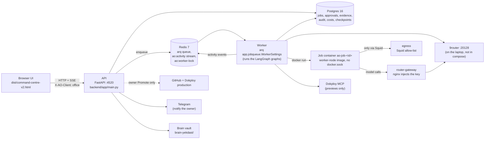
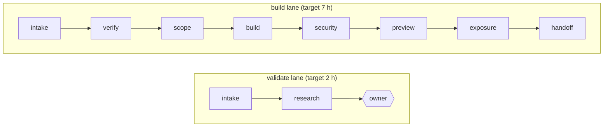

# Agents Office — Yekdast: project structure

Generated 2026-10-07 from the working tree at branch `main` (HEAD `bfc8e7a`, plus uncommitted work), the
graphify graph in `graphify-out/` (6,326 nodes, 9,691 edges, built from `bfc8e7a`) and
[.claude/plans/PLAN.md](.claude/plans/PLAN.md). Where this file and PLAN.md disagree, PLAN.md wins; this file
is a map, not a decision record.

---

## 1. What this is

A private workshop run from one laptop. The owner is the only human; **8 departments of agents plus a Brain**
are the staff. The goal is to get from an idea or client request to a **validated/killed idea** or a **live
preview** within one working day.

- **Backend**: FastAPI + LangGraph + Postgres (`backend/app/`). Models are reached only through the local
  9router proxy.
- **Front end**: a vanilla-JS 3D "office" (`src/`) bundled by esbuild into one HTML file,
  `dist/command-centre-v2.html`, which the API serves.
- **Builds** run in hardened Docker containers (`ao-job-<id>`), extend a golden template (`templates/webapp/`)
  and are judged by checks computed inside the container, never by a model's prose.
- **Hard rule**: agents build and deploy **previews** only. Production is the owner's Promote endpoint
  (`POST /api/jobs/{id}/promote`); nothing an agent can call reaches it (pinned by `backend/tests/test_promote.py`).

Forked from AJ Sahni's Agents Office (PolyForm Noncommercial, see `NOTICE`); the 3D UI is kept, the runtime is new.

| Size | Files | Lines |
|---|---|---|
| `backend/app/` (Python) | 55 files (49 modules + `__init__.py`) | ~7,900 |
| `backend/tests/` | 32 Python files; 315 tests pass, 12 skipped (re-run 2026-10-07) | ~4,100 |
| `src/` (JS + shell.html) | 17 files | ~6,900 |
| `citadel-saas-factory/` (vendored clone) | 889 tracked files | n/a |

---

## 2. Top-level layout

```
agents-office-yekdast/
├── CLAUDE.md                  Rules for Claude Code in this repo (read PLAN.md first)
├── README.md                  Overview and how to run
├── PROJECT_STRUCTURE.md       This file
├── SKILLS.md                  Guide for owner skills
├── CHANGELOG.md  LICENSE  NOTICE
├── .claude/plans/PLAN.md      THE plan: decisions, architecture, §11 laptop runbook, §20 feature inventory
│
├── backend/                   API, pipeline, workers, tests            → §4
├── src/                       UI source                                → §9
├── dist/command-centre-v2.html   Built UI (the only tracked file in dist/)
├── templates/webapp/          Golden Next.js template every build extends → §11
├── infra/                     sandbox image/scripts, egress proxy, router gateway, Dokploy hardening → §10
├── scripts/                   boot / stop / verify / gen_roster        → §12
├── brain-yekdast/             Owner's vault (company, playbooks, tech stack, audit log)  → §8
├── brain/                     Numbered sample vault shipped with the fork (00-Meta … 90-Operations, 35 notes)
├── skills/                    Example owner skills (client-reply, house-style, proposal)
├── assets/mcp/tiles/          28 connector tile images for the UI
├── citadel-saas-factory/      Vendored upstream clone + its own graphify graph (MIT)  → §13
│
├── build.mjs                  UI build: gen roster → bake brain graph → esbuild → dist/
├── graph-build.mjs            Bakes the vault's [[wiki-link]] graph into src/braingraph.js
├── check.mjs                  The build loop (`npm run check`)         → §12
├── config.mjs                 Node-side config loader (same layering as the backend)
├── setup                      One-command preparation (installs deps, builds the page, reports gaps)
├── docker-compose.yml         postgres, redis, egress, router-gateway (+ app profile)
├── Dockerfile                 Optional container for the app (default is native)
├── office.config.json         Shipped defaults (name, brain path, port, model, mcp, tools)
├── office.config.local.json   Local overrides (gitignored)
├── office.agents.json         Per-seat overrides (empty by default)
├── .env.example  .env.local   Env-var names and values (.env.local is gitignored; never commit a secret)
├── package.json  package-lock.json   Node scripts and dev deps (esbuild, three, d3-force, playwright-core)
│
├── data/                      Runtime state: pid files, logs, job workspaces, tasks.json, usage.json (gitignored)
├── graphify-out/              Knowledge graph of this repo (gitignored)
└── .arena/  .graphify-venv/  .pytest_cache/  node_modules/   local tooling (gitignored)
```

`scripts/gen_roster.mjs` and `src/roster.gen.js` are new and not yet committed.

---

## 3. Runtime topology



- **Ports**: API `127.0.0.1:4520`. 9router `127.0.0.1:20128` (containers reach it as `host.docker.internal`).
- **Compose services** (project `agents-office`): `postgres` (16-alpine), `redis` (7-alpine), `egress`
  (ubuntu/squid), `router-gateway` (nginx 1.27); profile `app`: `docker-proxy` (docker-socket-proxy) and `app`.
  Network `ao-internal`; volumes `pgdata`, `egresslogs`.
- **Process model**: with `AO_QUEUE=1` (on in `.env.local`) every job start/resume/kill, chat task and routine
  run is enqueued on Redis and driven by **one** worker. With it off, the API drives the graph in-process.
- **Pid files** in `data/`: `api.pid`, `worker.pid`. Never `pkill -f`/`pgrep -f`.
- **Boot**: `npm run boot` → `scripts/boot.sh` (compose up, wait for Postgres, start uvicorn, start the worker when
  `AO_QUEUE=1`, wait for `/api/health`). **Stop**: `scripts/stop.sh` (`--api-only` leaves containers up).

---

## 4. Backend (`backend/app/`)

### 4.1 Entry points and plumbing

| Module | Role |
|---|---|
| `main.py` (798 lines) | FastAPI app. Serves the UI, the `/api/*` contract, the routine ticker, SSE; the `guard` middleware requires `X-AO-Client: office` on mutating calls (and `AO_API_TOKEN` when set); OpenAPI JSON at `/api/openapi.json` for loopback clients only; Swagger/ReDoc off. |
| `config.py` | Layered config: code defaults ← `office.config.json` ← `office.config.local.json` ← environment. Holds `DEFAULT_STAGES` (stage → dept → lead seat), lane definitions, `live_departments`, exposure keys, and the worker/sandbox/dokploy/github/router/policies sections. Holds env-var **names** only; rejects inline secrets. |
| `db.py` | One psycopg 3 pool; jobs, tasks, approvals, evidence, audit, costs, counters, brain chunks; `fail_interrupted_tasks()`. |
| `deps.py` | Builds the pipeline's dependencies (deployer, worker, sandbox, notifier, …) from config, once at startup. |
| `llm.py` | The only model layer: 9router client, `RunMeter`, per-lane USD/token caps, model-swap check, `on_usage` hook; calls the Citadel SafetyGovernor when `AO_BACKBONE=1`. |
| `models.py` | The four office model keys (task/agent/routine menus) and which one wins; all roles currently map to `oc/nemotron-3-ultra-free`. |
| `activity.py` | 400-event ring buffer; `emit(kind, text, agent, connector, job, stage, level)` never raises; `STACK` names the stack connectors. In worker mode a sink forwards events to Redis. |
| `jobqueue.py` | arq glue: `enqueue`, `enqueue_task`, `drive_job`, `drive_task`, worker lock, activity stream `ao:activity`, `WorkerSettings` (`max_jobs=3`, `max_tries=1`, `job_timeout=4h`). |
| `backbone_bridge.py` | Prototype bridge to Citadel's backbone (SafetyGovernor, `AO_BACKBONE_MAX_USD`; the $ ceiling is skipped for `job:` labels). |
| `policy.py` | Path B enforcement: secret redaction, MCP audit log, refusal rules, `tool_verdict(server, tool, args, mode, policies)`. |
| `mcp.py` | `MCPRegistry`: connectors and per-department allow/deny; `call_allowed(dept, key, tool, args, mode)`; policies apply to connectors that have an owner note in `policies.mcpAccessNotes`. |
| `sandbox.py` | Builds hardened `docker run` commands for job containers (no socket, egress via Squid). Tests inspect the command; they never run it. |

### 4.2 Roster, brain and learning

| Module | Role |
|---|---|
| `roster.py` | Seat list from `seed/roster_seed.json`; `office.agents.json` may override `brief/does/tools/model/effort` only. |
| `personas.py` | Reads Citadel persona files from `seed/citadel/` (never authors them). |
| `onboard.py` | Which departments count as "set up". |
| `brain.py` | Vault index and context retrieval (port of `serve.mjs`). |
| `context.py` | One context builder for every agent call (task engine and pipeline). |
| `learn.py` | The agents learn from owner corrections (port of `learn.mjs`). |
| `proposals.py` | Brain write governance: agents propose a note, the owner decides; agents never edit notes. |
| `skills.py` | Owner skills from `<brain>/Agents Office/skills/<name>/SKILL.md`. |
| `routines.py` + `when.py` | Routines (tasks on a clock, `<brain>/Agents Office/routines.json`) and plain-words → schedule parsing. |

### 4.3 Job pipeline (`pipeline/`)

| Module | Role |
|---|---|
| `graph.py` | The LangGraph pipeline: `intake`, then per stage `work → review → gate`, plus `apply_exposure`, `park`, `resume_router`, `finish`. A FAIL loops back (max 2), then parks. |
| `stages.py` | The work of each stage; returns a dict merged into graph state. |
| `leads.py` | A department lead's model review of a stage (the verdict is only advice). |
| `exposure.py` | Separation of duties in code: who must approve what; Tier 1 needs a security key, a commercial key and owner clicks. |
| `research.py` | Validate lane: web research and a memo whose GO/TEST/NO-GO verdict is **computed** from the rubric (PLAN §2a). |
| `api.py` | `/api/jobs/*` router: create, read, SSE stream, gates, retry, kill, archive, consult, spawn, promote status; `park_interrupted()`. |
| `jobs.py` | Job record creation/merging; a job is one JSON document. |
| `spawn.py` | A lead may spawn a bench role as a bounded sub-agent (off by default, `max_per_stage=3`). |
| `activity.py` | Shows pipeline work as tasks so each seat is visibly busy. |
| `janitor.py` | Takes expired previews down (called from the routine ticker). |
| `ports.py` | Interfaces the pipeline depends on (`set_deps`). |

### 4.4 Single-task engine (`graph/engine.py`)

The chat/Task-panel engine: a `specialist → gate` LangGraph with a checkpointer, agent boundaries and escalation,
`route()` to pick a department, `run_task`, `resume_task`, `chat`. Pause/approve/reject/revise ride the same
Postgres checkpointer as the pipeline.

### 4.5 Workers (`worker/`)

One interface, several coding agents: `base.py` (shared container plumbing), `claude_code.py` (Claude Code
headless, `claude --bare -p … --output-format stream-json --verbose`), `openhands.py`, `mini_swe.py`, `fake.py`
(the default until the bake-off picks). Unverified CLI flags are marked in these files.

### 4.6 Connectors (`connectors/`)

| Module | Role |
|---|---|
| `guard.py` | Allow-list and audit guard around any tool-calling client. |
| `mcp_client.py` | Real MCP through `langchain-mcp-adapters` (Dokploy, GitHub). |
| `dokploy.py` | Previews through the owner's Dokploy MCP. |
| `git_publish.py` | Publishes a job's git bundle as a branch of the private previews repo. |
| `github.py` | Read-only GitHub tools for agents. |
| `web.py` | Keyless search/fetch for the research stage (host side, never in a job container). |
| `notify.py` | Telegram to the **owner** only. |
| `promote.py` | The owner's production Promote; unavailable without `PRODUCT_GITHUB_OWNER` / `PRODUCT_REPO_TOKEN`. |

### 4.7 Checks, migrations, seed data

- `checks/run.py` reads `/out/checks.json` from the container; `checks/patch.py` checks `/out/tree.tar.gz` and
  `/out/npm-audit.json`. **A failed check is a failed build gate**; no model can upgrade it.
- `migrations/001_core.sql`: tables `tasks`, `routine_state`, `jobs`, `approvals`, `evidence`, `audit_log`,
  `run_costs`, `counters`. `002_brain.sql`: `brain_chunks`. LangGraph checkpoint tables come from
  `AsyncPostgresSaver.setup()`.
- `seed/roster_seed.json` (seats, departments, V1 data), `seed/bench.json` (bench roles),
  `seed/backbone/{catalog,routing}.yaml` (tier → model; all `oc/nemotron-3-ultra-free`, daily budget $50),
  `seed/citadel/` (vendored personas, see §13).

---

## 5. Pipeline: lanes, stages, who approves

Two lanes over one graph (`config.py`, `pipeline.lanes`):



| Stage | Dept | Lead seat | Owner gate |
|---|---|---|---|
| intake | exec | `exec-ceo-strategist` | no |
| research (validate only) | exec | `exec-ceo-strategist` | **yes** |
| verify | exec | `exec-ceo-strategist` | **yes** |
| scope | engineering | `exec-vp-engineering` | no |
| build | engineering | `exec-vp-engineering` | no (the gate is the container's checks) |
| security | secdata | `sec-compliance` | no |
| preview | devops | `devops-cd` | no |
| exposure | secdata | `sec-compliance` | commercial key: `exec-ceo-strategist`; the building department never approves exposure |
| handoff | exec | `exec-ceo-strategist` | **yes** |

- Each stage = work, lead review, deterministic gate. FAIL loops back up to `max_review_loops=2`, then the job parks.
- `live_departments`: `exec`, `engineering`, `secdata`, `devops`. Stages of any other department wait for the owner.
- A job's status moves through `running`, `waiting` (owner gate), `parked`, `failed`, `killed`, `done`.
  `park_interrupted()` parks every `running` job when a worker boots; **Retry** continues from the last checkpoint.
- Build gate checks (inside the container): install, build, unit tests, start, `/healthz`, home page, e2e.

---

## 6. Queue, worker and streaming

1. The API handler calls `dispatch()` (jobs) or `enqueue_task()` (chat tasks, routine runs, approve/reject/revise).
2. arq ids dedupe: `drive-<job_id>` and `task-<task_id>-<key>`, so there is at most one driver per run.
3. The worker (`jobqueue.on_startup`) takes the lock `ao:worker-lock` (TTL 30 s, renewed every 10 s; a second
   worker exits 1), opens the Postgres pool and saver, compiles the task engine and the pipeline graph, attaches
   GitHub tools, parks interrupted jobs and fails interrupted tasks.
4. Activity events flow worker → Redis stream `ao:activity` → API (`pull_activity`) → `/api/activity` and
   `GET /api/jobs/{id}/stream` (SSE).
5. If Redis is unreachable at enqueue time the API runs the work in-process.
6. State lives in Postgres, so either process can restart without losing a job (decision in PLAN §20).

---

## 7. Safety model (where each rule is enforced)

| Rule | Where |
|---|---|
| Agents never reach production | `connectors/promote.py` + the Promote route in `pipeline/api.py`; `tests/test_promote.py`, `tests/test_openapi_contract.py` |
| Computed verdicts | build gates from `checks/`; market verdict from `pipeline/research.py` |
| Separation of duties | `pipeline/exposure.py`, `DEFAULT_STAGES` in `config.py`, `tests/test_architecture.py` |
| Secrets stay out of files and containers | config holds env-var names; `policy.py` redaction; `router-gateway` injects the key; no docker.sock in job containers |
| Egress allow-list | `infra/egress/{squid.conf,allowlist.txt}`; `tests/test_infra_invariants.py` |
| MCP access | `mcp.py` + `policy.py` + `connectors/guard.py`; audit log `brain-yekdast/audit/mcp-access.log`; `tests/test_mcp_policies.py` |
| Budget | `llm.py` per-lane caps; Citadel SafetyGovernor via `backbone_bridge.py` ($1 per routine run) |
| Cross-site guard | `X-AO-Client: office` header; optional `AO_API_TOKEN` meta tag |
| OpenAPI exposure | loopback only; route list pinned in `backend/tests/api_routes.txt` (43 routes) |
| One worker | `jobqueue.take_lock`; `tests/test_worker_lock.py` |

---

## 8. Data, brain and owner content

- **Postgres**: operational state (see §4.7). Local files in `data/` (`tasks.json`, `usage.json`, `jobs/<id>/` workspaces).
- **Brain** = a markdown vault whose path comes from `office.config.json` (`./brain-yekdast`):
  `Company/company.md`, `Playbooks/{exec,engineering,frontend,devops,secdata,revenue,fin,content}.md`,
  `Tech Stack/tech-stack.md`, `Agents Office/agents-office.md`, `audit/mcp-access.log`. Runtime-generated
  `Agents Office/skills/`, `routines.json` and proposals are gitignored.
- **`brain/`**: a numbered sample vault (`00-Meta` … `90-Operations`) shipped with the fork; the Dockerfile's front-end stage copies it.
- **`skills/`**: three example owner skills (`client-reply`, `house-style`, `proposal`); `SKILLS.md` is the guide.

---

## 9. Front end (`src/` → `node build.mjs` → `dist/command-centre-v2.html`)

`build.mjs` runs `scripts/gen_roster.mjs` (writes `src/roster.gen.js` from the backend seed), bakes the brain graph
(`graph-build.mjs` → `src/braingraph.js`), then bundles `src/main.js` with esbuild (+ three.js) into one
self-contained HTML.

| File | Role |
|---|---|
| `shell.html` | Page markup and CSS (1,135 lines). |
| `main.js` | Office scene, seats, feed, emotes, activity polling (1,533 lines). |
| `tasks.js` | Task panel and command bar. |
| `jobs.js` | Jobs overlay, stepper, NEEDS YOU inbox. |
| `mcp.js` | Connector panel; chips show connected tools and `+N not connected`. |
| `brain.js`, `braingraph.js` | Brain view and baked graph. |
| `calendar.js`, `when.js` | Routine calendar and schedule words. |
| `models.js`, `connectors.js`, `mcplogos.js` | Model menu, connector list, tile logos. |
| `builders.js` | Scene builders (props, desks). |
| `data.js`, `v1data.js`, `roster.gen.js` | Seat data; `v1data.js` is a 13-seat V1 fallback; `roster.gen.js` is generated. |
| `api.js` | Installs the `X-AO-Client` / `X-AO-Token` headers on every call. |

Two modes: **served over http** = live (no invented work); **`file://`** = the offline demo.

---

## 10. Infrastructure (`infra/`)

| Path | Role |
|---|---|
| `sandbox/worker-node.Dockerfile` | Worker image `agents-office/worker-node:latest` (Claude Code CLI + Node toolchain). |
| `sandbox/worker-openhands.Dockerfile` | OpenHands worker image. |
| `sandbox/run-job.sh` | Container entry: runs the coding agent (resumes with `--continue` on transient API errors, bounded), commits, produces `/out/{patch.bundle,tree.tar.gz,npm-audit.json,checks.json,agent.stdout,agent.stderr,exit_code}`. |
| `sandbox/run-checks.mjs` | Runs **inside** the container: install, build, test, start, probe, e2e → `/out/checks.json`. |
| `egress/squid.conf`, `allowlist.txt` | Forward-proxy allow-list for job containers. |
| `router-gateway/default.conf.template` | nginx in front of 9router; injects the key. |
| `dokploy/harden-almalinux.sh` | Host hardening for the Dokploy server. |

---

## 11. Golden template (`templates/webapp/`)

Next.js 16 + React 19 + Drizzle ORM + Better Auth + PGlite/`pg` + zod; tests with Vitest 5 and Playwright.
Contract that must keep working: `npm test`, `npm run test:e2e`, `GET /healthz`, the `Dockerfile` and `npm start`
(`node .next/standalone/server.js`). Layout: `src/app/` (pages, actions, `healthz`, `admin`, `sign-in`,
`api/auth/[...all]`), `src/db/`, `src/lib/`, `drizzle/`, `e2e/smoke.spec.ts`, `tests/items.test.ts`,
`scripts/standalone.mjs`. After any change, re-run `infra/sandbox/run-checks.mjs` on a copy.

---

## 12. Tests and the build loop

- `npm run check` (`check.mjs`): UI build, brain-graph/data sync, backend `pytest`, offline browser smoke
  (loads, every seat at its desk, task panel, command bar, department focus, approval flow) and, with
  `AO_TEST_DATABASE_URL` set, the live-UI smoke against the real server. Last result: 18/18.
- `cd backend && .venv/bin/python -m pytest -q tests`: 315 passed, 12 skipped. `pytest.ini` sets `asyncio_mode = auto`.
  Run one check at a time (they share one database).
- Test groups (all under `backend/tests/`): pipeline (`test_pipeline`, `test_validate_lane`, `test_spawn`),
  API (`test_api_contract`, `test_openapi_contract`, `test_inbox`), engine/LLM (`test_graph_integration`,
  `test_llm`, `test_models`, `test_router_node`), sandbox and workers (`test_sandbox_and_workers`,
  `test_run_checks`, `test_worker_trace`), safety (`test_redaction`, `test_policy_hook`, `test_mcp_policy`,
  `test_mcp_policies`, `test_promote`, `test_phase_a_hardening`, `test_infra_invariants`, `test_architecture`),
  queue (`test_worker_lock`, `test_backbone_bridge`), roster/personas (`test_roster`, `test_personas`),
  Postgres (`test_postgres`), scheduling (`test_when`), activity (`test_activity_agent`), and
  `e2e/test_compose_smoke.py`. Support files: `fakes.py`, `conftest.py`, `ui_server.py`, `api_routes.txt`.
- `scripts/`: `boot.sh`, `stop.sh`, `restart_api.sh`, `verify_slice.py` (end-to-end slice with restart), `verify_ui.mjs`
  (`npm run verify` runs both), `gen_roster.mjs`.

---

## 12a. HTTP API (43 routes, pinned in `backend/tests/api_routes.txt`)

| Area | Routes |
|---|---|
| UI | `GET /`, `GET /command-centre-v2.html`, `GET /dark` |
| Health / activity / usage | `GET /api/health`, `/api/activity`, `/api/usage`, `/api/inbox`, `/api/mcp` |
| Roster / brain / skills | `GET /api/agents`, `/api/bench`, `/api/brain`, `/api/skills`, `/api/lessons`; `GET/POST /api/brain/proposals`, `POST /api/brain/proposals/{pid}` |
| Chat and tasks | `POST /api/chat`; `GET/POST /api/tasks`; `DELETE /api/tasks/{id}`; `POST /api/tasks/{id}/{run,approve,reject,revise}` |
| Routines | `GET/POST /api/routines`; `POST /api/routines/{id}`, `/pause`, `/resume`, `/run`; `DELETE /api/routines/{id}` |
| Jobs | `GET/POST /api/jobs`; `GET /api/jobs/{id}`, `/stream`; `POST …/gates/{stage}`, `/retry`, `/kill`, `/archive`, `/consult`, `/spawn` |
| Promote (owner only) | `GET /api/jobs/{id}/promote` (status), `POST /api/jobs/{id}/promote` |

Mutating calls need `X-AO-Client: office`. `GET /api/openapi.json` is loopback only and is not in this list.

---

## 13. Vendored Citadel (`citadel-saas-factory/` and `backend/app/seed/citadel/`)

- `citadel-saas-factory/` is a full clone of Citadel-Cloud-Management/citadel-saas-factory (MIT) with its own
  `graphify-out/` (2,821 nodes). 889 tracked files, 439 of them under `.claude/` (agent personas). It also holds
  `backbone/`, `backend/`, `frontend/`, `infrastructure/`, `docs/`, `starter-kit/`, `compliance/`, `security/`,
  `models/`, `monitoring/`, `gitops/`, `tests/`, `mcp/`.
- `backend/app/seed/citadel/` holds byte-for-byte copies the office reads: `agents/<domain>/` (executive, legal,
  engineering, security, data-analytics, devops, qa-testing, plus 11 hand-written subagents in `hand/`), `rules/`,
  `skills/` (code-review, deploy, security-audit, guardrails, tdd) and `catalog/`. See `PROVENANCE.md` (commit
  `7c7ba41d`): do not edit; re-vendor from a new commit. Known limit: the 135 department persona files are one
  template with the name swapped, and each has `tools: []`.
- Our own choices (which seat uses which persona, tier → model, which tools a seat may call) live in code and config.

---

## 14. Roster: 8 departments plus the Brain, 17 seats

Departments (from `seed/roster_seed.json`): `exec` STRATEGY & LEGAL, `revenue` MARKET & SALES, `engineering`
BACKEND BUILD, `frontend` PRODUCT & FRONTEND, `devops` DEVOPS & QA, `secdata` SECURITY & PRIVACY,
`fin` FINANCE & PRICING, `content` CONTENT & SUPPORT, `brain` THE BRAIN.

| Dept | Seat ids (lead first) |
|---|---|
| exec | `exec-ceo-strategist` (CEO STRATEGIST) |
| revenue | `lexi` (VP SALES), `ilm` (LEAD QUALIFIER), `piper` (PROPOSAL WRITER), `enzo` (PRICING ANALYST) |
| engineering | `exec-vp-engineering` (VP ENGINEERING) |
| frontend | `mlead` (FRONTEND LEAD), `riley` (COMPONENT BUILDER), `gfx` (UI DESIGNER) |
| devops | `devops-cd` (DEVOPS LEAD) |
| secdata | `sec-compliance` (SECURITY LEAD) |
| fin | `alead` (FINANCE LEAD), `invo` (PRICING MODELLER), `apay` (USAGE & COST) |
| content | `elead` (CONTENT EDITOR), `newt` (DOCS WRITER), `cmail` (STATUS WRITER) |

Only `exec`, `engineering`, `secdata` and `devops` are live in the pipeline. `office.agents.json` overrides only
`brief`, `does`, `tools`, `model` and `effort`; `id`, `department` and `lead` are fixed.

---

## 15. Configuration and environment

- **Layers**: code defaults (`backend/app/config.py`) ← `office.config.json` ← `office.config.local.json` ← environment.
- **Env vars** (names in `.env.example`; values only in the gitignored `.env.local`): `ROUTER_API_KEY`, `PORT`,
  `AO_QUEUE`, `REDIS_URL`, `AO_BACKBONE`, `AO_BACKBONE_MAX_USD`, `AO_API_TOKEN`, `AO_TEST_DATABASE_URL`,
  `DOKPLOY_URL`, `DOKPLOY_API_KEY`, `PRODUCT_GITHUB_OWNER`, `PRODUCT_REPO_TOKEN`, `TELEGRAM_BOT_TOKEN`, `TELEGRAM_CHAT_ID`.
- **Models**: every tier maps to `oc/nemotron-3-ultra-free` through 9router (owner decision). S2 results are **big-pickle, not Haiku**.

---

## 16. Where the project stands (PLAN §11 and §20, 2026-10-07)

| Item | State |
|---|---|
| Boot, verify, UI, queue/worker, task queue, worker lock, policies, SafetyGovernor, OpenAPI contract, roster fixtures | Done and verified (315 tests, `npm run check` 18/18) |
| S1 9router; S1b keyless web tool; S4 budget; S5 Dokploy preview; S6 Promote; S7 Telegram | See PLAN §11. Dokploy, Promote and Telegram are not configured in this environment (the worker log says so) |
| **S2 bakery build** (job `7bc5b4b2aa83`) | **Waiting at the owner's `verify` gate.** The job was queued while no worker ran; the worker was started, its boot sweep parked the job, Retry resumed it, and it reached the verify gate. The owner clicks PASS on the Jobs screen; an agent does not approve an owner gate. |
| S3 Postgres restart/resume | Not run for this pass; it needs S2 to reach the build stage |
| Stress test | Not started |
| Commit of the ~73 changed files | Not started (planned: new branch off `main`, logical commits, no push, last) |

Observed during S2: a job enqueued while no worker is running is `running` in Postgres. The next worker boot parks
it, and the queue entry then still drives it, so the job can read `parked` while a stage works. To be recorded in
PLAN §11 and decided on.

---

## 17. Reading order

1. `CLAUDE.md`, then `.claude/plans/PLAN.md` (§1, §3, §11, §20).
2. `backend/app/config.py` (stages, lanes, defaults) and `backend/app/pipeline/graph.py` (the graph).
3. `backend/app/main.py` and `backend/app/pipeline/api.py` (the API contract).
4. `backend/app/jobqueue.py` (worker), `sandbox.py` + `infra/sandbox/run-job.sh` (containers), `checks/`.
5. `src/main.js` and `src/jobs.js` (UI), and `backend/tests/` for behaviour pinned by tests.
6. `graphify-out/GRAPH_REPORT.md` for the generated graph (hubs and communities).
