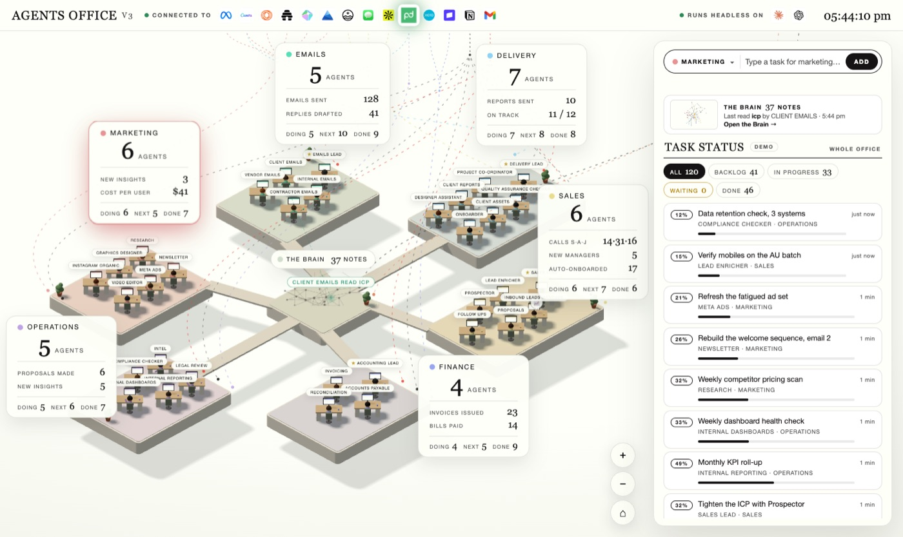
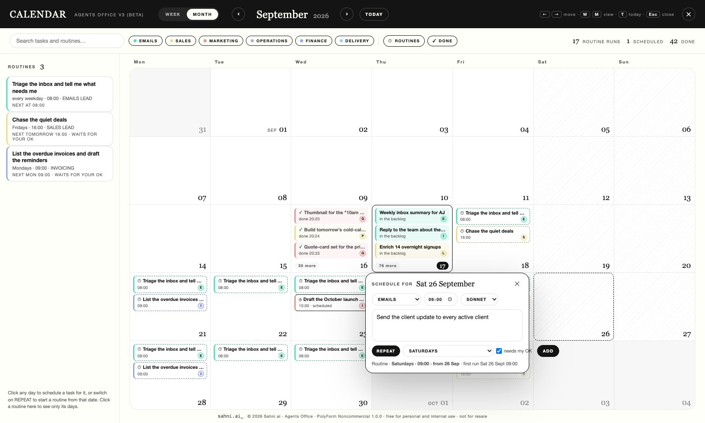

# Agents Office v3 (Beta)



A 3D isometric office where AI agents do real work on your own Claude login.

Six departments, thirty-five agents at their desks, a task bar that routes what you type to the
right agent, and a Brain at the centre that is your own folder of notes. Type a task, the office
gives it to the right person, they read your notes, use the connectors you have already set up
in Claude Code, do the work, and file the result back into your notes. Everything runs on your
machine.

**Beta.** It works end to end. Expect rough edges and tell us about them in Issues.

**License, in plain English:** free for personal and internal use. You may not sell it, resell it,
or build a paid product on it. (Formal terms: PolyForm Noncommercial 1.0.0 — see [LICENSE](LICENSE).)
The page carries the Sahni.ai mark at the bottom-left and a licence line along the bottom; the licence asks
that notices stay, so leave them in place.

## Latest updates



- **The calendar (P)** — 17 Sep 2026 · Everything on the day it belongs to: finished tasks, today's work, tasks you have scheduled, and every routine projected forward. Click any day to schedule a task for it, or switch on REPEAT to start a routine from that date. A rail lists the routines themselves. Month and week, dark mode too. → [The calendar](#the-calendar-everything-on-the-day-it-belongs-to)
- **Agent Teams** — 16 Sep · Press TEAM or say "as a team": the department lead splits the job across its desks, they work at the same time, leave notes for each other, and the lead writes the final. → [Agent Teams](#agent-teams-the-lead-splits-it-across-the-desks)
- **Claude in Chrome** — 16 Sep · The agents can use your own browser for any site you are signed in to, under the same read-freely, act-only-when-asked rule. → [Claude in Chrome](#claude-in-chrome-the-agents-can-use-your-browser)
- **Models by name, effort, and the usage gauge** — 9 Sep · Sonnet, Opus or Fable per task, routine, agent or office; an effort menu; your plan's session and week in the top bar. → [Which model](#which-model-and-how-much-of-your-plan)
- **Routines** — 9 Sep · Tasks on the office's own clock, with "needs my OK" before anything goes out. → [Routines](#routines-the-office-runs-on-its-own-clock)
- **The lead interviews you, and the agents learn from corrections** — 7 Sep · Say "set up" to a department lead; every `revise: …` becomes a standing rule. → [Teach the agents](#teach-the-agents-how-you-work)

The full list, release by release: [CHANGELOG](CHANGELOG.md).

## What you need

- macOS or Linux (Windows: works with `npm` commands directly, `./setup` is Bash only)
- Node.js 20+ — https://nodejs.org
- git
- **Claude Code**, logged in with your Claude account, or an `ANTHROPIC_API_KEY`

## Install

```bash
git clone https://github.com/ajsahni/agents-office.git
cd agents-office
./setup          # checks Node, git and Claude; installs; builds; boots once
npm start        # → http://localhost:4520
```

Without `./setup`: `npm install && node build.mjs && npm start`.

## First five minutes

1. Open http://localhost:4520. The panel on the right says **LIVE · CLAUDE** when the server is
   connected. Double-clicking `dist/command-centre-v2.html` opens the same office on its own,
   without a server, in demo mode.
2. In the bar at the top of the panel, pick a department, type a task in plain words, press **Add**.
   Claude picks the agent and names them; the task appears in the feed; the agent picks it up,
   works, and the deliverable lands in that agent's chat and in your brain folder as a note.
3. Click any agent to talk to them. They answer in their role, grounded in your notes.
   Say `revise: make it shorter` and they rework their last deliverable.
4. Press **G**, or click the Brain, to open your notes as a graph. Hover a note to see its links,
   click it to read where it sits and who read or wrote it.
5. The top bar shows the connectors your Claude Code is connected to. When an agent uses one,
   its logo pulses and the wire into that department lights up.
6. The first deliverables will be competent and generic: the agents know the sample studio and
   one sentence about their own job. Point the brain at your notes, then teach them how you
   work (below). That is where the office becomes yours.

## Connectors

The bar under **CONNECTED TO** is real: it is the list from `claude mcp list` on this machine,
which is the same list the agents get as tools. Gmail, Slack, Notion, Google Drive, Canva,
whatever you have connected in claude.ai or added with `claude mcp add`. A server that needs
authentication shows grey with the reason on hover, and is not wired to any pod until it works.
Nothing connected yet? The bar says so.

Agents can call those servers while they work, plus web search. They never get Bash, file
tools or sub-agents. Their standing rule: read freely; send, post, pay, delete or change
anything outside this machine **only** when your task explicitly asks for that exact action.
A finished deliverable says which tools it used, and the note in your brain records them.

Decide what the agents may touch in `office.config.json`:

```json
"mcp": { "allow": [], "deny": ["Stripe"], "departments": { "Slack": ["emails", "ops"] } },
"tools": { "web": true, "browser": true },
"teams": { "enabled": true, "max": 4 }
```

`allow` empty means every connected server. `deny` keeps a server in the bar but out of the
agents' hands (`"deny": ["Chrome"]` works the same for the browser). `departments` says which pods
a server is wired to (known brands have a default; anything else feeds every pod). Set `tools.web`
to `false` to keep the agents off the web, `tools.browser` to `false` to keep them out of your
Chrome (see [Claude in Chrome](#claude-in-chrome-the-agents-can-use-your-browser)).
Tool use needs the Claude Code login; on an `ANTHROPIC_API_KEY` the agents write from your notes only.

## Make the agents yours

The 35 agents are in `office.agents.json`: an id, a department, a name, a role, what they do,
and the connectors they usually use. Change the name, the role, what they do and their tools.
Departments, leads and seats are fixed: six pods, 35 desks, that is the office. A new kind of
agent is a renamed seat in the right department.

The easy way is to let Claude do it. Open Claude Code in this folder and say what you want:

```
claude
> Rename the Newsletter agent to PODCAST NOTES. It turns each episode into show notes and a LinkedIn post, and uses Google Drive.
> Make the Sales department about wholesale accounts, not inbound leads. Rewrite what each agent does.
> Tell every Finance agent to use Xero and nothing else.
```

Claude reads `CLAUDE.md`, writes your changes to `office.agents.local.json` (yours, ignored by
git, so `git pull` never overwrites it), and validates them with `npm run check`. Restart the
office and the desks carry the new names. Edit the file by hand if you prefer; the shape is:

```json
{ "agents": [
  { "id": "newt", "name": "PODCAST NOTES", "role": "Podcast Notes Agent",
    "does": "Turns each episode into show notes and a LinkedIn post.", "tools": ["google drive"],
    "brief": "Show notes are five bullets and a pull quote. The LinkedIn post opens with the quote, never with the episode title." }
] }
```

Edits to `id`, `department` or `lead` are ignored, and the server says so at start. The same
file can also sit in your brain as `<brain>/Agents Office/agents.json`; the office reads the
shipped roster, then the brain's, then the local file.

## Teach the agents how you work

Renaming an agent says what it does. It does not say *how*. Out of the box every agent knows
its one-line job, your notes, and a rule to hand over a finished deliverable, so the first
results are competent and generic. Two ways to fix that, both read before every task:

- **A brief** is a few standing sentences on one agent: tone, red lines, who to escalate to.
  It is the `brief` field above.
- **A skill** is a folder in your brain, `<brain>/Agents Office/skills/<name>/`, with a
  `SKILL.md` (when it applies, the steps, the shape, the rules) and the template or example
  beside it. Bind it to an agent or a department in its front matter. Same shape as a Claude
  Code skill.

```markdown
---
name: proposal
description: How we write a client proposal
agents: [piper]
---
# Writing a proposal
Use this for any request that ends in a document a client says yes or no to.
1. Prices come from `10-Business/offer-ladder.md`. Never invent one.
2. Follow `template.md` beside this file, section for section.
- Three options, always. Recommend the middle one.
```

Three example skills ship in `skills/` for the sample studio. The fastest way to write yours is
to hand Claude Code what you already have, the SOP, the email you keep copying, the last report
you were happy with, and ask for a skill:

```
claude
> Here is the proposal I sent Harbourside. Turn it into a skill for the Proposals agent: the
  shape as a template, the rules I follow, and keep this one as the example.
```

Skills and briefs take effect on the next task, no restart. `npm run check` validates them and
http://localhost:4520/api/skills shows who has what. The full guide, including what the agent
sees and how to write a good one, is **[SKILLS.md](SKILLS.md)**.

### Or let the lead interview you

Click a department lead and say **set up**. The lead asks five questions, one at a time: what
the department does here, the job you do most, what a good result looks like, what must never
happen, which tools and people are involved. Then it writes a brief for each agent on its team
and a skill for the job you described, into your brain, and tells you exactly what it wrote and
one task to type to try it. Nothing is written until the last answer. "skip", "done" and
"cancel" do what they say. A lead whose department has nothing of yours yet offers this in its
greeting.

### They learn from your corrections

Send a deliverable back with `revise: …` in the agent's chat and the correction is recorded in
`<brain>/Agents Office/feedback/<agent>.md`. Claude sorts it: a one-off about that task, or a
standing rule ("proposals are always one page") that the agent then applies to every task from
then on. The file is plain Markdown and it is yours: reword a rule, delete a line to unlearn it,
move a one-off up to make it a rule. When a rule is really a process, ask Claude Code to fold it
into the skill.

## Routines: the office runs on its own clock

A routine is a task the office does by itself, on a timetable: every weekday at 08:00, every
Monday, every hour. In this release routines are for **Emails, Accounting and Sales**; the
other departments get them later, and say so if you try.

Three ways to set one, all the same underneath:

- **Type it in the bar with the time in the sentence.** `every weekday at 8am, triage the
  inbox and tell me what needs me`. The hint line reads the schedule back before you press Add.
  Or press **REPEAT** and pick a cadence and a time. Times are this machine's clock.

The task box grows as you type (Shift+Enter for a new line, Enter adds). The ⤢ button in the box, or
⌘⇧E, opens a big editor with room for a whole brief; ⌘↵ adds from there, Esc closes.
- **Tell a department lead in chat.** "every Monday 9am, list the overdue invoices and draft the
  reminders". The lead puts it on the right desk and reads the timetable back on `routines`;
  `pause …`, `resume …`, `run … now` and `delete …` work with a few words from the name.
- **Ask Claude Code.** Routines live in `<brain>/Agents Office/routines.json`; `CLAUDE.md` tells
  Claude Code how to write one.
- **Click a day in the calendar** (P) with REPEAT on: a routine that starts on that date.

Where they show: a **SCHEDULED** chip in the Task Status panel with a countdown on every routine
and RUN NOW / PAUSE / DELETE on each; a next-up line under the chips; a SCHEDULED column on the
company board (**B**); a clock chip on the agent's name pill and a routines strip at the top of
their chat.

What a routine may do alone: a routine that only reads (a triage, a list, a reconciliation) runs
and lands in DONE like any task. A routine that would send, pay or change anything has **needs
my OK** on by default: the agent prepares everything, the draft lands in the chat, the card moves
to WAITING ON APPROVAL and the agent stands and waves. **APPROVE** and the agent does the
outbound step with its tools; **REJECT**, say what should change, and it comes back reworked,
and that correction is remembered. Switch the OK off per routine for the ones you trust.

The clock lives in the server: `npm start` has to be running, but the page does not have to be
open. A run missed while the machine was asleep or the office was off is caught up once when it
comes back, marked LATE; never more than one catch-up per routine. Every firing is a line in the
terminal and a task in the panel, so "did it run" is never a guess. For filming, `every 2
minutes` is accepted, though the picker does not offer it.

## The calendar: everything on the day it belongs to

Press **P**, or the CALENDAR button in the top bar beside the approval counter. One quiet screen: finished tasks on the day they finished, today's work on today,
tasks you have scheduled for a date, and every routine projected forward on the days it will
fire — dashed cards with a ⏱, one per run. Month or week; ← → move, T is today. A rail on the
left lists the routines themselves (cadence, who has it, next run, paused, waits for your OK), so
the timetable is never a guess; click one to see only its days. Filters by department, routines
on or off, done on or off, and a search box. Click a card: a finished task opens the agent's chat
with the deliverable; a routine run shows RUN NOW, PAUSE, DELETE; a scheduled task can be cancelled.

**Click any day to schedule.** Write what should happen, pick the department, the time and the
model, press ADD: Claude names the agent now and the office runs it at that minute, page open or
not, and it lands in the panel like any task (waiting for your OK if it would send anything). A
run missed while the office was off happens once when it comes back, marked LATE. Switch on
**REPEAT**, pick the cadence, and it becomes a routine that starts on that date — `every weekday
· 08:00 · from 5 Oct` — and shows on the grid from that day forward and never before it
(Emails, Accounting and Sales, as routines are). Scheduled tasks also show under the SCHEDULED
chip in the panel and in the SCHEDULED column on the board, with CANCEL.

## Agent Teams: the lead splits it across the desks

Some jobs are three jobs. Press **TEAM** in the bar, or just say it (`as a team, …`, `get the
team on this`, `spawn three teammates to …`), and the task goes to the department lead instead of
one specialist. The lead reads your notes and splits the request into two to four independent
pieces, each on the desk whose job or skills fit it (it may keep one). The pieces run **at the
same time**: one Claude process per desk, each with its own context, its own brief, skills and
lessons, and the same connectors. Each teammate can leave a note for another teammate or the lead
(`@lead: the two hook lines clash`); the notes pop as 💬 over the desks and reach the lead. When the
last piece is in, the lead writes the finished deliverable from all of them and ends it with one
line saying who did what.

What you see: the lead's card with a ⚑ and a TEAM chip, a ↳ piece card on every teammate's desk,
all IN PROGRESS together; each finished piece lands in that teammate's own chat and walks back to
the lead as a 📋; the lead's card finishes last with the combined result, and the note in your
brain carries the final, then every piece under its own heading, then the notes they left each
other. `revise: …` to the lead reworks the final from the same pieces without re-running them.
A team task that needs your OK waits like any other; APPROVE and the lead alone does the outbound
step. Routines can be teams too (`"team": true` in `routines.json`; the lead owns it).

Why the office builds this itself: Claude Code has its own agent teams, but it only spawns
teammates in an interactive terminal, never in the headless runs the office makes. What runs here
is the same shape (lead, teammates, a shared piece list, notes between them), made of real
separate Claude sessions on your login. A team costs more of your plan than one agent: two to four
runs plus the lead's plan and final. Use it for work with independent parts — angles, a review
from three sides, a launch with a copy, a design and a schedule piece — not for one linear job.
`teams.max` in `office.config.json` caps the desks (default 4); `teams.enabled: false` hides the
button and makes "as a team" an ordinary task.

## Claude in Chrome: the agents can use your browser

With the [Claude in Chrome extension](https://chromewebstore.google.com/detail/claude/fcoeoabgfenejglbffodgkkbkcdhcgfn)
installed and paired to this machine's Claude Code (`claude --chrome` once, follow the prompt),
the office starts every run with Chrome enabled and the agents get the browser as a tool: open a
tab, read a page, search, fill a form, on any site you are already signed in to. That reaches the
web apps that have no connector: a supplier portal, your accounting dashboard, a job board, a
Google Doc. The bar shows a **Chrome** tile wired to every pod; it lights when an agent is in the
browser, and the deliverable and the note say so (`Used: Chrome — read the pricing page`).

The rule is the connector rule: look and read freely; type into a form, submit, post, send, buy or
change anything on a site **only** when your task explicitly asks for that exact action. A login
page, a code or a CAPTCHA stops the agent, which says so. Browser actions run in your real Chrome
window, so you will see tabs open and close while an agent works; the agent closes what it opened.
It needs the Claude Code login (not an API key), the extension paired, and Chrome running. Not
paired yet? The tile is grey and says what to do on hover. `tools.browser: false` in
`office.config.json` keeps the agents out of the browser altogether (and off the bar).

## Which model, and how much of your plan

Every run names its model. Three, by name: **Sonnet**, **Opus**, **Fable**. Sonnet is the
default for everything, including the routing call that names the agent. The menu beside REPEAT
in the bar shows the office default; change it and it applies to the task you are typing (or the
routine, with REPEAT on). Four places, one precedence: the task beats the routine beats the agent
(a `model` field in the roster) beats the office default (`model` in `office.config.json`). Every
card says which model ran and, if it was set above the default, where.

**Effort** sits beside the model: AUTO, Low, Medium, High, Extra high, Max, the levels Claude Code
itself uses. AUTO is the model's own level (Opus runs at high). Set it on a task, a routine, an
agent (an `effort` field in the roster) or the office (`effort` in `office.config.json`), same
precedence as the model, and the card shows it next to the model name.

The top bar shows what your Claude plan has used, the way Claude Code's own usage screen shows
it: **session** and **week**, a bar and a percentage, reset times on hover. It is read from the
same place Claude Code reads it, with the login token Claude Code keeps on this machine (the
keychain on macOS, `~/.claude/.credentials.json` elsewhere). The token is read into memory, sent
only to Anthropic's usage endpoint, never logged and never written. That endpoint is not a
documented one; when it does not answer, the gauge shows the office's own count for the current
five-hour window instead, and says so on hover. No dollars anywhere: the office runs on the plan
you already pay for, and the gauge is there to show it.

## Make it yours

`office.config.json`:

```json
{ "name": "Northgate Studio", "brain": "./brain", "port": 4520, "model": "" }
```

- **name** — your business. It appears in the title and in every agent's brief.
- **brain** — a folder of Markdown notes with `[[wiki links]]`. An Obsidian vault works as is.
  The sample brain in `brain/` is a small fictional studio so the office works out of the box.
  Point this at your own notes and rebuild (`node build.mjs`) or just restart the server.
- **port** — where the office listens.
- **model** — `sonnet` (default), `opus` or `fable`. The office default; a routine, an agent or a task can set its own.

Put private overrides in `office.config.local.json` (ignored by git).

Agents write their deliverables to `<brain>/Agents Office/` as dated notes with a link back to
every note they read, so your graph grows as the office works.

## Keys

| Key | Does |
|---|---|
| `1` to `6` | Marketing, Emails, Sales, Operations, Finance, Delivery |
| `B` | The company board: every department, scheduled to done |
| `G` | The Brain graph |
| `P` | The calendar: tasks and routines on their days; click a day to schedule |
| `C` | Chat with the department lead |
| `X` | Send two agents to meet at the Brain |
| `V` | Full screen view with dimmed lighting |
| `D` | Dark mode. http://localhost:4520/dark opens in it |
| `Esc` | Back |

## The build loop

```bash
npm run check         # build, offline smoke test in a headless browser, server smoke test
npm run check:live    # the same, plus real runs through Claude: a task, a routine, an Opus task, a team, a browser task, a chat turn
```

Every check prints ✓ or ✗ with the reason. The Beta was built against this loop and it is the
first thing to run after any change.

## Where things live

| Path | What |
|---|---|
| `src/` | The office: `main.js` scene, `tasks.js` task panel, `brain.js` the Brain, `mcp.js` connectors, `data.js` departments and roster, `v1data.js` agent personalities |
| `serve.mjs` | The local server: routing, deliverables, chat, the live Brain graph |
| `mcp.mjs` | Connectors: `claude mcp list` parsed, allow/deny, the tools each agent may call |
| `roster.mjs` · `office.agents.json` | The 35 agents: names, roles, what they do, their tools, their briefs (`<brain>/Agents Office/agents.json` and `office.agents.local.json` override) |
| `skills.mjs` · `skills/` | Skills: how a kind of work is done, bound to agents or departments (`<brain>/Agents Office/skills/` is yours) |
| `learn.mjs` | Corrections from `revise: …` recorded per agent in `<brain>/Agents Office/feedback/`; standing rules go back into the prompt |
| `onboard.mjs` | The lead's five-question set-up interview; writes briefs and a skill into the brain |
| `src/models.js` · `usage.mjs` | The three models by name and their CLI flags; the usage gauge (Claude's numbers, the office's own count underneath) |
| `routines.mjs` · `src/when.js` | Routines: the timetable in `<brain>/Agents Office/routines.json`, plain words → a schedule, the clock and the catch-up (run state in `data/routines.json`) |
| `SKILLS.md` | The guide to briefs and skills |
| `CLAUDE.md` | What Claude Code does when you ask it to change agents, write a skill, put a routine on the timetable, or change connectors in this folder |
| `graph-build.mjs` | Reads your brain folder and lays out the graph |
| `dist/command-centre-v2.html` | The office as one built file (`node build.mjs` from `src/`); the server serves it, or double-click it for the demo |
| `brain/` | The sample brain |
| `data/tasks.json` | Your tasks (created on first run, ignored by git) |

## Privacy

Your notes are read from disk and sent to Claude only as context for the task or chat at hand
(a handful of the most relevant notes, plus your brain's `CLAUDE.md` and `index.md` if present,
plus the agent's brief, skills and standing rules from your corrections).
When an agent calls a connector, that call goes to that service through your own Claude Code
login, exactly as it would if you called it yourself. Nothing else leaves your machine.
Deliverables are saved locally.
